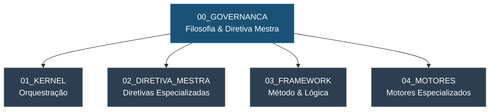

# 📁 00_GOVERNANCA — Governança e Fundamentos do SJIF

> **Sigma—Juris Intelligence Framework (SJIF)**
> Módulo de Governança, Filosofia e Diretiva Mestra

## Descrição

O diretório `00_GOVERNANCA` reúne os documentos fundacionais do Sigma—Juris Intelligence Framework (SJIF). Aqui estão definidos os pilares filosóficos, éticos e metodológicos que sustentam toda a arquitetura do sistema. Nenhum módulo, motor ou biblioteca do SJIF opera de forma válida sem estar em conformidade com os princípios e diretivas estabelecidos neste bloco.

## 📋 Conteúdo do Diretório

| Arquivo | Descrição | Capítulo |
|---|---|---|
| [cap01_governanca_filosofia.md](./cap01_governanca_filosofia.md) | Governança Jurídica e Filosofia do Framework | Capítulo 1 |
| [cap02_diretiva_mestra.md](./cap02_diretiva_mestra.md) | Diretiva Mestra Jurídica — regras inegociáveis | Capítulo 2 |
| [etica_e_principios.md](./etica_e_principios.md) | Consolidação de ética e princípios (Cap. 1 + Cap. 2) | Transversal |

## 🔗 Relação com Outros Módulos

## 📖 Capítulos Relacionados

- **Capítulo 1** — Define missão, visão, objetivos, escopo, princípios fundamentais, ética, limitações e roadmap
- **Capítulo 2** — Estabelece as 5 diretivas gerais invioláveis, a separação dos 9 elementos jurídicos e as 9 diretivas especializadas
- **Capítulo 3** — O Kernel Jurídico implementa as diretivas como regras de orquestração (ver `01_KERNEL/`)
- **Capítulos 4–6** — O Framework metodológico aplica a filosofia de governança na prática analítica (ver `03_FRAMEWORK/`)

## ⚠️ Regra de Ouro

> **Nenhum módulo do SJIF pode operar sem conformidade com a Diretiva Mestra.**
> Toda análise, pesquisa ou construção argumentativa deve respeitar integralmente os princípios aqui estabelecidos.

---
> Sigma—Juris Intelligence Framework (SJIF) v1.0 | Propriedade de Charles de Paula Eugênio — Sigma Sihf Soluções Analíticas Ltda
