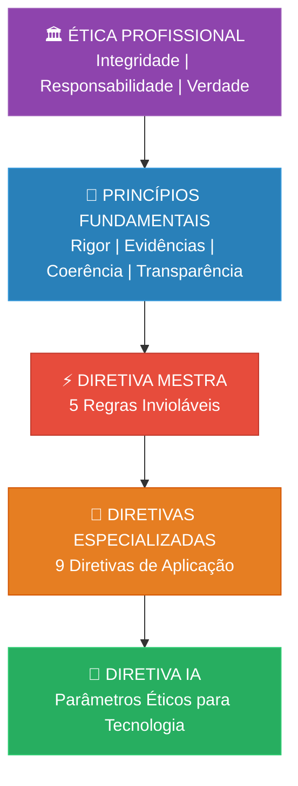

# Ética e Princípios Fundamentais do SJIF

> **Documento Transversal** | Consolidação dos Capítulos 1 e 2
> Sigma—Juris Intelligence Framework (SJIF)

---

## Propósito deste Documento

Este documento consolida todos os princípios éticos e fundamentais que permeiam o Sigma—Juris Intelligence Framework, extraídos do [Capítulo 1 — Governança e Filosofia](./cap01_governanca_filosofia.md) e do [Capítulo 2 — Diretiva Mestra](./cap02_diretiva_mestra.md). Ele serve como **referência rápida e unificada** para qualquer profissional, módulo ou motor que opere dentro do ecossistema SJIF.

---

## 1. Princípios Fundamentais

Os princípios abaixo norteiam toda e qualquer operação do JIF. Eles são **cumulativos e inderrogáveis** — nenhum módulo pode operar em violação a qualquer um deles.

### 1.1 Rigor Metodológico

> Todas as análises e processos devem seguir metodologias **claras, transparentes e verificáveis**.

- Cada etapa de análise deve ser documentada e rastreável
- Metodologias devem ser explícitas e passíveis de auditoria
- Não há espaço para "achismos" ou conclusões sem fundamento metodológico

### 1.2 Base em Evidências

> Conclusões e recomendações devem ser sempre fundamentadas em **fatos, provas, normas, jurisprudência e doutrina** juridicamente verificáveis.

- A afirmação sem prova é inadmissível
- Toda conclusão deve apontar para suas fontes
- Evidências empíricas complementam as fontes jurídicas tradicionais

### 1.3 Coerência Lógica

> A argumentação e o raciocínio jurídico devem ser **internamente consistentes** e livres de contradições.

- Premissas devem logicamente conduzir às conclusões
- Falácias lógicas devem ser identificadas e eliminadas
- O Motor de Coerência Jurídica (Cap. 23) automatiza essa verificação

### 1.4 Transparência

> Os processos e as fontes de informação devem ser **claros e auditáveis**.

- Cadeias de raciocínio devem ser explícitas
- Fontes devem ser citadas com precisão
- Limitações da análise devem ser declaradas

### 1.5 Adaptabilidade

> O framework deve ser capaz de se adaptar a **diferentes ramos do direito, jurisdições e evoluções legislativas**.

- Módulos especializados para cada ramo jurídico
- Kernels especializados garantem contextualização
- Atualização contínua diante de mudanças legislativas

### 1.6 Inovação Contínua

> Busca constante por aprimoramento e integração de **novas tecnologias e conhecimentos**.

- Integração de IA, modelos matemáticos e grafos de conhecimento
- Evolução do roadmap conforme avanços tecnológicos
- Feedback contínuo para melhoria do sistema

---

## 2. Princípios Éticos Inegociáveis

### 2.1 O JIF como Assistente, não Substituto

O JIF é um **assistente inteligente**, jamais um substituto do jurista:

- A **interpretação final** permanece com o profissional humano
- A **estratégia jurídica** é responsabilidade do advogado
- A **decisão ética** não pode ser delegada a algoritmos
- O sistema **não produz Direito** — organiza, analisa e sugere

### 2.2 Vedação à Manipulação

O sistema deve ser utilizado para **aprimorar** a prática jurídica, nunca para:

- ❌ Manipular fatos ou distorcer a verdade
- ❌ Produzir análises tendenciosas intencionalmente
- ❌ Omitir informações desfavoráveis deliberadamente
- ❌ Utilizar IA para fabricar ou falsificar evidências

### 2.3 Análise de Padrões Decisórios

A análise de padrões decisórios de julgadores deve:

- ✅ Focar em **dados objetivos e públicos**
- ✅ Basear-se em **decisões publicadas** e acessíveis
- ✅ Identificar **tendências** e **padrões** verificáveis
- ❌ Evitar especulações sobre **preferências pessoais**
- ❌ Não buscar manipular ou influenciar indevidamente o julgador

### 2.4 Integridade e Responsabilidade Profissional

- A **integridade** é valor inegociável na aplicação do JIF
- A **responsabilidade profissional** do operador do Direito permanece integral
- O uso do JIF não exime o profissional de suas obrigações éticas e deontológicas
- Decisões tomadas com auxílio do JIF são de **responsabilidade do profissional**

---

## 3. Princípios da Diretiva Mestra

A Diretiva Mestra (Cap. 2) traduz os princípios éticos em **regras operacionais invioláveis**:

### 3.1 Exaustividade Obrigatória

| Regra | Implicação Ética |
|---|---|
| Nenhuma linha ignorada | Respeito à completude e ao direito à informação plena |
| Nenhuma prova omitida | Compromisso com a verdade e a justiça |
| Nenhuma decisão ignorada | Respeito ao devido processo e ao contraditório |
| Nenhuma jurisprudência omitida | Lealdade à fundamentação robusta e transparente |
| Nenhum resumo sem autorização | Preservação da integridade documental |

### 3.2 Separação Rigorosa de Elementos

A confusão entre elementos jurídicos distintos (Fato, Prova, Hipótese, Inferência, Norma, Jurisprudência, Doutrina, Conclusão, Recomendação) é uma violação ética porque:

- **Compromete a transparência** da análise
- **Induz a erros** de raciocínio e decisão
- **Impede a auditoria** adequada do processo analítico
- **Prejudica o contraditório** e a ampla defesa

---

## 4. Ética na Aplicação de Inteligência Artificial

A **Diretiva IA** (seção 2.4 do Cap. 2) estabelece parâmetros éticos específicos:

### 4.1 Princípios para IA no SJIF

1. **Suporte, não substituição** — A IA atua como ferramenta de apoio à análise humana
2. **Padrões observáveis** — A IA deve focar em dados verificáveis, não em especulações
3. **Transparência algorítmica** — Os processos de IA devem ser auditáveis
4. **Viés controlado** — Mecanismos para identificar e mitigar vieses algorítmicos
5. **Responsabilidade humana** — A decisão final é sempre do profissional

### 4.2 Vedações Específicas para IA

- ❌ Fabricação de jurisprudência ou doutrina inexistente
- ❌ Criação de padrões decisórios baseados em dados insuficientes
- ❌ Automatização de decisões jurídicas sem supervisão humana
- ❌ Utilização de dados pessoais de julgadores para fins de manipulação
- ❌ Geração de peças jurídicas sem revisão profissional

---

## 5. Quadro Resumo: Hierarquia de Princípios

---

## Referências Cruzadas

| Documento | Relação |
|---|---|
| [Cap. 1 — Governança e Filosofia](./cap01_governanca_filosofia.md) | Origem dos princípios fundamentais |
| [Cap. 2 — Diretiva Mestra](./cap02_diretiva_mestra.md) | Operacionalização dos princípios em regras |
| [Diretiva IA](../02_DIRETIVA_MESTRA/diretiva_ia.md) | Detalhamento da ética em IA |
| [Cap. 4 — Método Científico](../03_FRAMEWORK/cap04_metodo_cientifico.md) | Rigor metodológico aplicado |
| [Cap. 5 — Lógica Argumentativa](../03_FRAMEWORK/cap05_logica_argumentativa.md) | Coerência lógica como disciplina |
| [Separação de Elementos](../03_FRAMEWORK/metodologia/separacao_elementos.md) | Detalhamento dos 9 elementos |

---
> Sigma—Juris Intelligence Framework (SJIF) v1.0 | Propriedade de Charles de Paula Eugênio — Sigma Sihf Soluções Analíticas Ltda
