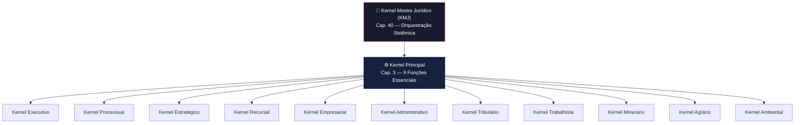

# 01_KERNEL — Arquitetura do Kernel Jurídico

## Visão Geral

O diretório `01_KERNEL` contém a documentação completa do **Kernel Jurídico** do Sigma—Juris Intelligence Framework (SJIF). O Kernel é o **cérebro orquestrador** do sistema — ele não produz Direito, mas **gerencia, direciona e valida** todas as análises realizadas pelos demais componentes.

> [!IMPORTANT]
> O Kernel Jurídico nunca produz Direito. Sua função é exclusivamente de **orquestração, validação e auditoria** das operações do framework.

## Arquitetura em 3 Camadas

## Conteúdo deste Diretório

| Arquivo | Descrição |
|---------|-----------|
| [cap03_kernel_juridico.md](cap03_kernel_juridico.md) | **Capítulo 3** — Kernel Principal (9 funções) e visão geral dos Kernels Especializados |
| [cap40_kernel_mestre.md](cap40_kernel_mestre.md) | **Capítulo 40** — Kernel Mestre Jurídico (KMJ): definição, arquitetura, 5 componentes, fluxo de 10 passos |
| [kernel_principal/orquestrador.md](kernel_principal/orquestrador.md) | Detalhamento do Orquestrador Principal e suas 9 funções essenciais |
| [kernels_especializados/](kernels_especializados/) | 11 arquivos detalhando cada Kernel Especializado por domínio jurídico |

### Kernels Especializados

| # | Kernel | Arquivo | Domínio |
|---|--------|---------|---------|
| 1 | Executivo | [kernel_executivo.md](kernels_especializados/kernel_executivo.md) | Execução e cumprimento de obrigações |
| 2 | Processual | [kernel_processual.md](kernels_especializados/kernel_processual.md) | Processos judiciais, administrativos e arbitrais |
| 3 | Estratégico | [kernel_estrategico.md](kernels_especializados/kernel_estrategico.md) | Formulação de estratégias jurídicas |
| 4 | Recursal | [kernel_recursal.md](kernels_especializados/kernel_recursal.md) | Gestão de recursos |
| 5 | Empresarial | [kernel_empresarial.md](kernels_especializados/kernel_empresarial.md) | Direito empresarial e corporativo |
| 6 | Administrativo | [kernel_administrativo.md](kernels_especializados/kernel_administrativo.md) | Direito administrativo |
| 7 | Tributário | [kernel_tributario.md](kernels_especializados/kernel_tributario.md) | Direito tributário e fiscal |
| 8 | Trabalhista | [kernel_trabalhista.md](kernels_especializados/kernel_trabalhista.md) | Direito do trabalho |
| 9 | Minerário | [kernel_minerario.md](kernels_especializados/kernel_minerario.md) | Direito minerário |
| 10 | Agrário | [kernel_agrario.md](kernels_especializados/kernel_agrario.md) | Direito agrário |
| 11 | Ambiental | [kernel_ambiental.md](kernels_especializados/kernel_ambiental.md) | Direito ambiental |

## Capítulos Relacionados

- [Capítulo 2 — Diretiva Mestra Jurídica](../02_DIRETIVA_MESTRA/cap02_diretiva_mestra.md)
- [Capítulo 25 — Módulo Jurídico Forense (MJF)](../04_MOTORES/mjf/cap25_modulo_juridico_forense.md)
- [Capítulo 26 — Motores Especializados](../04_MOTORES/especializados/cap26_motores_especializados.md)
- [Capítulo 27 — Ontologia Jurídica](../04_MOTORES/ontologia/cap27_ontologia_juridica.md)
- [Capítulo 28 — Grafo de Conhecimento Jurídico](../04_MOTORES/grafo/cap28_grafo_conhecimento.md)

---
> Sigma—Juris Intelligence Framework (SJIF) v1.0 | Propriedade de Charles de Paula Eugênio — Sigma Sihf Soluções Analíticas Ltda
