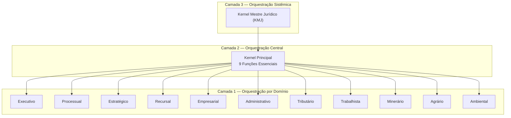

# Capítulo 3: Kernel Jurídico

## 3.1 O Kernel Jurídico: O Cérebro Orquestrador do JIF

O Kernel Jurídico é o componente central e orquestrador do Juris Intelligence Framework (JIF), atuando como o cérebro que coordena todas as operações e módulos do sistema. Sua função primordial **não é produzir Direito**, mas sim **gerenciar, direcionar e validar** as análises realizadas pelos demais componentes, garantindo a fluidez e a consistência do fluxo de trabalho.

> [!IMPORTANT]
> O Kernel Jurídico atua como um **maestro**: ele não toca os instrumentos, mas garante que cada parte do JIF execute sua tarefa no momento certo e de forma integrada.

A arquitetura do Kernel é organizada em três camadas hierárquicas:

---

## 3.2 Funções Essenciais do Kernel Principal

O Kernel Principal é a camada mais alta do Kernel Jurídico, responsável pelas funções de gerenciamento e coordenação. As **9 funções essenciais** são:

### 1. Identificar a Demanda

Receber e interpretar a solicitação inicial, seja ela uma análise de processo, um parecer, uma auditoria ou uma pesquisa específica. Esta etapa envolve a compreensão do objetivo e do contexto da tarefa.

### 2. Identificar o Ramo Jurídico

Classificar a demanda dentro do ramo do direito pertinente (Civil, Tributário, Trabalhista, etc.), o que direciona a seleção dos módulos e bibliotecas especializadas a serem acionados.

### 3. Identificar o Procedimento

Determinar o tipo de procedimento legal envolvido (judicial, administrativo, arbitral, consultivo), influenciando as diretivas e os motores a serem utilizados.

### 4. Identificar o Objetivo

Clarificar o resultado esperado da análise (ganhar uma causa, negociar, reduzir danos, anular uma decisão, etc.), orientando a estratégia e a profundidade da investigação.

### 5. Carregar os Módulos

Ativar e configurar os módulos especializados (Motores, Bibliotecas, Briefings, etc.) necessários para processar a demanda, com base nas identificações anteriores.

### 6. Controlar a Execução

Monitorar o progresso das tarefas executadas pelos módulos, garantindo que as etapas sejam seguidas conforme a metodologia definida e que os recursos sejam alocados eficientemente.

### 7. Validar

Verificar a conformidade das saídas dos módulos com as diretivas mestras e os padrões de qualidade do JIF, assegurando a precisão e a aderência aos princípios estabelecidos.

### 8. Auditar

Realizar verificações periódicas e pontuais para identificar inconsistências, omissões ou falhas na execução, promovendo a melhoria contínua e a robustez do sistema.

### 9. Consolidar

Integrar os resultados parciais de diferentes módulos em uma saída final coerente e compreensível, apresentando a inteligência jurídica de forma estruturada.

> [!TIP]
> Para o detalhamento completo de cada função, consulte o arquivo [kernel_principal/orquestrador.md](kernel_principal/orquestrador.md).

---

## 3.3 Kernels Especializados: Orquestração por Domínio

Além do Kernel Principal, o JIF incorpora **Kernels Especializados**, que são sub-kernels focados em domínios específicos do direito ou em tipos de operações. Esses kernels atuam como orquestradores dentro de suas respectivas áreas, garantindo que as particularidades de cada domínio sejam tratadas com a devida atenção.

> [!NOTE]
> Assim como o Kernel Principal, os Kernels Especializados **nunca produzem Direito**, mas sim coordenam as ações dos módulos e motores sob sua alçada.

### Tabela dos 11 Kernels Especializados

| # | Kernel | Função Principal | Módulos Coordenados |
|---|--------|-----------------|---------------------|
| 1 | **Executivo** | Gerencia demandas de execução de decisões e cumprimento de obrigações | Engenharia da Execução, Gestão de Ativos |
| 2 | **Processual** | Orquestra análises de processos judiciais, administrativos e arbitrais | Motores Processuais, Bibliotecas de Procedimentos |
| 3 | **Estratégico** | Direciona a formulação de estratégias jurídicas | Análise de Riscos, Simulação de Cenários, Construção de Teses |
| 4 | **Recursal** | Gerencia demandas relacionadas a recursos | Análise de Cabimento, Prazos, Peças Recursais |
| 5 | **Empresarial** | Focado em questões de direito empresarial | Compliance, Governança Corporativa, Contratos |
| 6 | **Administrativo** | Orquestra análises de direito administrativo | Licitações, Contratos Administrativos, Processos Disciplinares |
| 7 | **Tributário** | Direciona análises de direito tributário | Legislação Fiscal, Planejamento Tributário, Contencioso |
| 8 | **Trabalhista** | Gerencia demandas de direito do trabalho | Contencioso Trabalhista, Consultoria, Compliance |
| 9 | **Minerário** | Focado em questões de direito minerário | Concessões, Licenciamentos, Aspectos Regulatórios |
| 10 | **Agrário** | Orquestra análises de direito agrário | Posse, Propriedade Rural, Legislação Ambiental Aplicada |
| 11 | **Ambiental** | Direciona demandas de direito ambiental | Licenciamentos, Infrações, Passivos Ambientais |

> [!TIP]
> Cada kernel especializado possui documentação detalhada em [kernels_especializados/](kernels_especializados/).

---

## 3.4 A Importância da Orquestração no JIF

A arquitetura de Kernel Jurídico é fundamental para a **robustez e a escalabilidade** do JIF. Ao centralizar a orquestração e descentralizar a execução especializada, o sistema garante que as análises sejam sempre:

- **Consistentes** — seguindo a Diretiva Mestra Jurídica
- **Completas** — nenhum módulo relevante é ignorado
- **Alinhadas** — com os princípios e objetivos do framework

A capacidade do Kernel de **identificar, carregar, controlar, validar, auditar e consolidar** as informações é o que permite ao JIF transformar a complexidade do Direito em inteligência jurídica acionável, sem nunca se desviar do seu papel de ferramenta de suporte ao profissional do direito.

## Referências Cruzadas

- **Capítulo 2** — [Diretiva Mestra Jurídica](../02_DIRETIVA_MESTRA/cap02_diretiva_mestra.md)
- **Capítulo 40** — [Kernel Mestre Jurídico (KMJ)](cap40_kernel_mestre.md)
- **Capítulo 25** — Módulo Jurídico Forense (MJF)
- **Capítulo 26** — Motores Especializados

---
> Sigma—Juris Intelligence Framework (SJIF) v1.0 | Propriedade de Charles de Paula Eugênio — Sigma Sihf Soluções Analíticas Ltda
