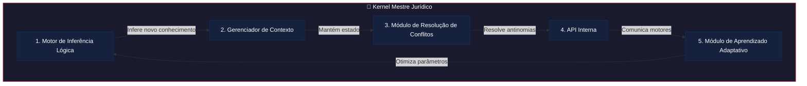
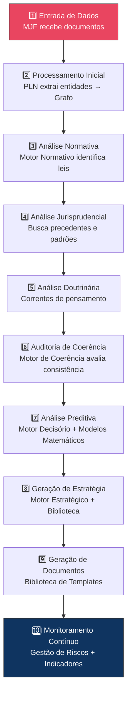

# Capítulo 40: Kernel Mestre Jurídico (KMJ)

## 40.1 O Coração da Inteligência: Desvendando o Kernel Mestre Jurídico do JIF

Ao longo dos capítulos anteriores, desvendamos a arquitetura multifacetada do Juris Intelligence Framework (JIF), explorando seus motores especializados, bibliotecas de conhecimento e aplicações práticas. Chegamos agora ao ápice dessa construção: o **Kernel Mestre Jurídico (KMJ)**.

O KMJ **não é** um motor ou um módulo isolado — é a **essência**, o coração pulsante do JIF, a camada mais profunda e fundamental que orquestra todos os componentes, garantindo a coerência, a integração e a inteligência sistêmica.

> [!IMPORTANT]
> O KMJ representa a materialização da filosofia do JIF de transformar o Direito em uma ciência aplicada, onde a lógica, a estrutura e a previsibilidade são maximizadas.

---

## 40.2 Definição e Função do Kernel Mestre Jurídico

O Kernel Mestre Jurídico é o **núcleo operacional e conceitual** do JIF. Ele é a camada que garante que todos os elementos do framework trabalhem em harmonia, processando informações, aplicando regras e gerando insights de forma integrada e consistente.

### 40.2.1 O que é o KMJ?

| Papel | Descrição |
|-------|-----------|
| **Núcleo de Orquestração** | Gerencia a interação entre todos os motores e módulos do JIF, garantindo que as informações fluam corretamente e que as funcionalidades sejam acionadas no momento certo |
| **Motor de Raciocínio Central** | Contém a lógica fundamental para o raciocínio jurídico, baseada na Ontologia Jurídica (Cap. 27) e no Grafo de Conhecimento Jurídico (Cap. 28) |
| **Garantidor de Coerência** | Assegura que as análises e recomendações geradas pelo JIF sejam internamente consistentes e alinhadas aos princípios do Direito |
| **Ponto de Integração** | Serve como hub central para a integração de novas fontes de dados, tecnologias e funcionalidades |
| **Camada de Abstração** | Abstrai a complexidade dos motores e módulos subjacentes, apresentando uma interface unificada para o restante do sistema |

### 40.2.2 Funções Essenciais do KMJ

1. **Gestão de Conhecimento Centralizada** — Supervisiona a Biblioteca Jurídica (Cap. 31), garantindo que o acervo esteja sempre atualizado, categorizado e indexado de forma coerente.

2. **Processamento Semântico Avançado** — Utiliza a Ontologia Jurídica para interpretar o significado dos termos e conceitos, permitindo que o JIF compreenda o Direito em um nível mais profundo.

3. **Raciocínio Baseado em Grafo** — Navega pelo Grafo de Conhecimento Jurídico para identificar relações complexas, fazer inferências e descobrir padrões que seriam invisíveis em abordagens tradicionais.

4. **Orquestração de Motores** — Aciona os motores especializados (Normativo, Jurisprudencial, Doutrinário, Coerência, Decisório, Riscos, Compliance) conforme a demanda, coordenando suas operações e integrando seus resultados.

5. **Geração de Insights Contextualizados** — Combina as análises de diferentes motores para gerar insights abrangentes e contextualizados, apresentados de forma clara e acionável.

6. **Aprendizado Contínuo** — Incorpora mecanismos de feedback e aprendizado para aprimorar continuamente a performance dos motores e a precisão das análises.

---

## 40.3 Arquitetura e Componentes Centrais do KMJ

A arquitetura do Kernel Mestre Jurídico é projetada para ser **robusta, eficiente e extensível**, permitindo a evolução contínua do JIF.

### 40.3.1 Os 5 Componentes-Chave

#### 1. Motor de Inferência Lógica

Responsável por aplicar regras de lógica formal e inferir novas informações a partir do conhecimento existente na Ontologia e no Grafo. Utiliza:

- Silogismos jurídicos
- Raciocínio dedutivo, indutivo e abdutivo
- Inferências baseadas em regras e em casos

#### 2. Gerenciador de Contexto

Mantém o estado atual da análise, garantindo que as informações sejam processadas no contexto correto do caso ou da questão jurídica. Funcionalidades:

- Rastreamento da fase processual
- Memória de sessão e histórico
- Contextualização de consultas por domínio jurídico

#### 3. Módulo de Resolução de Conflitos

Aplica princípios de hierarquia, especialidade e cronologia para resolver antinomias e conflitos entre normas ou interpretações:

- **Critério Hierárquico** — norma superior prevalece sobre a inferior
- **Critério da Especialidade** — norma especial prevalece sobre a geral
- **Critério Cronológico** — norma posterior revoga a anterior

#### 4. Interface de Programação de Aplicações (API) Interna

Permite que os motores e módulos do JIF se comuniquem de forma padronizada e eficiente com o KMJ:

- Protocolo de comunicação unificado
- Contratos de dados padronizados
- Gerenciamento de filas de processamento

#### 5. Módulo de Aprendizado Adaptativo

Monitora o desempenho dos motores, identifica áreas de melhoria e ajusta os parâmetros dos algoritmos de IA para otimizar os resultados:

- Análise de métricas de performance
- Ajuste automático de modelos
- Incorporação de feedback humano

### 40.3.2 Tecnologias Subjacentes

| Tecnologia | Aplicação no KMJ |
|-----------|------------------|
| **Processamento de Linguagem Natural (PLN)** | Compreensão e extração de informações de textos jurídicos |
| **Machine Learning e Deep Learning** | Identificação de padrões, classificação, previsão e raciocínio |
| **Bancos de Dados de Grafo** | Armazenamento e consulta eficiente do Grafo de Conhecimento Jurídico |
| **Sistemas de Gerenciamento de Regras (Rule Engines)** | Aplicação de regras jurídicas e lógicas |
| **Arquitetura de Microsserviços** | Modularidade, escalabilidade e resiliência dos componentes |

---

## 40.4 Orquestração de Motores e Módulos

A principal função do KMJ é orquestrar a interação entre os diversos motores e módulos do JIF, garantindo um fluxo de trabalho coeso e inteligente.

### 40.4.1 Fluxo de Orquestração — 10 Passos

O exemplo abaixo ilustra o fluxo completo para a análise de um caso pelo Módulo Jurídico Forense (MJF):

| Passo | Ação | Motor/Módulo Acionado |
|-------|------|----------------------|
| **1** | **Entrada de Dados** | O MJF (Cap. 25) recebe os documentos de um novo caso |
| **2** | **Processamento Inicial pelo KMJ** | PLN extrai entidades e relações → Grafo de Conhecimento Jurídico |
| **3** | **Análise Normativa** | Motor Normativo (Cap. 26) identifica leis, vigência e hierarquia |
| **4** | **Análise Jurisprudencial** | Motor Jurisprudencial (Cap. 26) busca precedentes e padrões decisórios |
| **5** | **Análise Doutrinária** | Motor Doutrinário (Cap. 26) complementa com correntes de pensamento |
| **6** | **Auditoria de Coerência** | Motor de Coerência (Cap. 23) avalia consistência da argumentação |
| **7** | **Análise Preditiva** | Motor Decisório (Cap. 24) + Modelos Matemáticos (Cap. 29) simulam cenários |
| **8** | **Geração de Estratégia** | Motor Estratégico (Cap. 19) + Biblioteca de Estratégias (Cap. 36) |
| **9** | **Geração de Documentos** | Biblioteca de Templates (Cap. 33) produz peças pré-preenchidas |
| **10** | **Monitoramento Contínuo** | Motor de Gestão de Riscos (Cap. 26) + Indicadores (Cap. 35) monitoram evolução |

---

## 40.5 O Futuro da Inteligência Jurídica: A Evolução do KMJ

O Kernel Mestre Jurídico não é um sistema estático; ele está em **constante evolução**, incorporando novas tecnologias e aprendendo com a interação com os usuários e com o ambiente jurídico.

### 40.5.1 IA Explicável (XAI)

O KMJ buscará aprimorar a **explicabilidade** de suas decisões, permitindo que os usuários compreendam como os insights foram gerados e quais fatores foram considerados. Isso é crucial para a **confiança e a aceitação** da IA no Direito.

### 40.5.2 Aprendizado por Reforço no Direito

Explorar a aplicação de **aprendizado por reforço** para otimizar estratégias jurídicas em cenários complexos, onde o sistema aprende a tomar as melhores decisões através de tentativa e erro em ambientes simulados.

### 40.5.3 Integração com Novas Fontes de Dados

O KMJ continuará a se integrar com novas fontes de dados:
- Dados de mídias sociais
- Informações de mercado
- Dados de sensores (em casos de direito ambiental ou de propriedade)

### 40.5.4 Interação Multimodal

Desenvolver a capacidade do KMJ de interagir com os usuários através de diferentes modalidades:
- **Voz** — comandos e consultas por voz
- **Imagem** — análise de documentos digitalizados
- **Vídeo** — análise de audiências e depoimentos

### 40.5.5 Ética e Responsabilidade da IA

O KMJ continuará a incorporar **diretrizes éticas** e mecanismos de auditoria para garantir que a IA seja utilizada de forma responsável, justa e transparente, evitando vieses e protegendo os direitos fundamentais.

---

## 40.6 O JIF e o Kernel Mestre Jurídico: A Nova Era do Direito

O Sigma—Juris Intelligence Framework, com seu Kernel Mestre Jurídico, representa a **vanguarda da tecnologia aplicada ao Direito**. Ele não é apenas uma ferramenta, mas uma nova forma de pensar e praticar o Direito, onde a inteligência artificial atua como um parceiro estratégico, ampliando as capacidades humanas e permitindo que os profissionais se concentrem no que fazem de melhor: aplicar o julgamento, a ética e a criatividade para buscar a justiça.

> [!NOTE]
> O KMJ é a promessa de um futuro onde o Direito é mais acessível, eficiente, previsível e, acima de tudo, mais **inteligente**. Ele é o alicerce para a construção de uma nova era na prática jurídica, onde a tecnologia e a expertise humana se unem para desvendar os desafios mais complexos e construir um sistema jurídico mais justo e eficaz para todos.

## Referências Cruzadas

- **Capítulo 3** — [Kernel Jurídico](cap03_kernel_juridico.md)
- **Capítulo 23** — Motor de Coerência Jurídica
- **Capítulo 24** — Motor Decisório Jurídico
- **Capítulo 25** — Módulo Jurídico Forense (MJF)
- **Capítulo 27** — Ontologia Jurídica
- **Capítulo 28** — Grafo de Conhecimento Jurídico
- **Capítulo 29** — Modelos Matemáticos
- **Capítulo 30** — Inteligência Artificial Aplicada ao Direito

---
> Sigma—Juris Intelligence Framework (SJIF) v1.0 | Propriedade de Charles de Paula Eugênio — Sigma Sihf Soluções Analíticas Ltda
