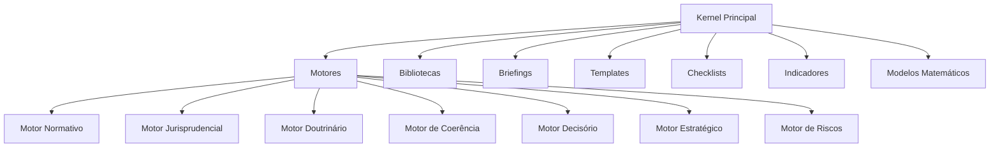
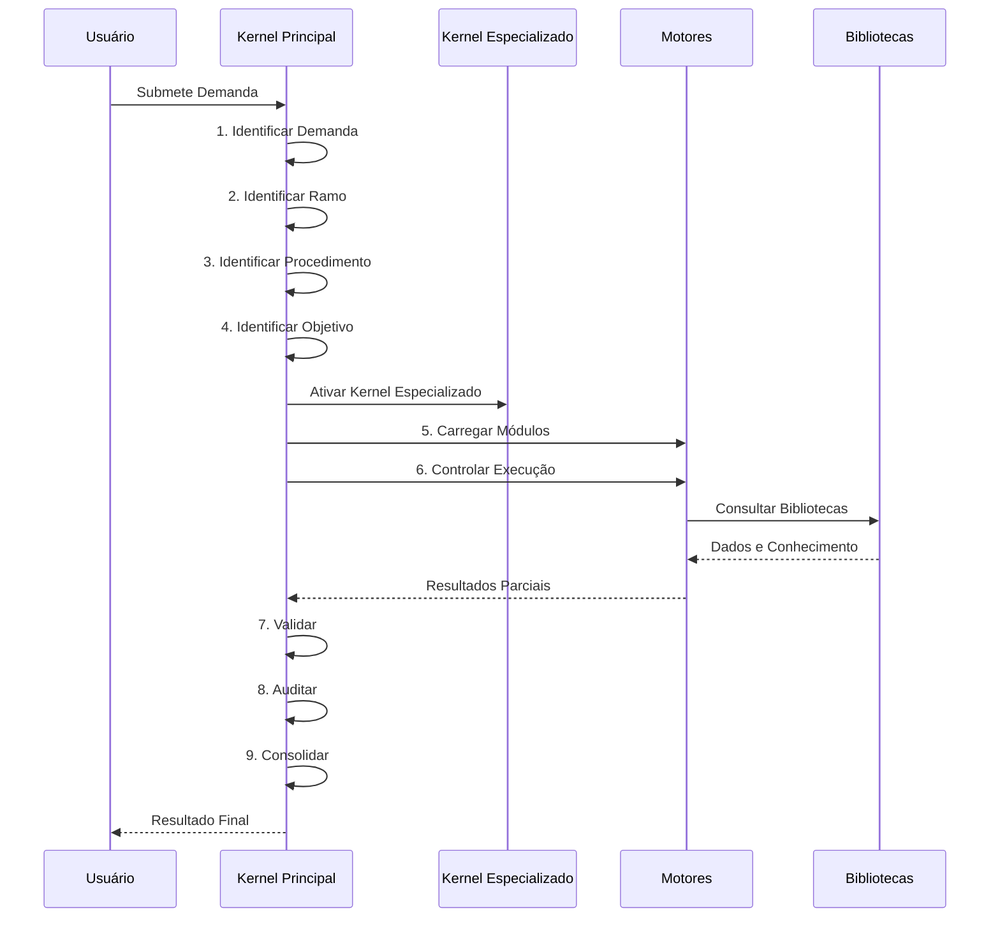

# Kernel Principal — Orquestrador

## Visão Geral

O **Kernel Principal** é a camada mais alta do Kernel Jurídico do SJIF, responsável pelo gerenciamento e coordenação de todas as operações do framework. Ele atua como um **maestro**, garantindo que cada componente do JIF execute sua tarefa no momento certo e de forma integrada.

> [!IMPORTANT]
> O Kernel Principal **não produz Direito**. Sua função é exclusivamente de **orquestração, validação e auditoria** das operações do framework.

---

## As 9 Funções Essenciais

---

### 1. Identificar a Demanda

**Objetivo:** Receber e interpretar a solicitação inicial do usuário.

**Escopo:**
- Análise de processo judicial
- Parecer jurídico
- Auditoria de conformidade
- Pesquisa específica (legislativa, jurisprudencial, doutrinária)
- Elaboração de peça processual
- Análise de contratos

**Processo:**
1. Receber a entrada do usuário (documentos, consulta, dados brutos)
2. Classificar o tipo de demanda (análise, consultoria, contencioso, prevenção)
3. Determinar a complexidade e o escopo da tarefa
4. Registrar os parâmetros iniciais para rastreabilidade

**Saída:** Objeto de demanda classificado e parametrizado.

---

### 2. Identificar o Ramo Jurídico

**Objetivo:** Classificar a demanda dentro do ramo do direito pertinente.

**Ramos Suportados:**

| Ramo | Kernel Especializado | Exemplos de Demandas |
|------|---------------------|---------------------|
| Civil | Processual | Contratos, responsabilidade civil, obrigações |
| Tributário | Tributário | Impostos, contribuições, planejamento fiscal |
| Trabalhista | Trabalhista | CLT, contencioso, compliance trabalhista |
| Empresarial | Empresarial | Societário, M&A, falência, recuperação judicial |
| Administrativo | Administrativo | Licitações, contratos públicos, disciplinar |
| Ambiental | Ambiental | Licenciamento, infrações, passivos |
| Minerário | Minerário | Concessões, regulatório, compliance minerário |
| Agrário | Agrário | Posse, propriedade rural, agronegócio |
| Constitucional | Estratégico | Direitos fundamentais, controle de constitucionalidade |

**Processo:**
1. Analisar as palavras-chave e o contexto da demanda
2. Consultar a Ontologia Jurídica (Cap. 27) para classificação semântica
3. Selecionar o Kernel Especializado correspondente
4. Registrar a classificação para acionamento dos módulos

**Saída:** Ramo jurídico identificado e Kernel Especializado selecionado.

---

### 3. Identificar o Procedimento

**Objetivo:** Determinar o tipo de procedimento legal envolvido.

**Tipos de Procedimento:**

- **Judicial** — processos perante o Poder Judiciário
  - Processo de conhecimento
  - Processo de execução
  - Processo cautelar / tutela provisória
  - Procedimentos especiais
- **Administrativo** — processos perante órgãos da administração pública
  - Processo administrativo disciplinar
  - Licenciamento
  - Licitações
- **Arbitral** — procedimentos de arbitragem
- **Consultivo** — pareceres, análises preventivas, due diligence
- **Negocial** — mediação, conciliação, negociação

**Saída:** Tipo de procedimento definido, influenciando diretivas e motores a serem utilizados.

---

### 4. Identificar o Objetivo

**Objetivo:** Clarificar o resultado esperado da análise.

**Objetivos Possíveis:**

| Objetivo | Descrição | Prioridade de Análise |
|----------|-----------|----------------------|
| **Ganhar a causa** | Maximizar chances de procedência | Tese principal + subsidiárias |
| **Negociar** | Preparar para acordo ou transação | BATNA, riscos, cenários |
| **Reduzir danos** | Minimizar impacto financeiro/reputacional | Gestão de riscos, contingências |
| **Anular decisão** | Reverter decisão desfavorável via recurso | Engenharia reversa, cabimento |
| **Prevenir** | Evitar litígio ou risco futuro | Compliance, auditoria |
| **Executar** | Efetivar direito reconhecido | Mapeamento patrimonial, constrição |

**Processo:**
1. Dialogar com o usuário para clarificar objetivos
2. Mapear objetivos primários e secundários
3. Definir nível de profundidade da análise
4. Estabelecer métricas de sucesso

**Saída:** Objetivo clarificado e estratégia de profundidade definida.

---

### 5. Carregar os Módulos

**Objetivo:** Ativar e configurar os módulos especializados necessários.

**Módulos Disponíveis:**

**Processo:**
1. Com base nas identificações anteriores (demanda, ramo, procedimento, objetivo), selecionar os módulos pertinentes
2. Configurar parâmetros de cada módulo (profundidade, escopo, filtros)
3. Estabelecer a ordem de execução e dependências entre módulos
4. Alocar recursos computacionais

**Saída:** Pipeline de módulos configurado e pronto para execução.

---

### 6. Controlar a Execução

**Objetivo:** Monitorar o progresso das tarefas executadas pelos módulos.

**Atividades de Controle:**

- **Sequenciamento** — garantir que as etapas sejam seguidas na ordem correta
- **Paralelismo** — identificar tarefas que podem ser executadas simultaneamente
- **Monitoramento** — acompanhar o progresso de cada módulo em tempo real
- **Tratamento de Erros** — detectar e gerenciar falhas de execução
- **Alocação de Recursos** — distribuir capacidade computacional conforme prioridade
- **Gestão de Prazos** — garantir que deadlines internos sejam respeitados

**Saída:** Relatório de execução com status de cada módulo.

---

### 7. Validar

**Objetivo:** Verificar a conformidade das saídas com as diretivas mestras e padrões de qualidade.

**Critérios de Validação:**

- [ ] Aderência à **Diretiva Mestra Jurídica** (Cap. 2)
- [ ] Nenhuma linha ignorada
- [ ] Nenhuma prova omitida
- [ ] Nenhuma decisão desconsiderada
- [ ] Pesquisa jurisprudencial exaustiva realizada
- [ ] Separação correta entre fato, prova, hipótese, inferência, norma, jurisprudência, doutrina, conclusão e recomendação
- [ ] Coerência lógica da argumentação
- [ ] Consistência entre fatos, provas e fundamentos

**Saída:** Relatório de validação com status aprovado/reprovado e detalhamento de não-conformidades.

---

### 8. Auditar

**Objetivo:** Identificar inconsistências, omissões ou falhas na execução.

**Tipos de Auditoria:**

| Tipo | Foco | Frequência |
|------|------|-----------|
| **Auditoria de Processo** | Verificar se o fluxo foi seguido corretamente | A cada execução |
| **Auditoria de Qualidade** | Avaliar a profundidade e precisão das análises | Periódica |
| **Auditoria de Coerência** | Buscar contradições e saltos argumentativos | A cada consolidação |
| **Auditoria de Conformidade** | Verificar aderência às normas e regulamentos | Por demanda |

**Processo:**
1. Aplicar checklists de auditoria (Cap. 34) aos resultados
2. Executar o Motor de Coerência Jurídica (Cap. 23) nas saídas
3. Comparar resultados com benchmarks e padrões
4. Registrar achados e recomendações de melhoria

**Saída:** Relatório de auditoria com achados, classificação de severidade e recomendações.

---

### 9. Consolidar

**Objetivo:** Integrar os resultados parciais em uma saída final coerente e compreensível.

**Etapas de Consolidação:**

1. **Reunir** — Agregar os resultados de todos os módulos executados
2. **Harmonizar** — Resolver eventuais conflitos ou redundâncias entre as saídas
3. **Estruturar** — Organizar a informação em formato adequado ao tipo de demanda (parecer, relatório, petição, briefing)
4. **Sintetizar** — Criar resumos executivos e destaques dos principais achados
5. **Formatar** — Aplicar templates e padrões visuais do JIF
6. **Entregar** — Apresentar o resultado final ao usuário com rastreabilidade completa

**Saída:** Documento final consolidado, auditado e validado, pronto para utilização pelo profissional do direito.

---

## Fluxo Completo de Orquestração

## Referências Cruzadas

- **Capítulo 2** — [Diretiva Mestra Jurídica](../../02_DIRETIVA_MESTRA/cap02_diretiva_mestra.md)
- **Capítulo 3** — [Kernel Jurídico](../cap03_kernel_juridico.md)
- **Capítulo 23** — Motor de Coerência Jurídica
- **Capítulo 40** — [Kernel Mestre Jurídico](../cap40_kernel_mestre.md)

---
> Sigma—Juris Intelligence Framework (SJIF) v1.0 | Propriedade de Charles de Paula Eugênio — Sigma Sihf Soluções Analíticas Ltda
