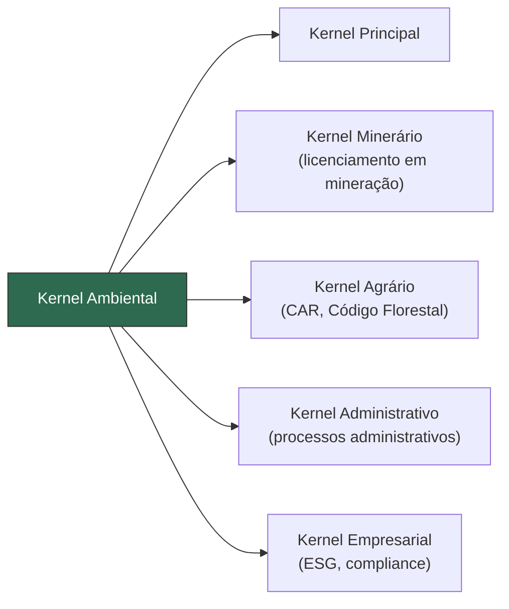

# Kernel Ambiental

## Visão Geral

O **Kernel Ambiental** é o kernel especializado responsável por direcionar todas as demandas de **direito ambiental**, coordenando licenciamentos, análise de infrações, gestão de passivos ambientais e conformidade com a legislação ambiental.

> [!NOTE]
> O Kernel Ambiental **não produz Direito** — ele coordena os módulos e motores especializados para garantir análises ambientais completas, rigorosas e em conformidade com a legislação.

---

## Propósito

Fornecer suporte completo para **demandas ambientais**, desde a consultoria preventiva (licenciamento, compliance ambiental) até o contencioso ambiental (infrações, responsabilidade civil, ações civis públicas), garantindo a proteção do meio ambiente e a segurança jurídica das operações.

---

## Escopo de Atuação

| Área | Descrição |
|------|-----------|
| **Licenciamento Ambiental** | LP (Licença Prévia), LI (Licença de Instalação), LO (Licença de Operação) |
| **EIA/RIMA** | Estudo de Impacto Ambiental e Relatório de Impacto ao Meio Ambiente |
| **Infrações Ambientais** | Autos de infração, multas, embargos, processos administrativos |
| **Responsabilidade Ambiental** | Responsabilidade civil (objetiva), penal e administrativa |
| **Passivos Ambientais** | Identificação, quantificação e gestão de passivos |
| **Áreas Protegidas** | Unidades de Conservação, APPs, Reserva Legal |
| **Recursos Hídricos** | Outorga de uso, gestão de bacias hidrográficas |
| **Resíduos Sólidos** | Política Nacional de Resíduos Sólidos, logística reversa |
| **Mudanças Climáticas** | Mercado de carbono, compromissos climáticos, ESG |
| **Ações Civis Públicas** | Defesa em ações ambientais, TACs (Termos de Ajustamento de Conduta) |

---

## Módulos Coordenados

- **Motor Normativo** (Cap. 14) — Código Florestal, PNMA, SNUC, legislação ambiental
- **Motor Jurisprudencial** (Cap. 15) — Precedentes ambientais em tribunais superiores
- **Motor de Compliance** (Cap. 26) — Compliance ambiental e ESG
- **Motor de Gestão de Riscos** (Cap. 20) — Riscos ambientais e contingências
- **Modelos Matemáticos** (Cap. 29) — Quantificação de danos ambientais e valoração
- **Biblioteca de Checklists** (Cap. 34) — Checklists de licenciamento e auditoria ambiental

---

## Pontos de Integração

- **Kernel Principal** — Recebe demandas ambientais classificadas
- **Kernel Minerário** — Licenciamento ambiental para atividades de mineração
- **Kernel Agrário** — Questões ambientais em propriedades rurais
- **Kernel Administrativo** — Processos administrativos ambientais
- **Kernel Empresarial** — ESG e compliance ambiental corporativo
- **Kernel Tributário** — Incentivos fiscais ambientais (ICMS Ecológico)

---
> Sigma—Juris Intelligence Framework (SJIF) v1.0 | Propriedade de Charles de Paula Eugênio — Sigma Sihf Soluções Analíticas Ltda
