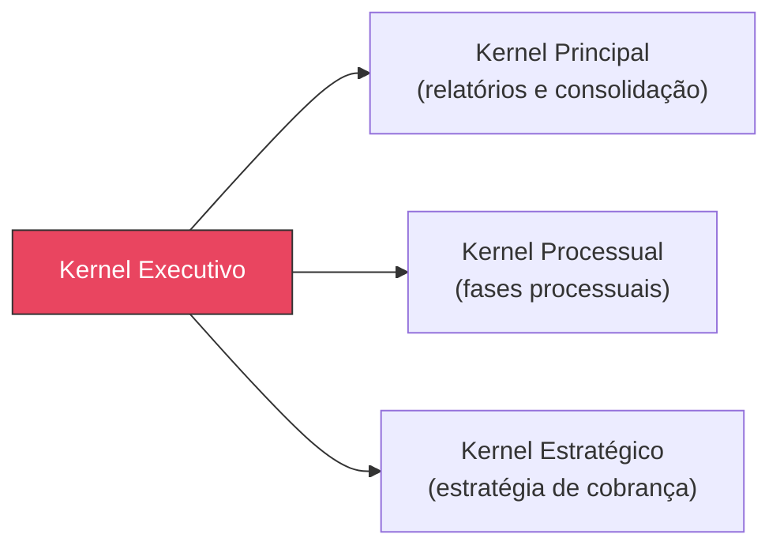

# Kernel Executivo

## Visão Geral

O **Kernel Executivo** é o kernel especializado responsável por gerenciar todas as demandas relacionadas à **execução de decisões judiciais e cumprimento de obrigações**. Ele coordena os módulos e motores necessários para transformar o direito reconhecido em resultado prático e tangível.

> [!NOTE]
> Assim como todos os kernels especializados, o Kernel Executivo **não produz Direito** — ele orquestra as ações dos módulos e motores sob sua alçada.

---

## Propósito

Garantir a **máxima efetividade** na fase executiva, coordenando as estratégias de localização de bens, penhora, alienação e satisfação do crédito. O Kernel Executivo atua para que a vitória obtida no processo de conhecimento se converta em resultado concreto para o cliente.

---

## Escopo de Atuação

| Área | Descrição |
|------|-----------|
| **Cumprimento de Sentença** | Execução de decisões judiciais proferidas em processos de conhecimento |
| **Execução de Títulos Extrajudiciais** | Cobrança de créditos representados por títulos como cheques, notas promissórias, contratos |
| **Mapeamento Patrimonial** | Localização e análise de bens e direitos do devedor |
| **Medidas Coercitivas** | Penhora online, de veículos, imóveis, faturamento e ativos digitais |
| **Medidas Indutivas** | Inclusão em cadastros de inadimplentes, protesto, medidas atípicas |
| **Desconsideração da Personalidade Jurídica** | Responsabilização de sócios em casos de abuso |
| **Leilões e Hastas Públicas** | Alienação de bens penhorados |

---

## Módulos Coordenados

- **Motor de Execução** (Cap. 13) — Mapeamento patrimonial inteligente e sugestão de medidas
- **Engenharia da Execução** (Cap. 13) — Estratégias de efetivação
- **Motor de Gestão de Riscos** (Cap. 26) — Avaliação de risco de inexecução
- **Biblioteca de Templates** (Cap. 33) — Petições de penhora e requerimentos
- **Biblioteca de Indicadores** (Cap. 35) — KPIs de execução (taxa de sucesso, tempo médio, custo)

---

## Pontos de Integração

- **Kernel Principal** — Recebe instruções de orquestração e envia relatórios consolidados
- **Kernel Processual** — Integração para acompanhamento de fases do processo executivo
- **Kernel Estratégico** — Definição de estratégia de cobrança e negociação

---
> Sigma—Juris Intelligence Framework (SJIF) v1.0 | Propriedade de Charles de Paula Eugênio — Sigma Sihf Soluções Analíticas Ltda
