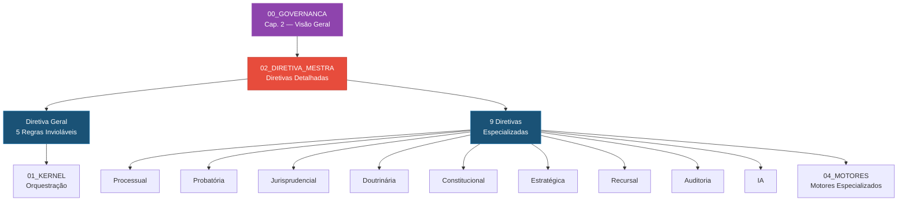

# 📁 02_DIRETIVA_MESTRA — Diretivas Especializadas do SJIF

> **Sigma—Juris Intelligence Framework (SJIF)**
> Módulo de Diretivas Mestras Especializadas

## Descrição

O diretório `02_DIRETIVA_MESTRA` contém o detalhamento individual de cada uma das diretivas que compõem a Diretiva Mestra Jurídica do SJIF. Enquanto o [Capítulo 2](../00_GOVERNANCA/cap02_diretiva_mestra.md) define a visão geral, este diretório aprofunda cada diretiva com: definição, escopo, regras-chave, pontos de integração e referências cruzadas.

## 📋 Conteúdo do Diretório

### Diretiva Geral
| Arquivo | Descrição |
|---|---|
| [diretiva_geral.md](./diretiva_geral.md) | As 5 regras invioláveis que governam todo o SJIF |

### Diretivas Especializadas (9 tipos)
| # | Arquivo | Foco |
|---|---|---|
| 1 | [diretiva_processual.md](./diretiva_processual.md) | Fase processual, competência, partes, pedidos |
| 2 | [diretiva_probatoria.md](./diretiva_probatoria.md) | Análise documental integral, classificação de provas |
| 3 | [diretiva_jurisprudencial.md](./diretiva_jurisprudencial.md) | Precedentes, súmulas, temas repetitivos |
| 4 | [diretiva_doutrinaria.md](./diretiva_doutrinaria.md) | Doutrina majoritária vs. minoritária |
| 5 | [diretiva_constitucional.md](./diretiva_constitucional.md) | Conformidade constitucional, direitos fundamentais |
| 6 | [diretiva_estrategica.md](./diretiva_estrategica.md) | Teses jurídicas, planos A/B/C, simulação |
| 7 | [diretiva_recursal.md](./diretiva_recursal.md) | Cabimento, prazos, probabilidade de sucesso |
| 8 | [diretiva_auditoria.md](./diretiva_auditoria.md) | Vulnerabilidades, contradições, omissões |
| 9 | [diretiva_ia.md](./diretiva_ia.md) | Parâmetros éticos e técnicos para IA |

## 🔗 Relação com Outros Módulos

## 📖 Capítulos Relacionados

- **Capítulo 1** — Governança e filosofia que originam as diretivas
- **Capítulo 2** — Definição geral da Diretiva Mestra
- **Capítulo 3** — O Kernel implementa as diretivas como regras de orquestração
- **Capítulos 7–13** — A Engenharia Jurídica aplica as diretivas na prática

## ⚠️ Regra de Conformidade

> **Todas as diretivas são cumulativas.** Nenhuma diretiva especializada pode contradizer ou flexibilizar as 5 regras invioláveis da Diretiva Geral. Em caso de aparente conflito, a Diretiva Geral prevalece.

---
> Sigma—Juris Intelligence Framework (SJIF) v1.0 | Propriedade de Charles de Paula Eugênio — Sigma Sihf Soluções Analíticas Ltda
