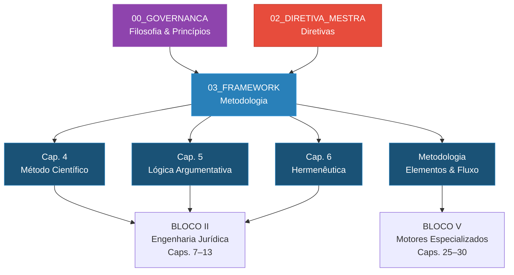

# 📁 03_FRAMEWORK — Framework Metodológico do SJIF

> **Sigma—Juris Intelligence Framework (SJIF)**
> Módulo de Metodologia, Lógica e Hermenêutica

## Descrição

O diretório `03_FRAMEWORK` reúne os capítulos que definem o **arcabouço metodológico** do SJIF. Aqui estão as ferramentas intelectuais e analíticas que transformam a governança (Bloco 00) e as diretivas (Bloco 02) em prática jurídica estruturada: o método científico aplicado ao Direito, a lógica jurídica e engenharia argumentativa, e a hermenêutica jurídica avançada.

## 📋 Conteúdo do Diretório

### Capítulos

| Arquivo | Descrição | Capítulo |
|---|---|---|
| [cap04_metodo_cientifico.md](./cap04_metodo_cientifico.md) | Método Científico Aplicado ao Direito | Capítulo 4 |
| [cap05_logica_argumentativa.md](./cap05_logica_argumentativa.md) | Lógica Jurídica e Engenharia Argumentativa | Capítulo 5 |
| [cap06_hermeneutica.md](./cap06_hermeneutica.md) | Hermenêutica Jurídica Avançada | Capítulo 6 |

### Metodologia

| Arquivo | Descrição |
|---|---|
| [metodologia/separacao_elementos.md](./metodologia/separacao_elementos.md) | Os 9 tipos de elementos jurídicos com definições detalhadas |
| [metodologia/fluxo_analise.md](./metodologia/fluxo_analise.md) | Fluxo completo de análise: da demanda ao resultado final |

## 🔗 Relação com Outros Módulos

## 📖 Capítulos Relacionados

- **Capítulo 1** — Governança e filosofia que originam o framework
- **Capítulo 2** — Diretiva Mestra que o framework operacionaliza
- **Capítulo 3** — Kernel Jurídico que orquestra a aplicação do framework
- **Capítulos 7–13** — Engenharia Jurídica que implementa o framework na prática
- **Capítulo 23** — Motor de Coerência como validador do framework

## 🧠 Conceito Central

O Framework Metodológico é a **ponte entre a filosofia e a prática**:

1. O **Método Científico** (Cap. 4) fornece a disciplina de investigação
2. A **Lógica Argumentativa** (Cap. 5) fornece a ferramenta de raciocínio
3. A **Hermenêutica** (Cap. 6) fornece a técnica de interpretação
4. A **Separação de Elementos** garante precisão conceitual
5. O **Fluxo de Análise** integra tudo em um processo operacional

---
> Sigma—Juris Intelligence Framework (SJIF) v1.0 | Propriedade de Charles de Paula Eugênio — Sigma Sihf Soluções Analíticas Ltda
