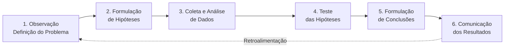

# Capítulo 4: Método Científico Aplicado ao Direito

> **BLOCO I — FUNDAMENTOS** | Sigma—Juris Intelligence Framework (SJIF)

---

## 4.1 A Necessidade do Método Científico no Direito

O Direito, embora tradicionalmente associado às ciências humanas e sociais, beneficia-se enormemente da aplicação de um rigoroso método científico. Em um cenário jurídico cada vez mais complexo, com volume crescente de informações, normas e precedentes, a intuição e a experiência isoladas tornam-se insuficientes.

O **Método Científico Aplicado ao Direito**, no contexto do Juris Intelligence Framework (JIF), visa introduzir uma abordagem **sistemática, empírica e verificável** para a análise e resolução de problemas jurídicos.

> O método não busca transformar o Direito em ciência exata, mas sim aprimorar a racionalidade, a objetividade e a verificabilidade das análises e decisões.

---

## 4.2 Definição e Importância no Contexto Jurídico

### Definição

O **Método Científico** é um conjunto de procedimentos sistemáticos para adquirir conhecimento, caracterizado por:
- **Observação** — identificação de fenômenos e problemas
- **Formulação de hipóteses** — proposição de explicações ou soluções testáveis
- **Experimentação / Coleta de dados** — busca de evidências
- **Análise** — processamento e interpretação dos dados
- **Conclusão** — formulação de resultados verificáveis e replicáveis

### Importância

| Benefício | Descrição |
|---|---|
| **Aumento da Objetividade** | Reduz a subjetividade na interpretação e aplicação do Direito, promovendo análises mais imparciais |
| **Rigor na Análise** | Garante que todas as etapas da investigação jurídica sejam conduzidas com precisão e atenção aos detalhes |
| **Verificabilidade** | Permite que as conclusões sejam testadas e validadas por outros profissionais, aumentando a credibilidade |
| **Identificação de Padrões** | Facilita a descoberta de tendências em jurisprudência, doutrina e legislação, auxiliando na previsão de resultados |
| **Fundamentação Robusta** | Fornece base sólida para a argumentação, tornando-a mais persuasiva e resistente a contestações |
| **Inovação** | Abre caminho para a integração de novas ferramentas e tecnologias, como IA, na prática jurídica |

---

## 4.3 As 6 Etapas do Método Científico Adaptado ao Direito

As etapas do método científico, adaptadas ao contexto jurídico, fornecem um **roteiro estruturado** para a investigação e análise:

### Etapa 1: Observação e Definição do Problema

Identificação clara da **questão jurídica** a ser resolvida:

- Coleta inicial de fatos, documentos, normas e precedentes relevantes
- Delimitação precisa do problema jurídico
- Identificação das partes, interesses e contexto
- **Aplicação da Diretiva Mestra**: nenhuma linha ignorada, nenhuma prova omitida

> Esta etapa é o alicerce de toda a análise. Um problema mal definido conduz inevitavelmente a conclusões inadequadas.

### Etapa 2: Formulação de Hipóteses

Desenvolvimento de **possíveis soluções ou teses jurídicas**:

- As hipóteses devem ser **testáveis** e baseadas no conhecimento jurídico existente
- Formulação de múltiplas hipóteses para explorar diferentes cenários
- Vinculação de cada hipótese aos fatos observados
- Documentação clara das premissas de cada hipótese

> A formulação de hipóteses é o momento criativo da análise, onde a experiência jurídica se combina com o rigor metodológico.

### Etapa 3: Coleta e Análise de Dados (Evidências)

Esta é a fase **mais intensiva** em termos de pesquisa, envolvendo a busca exaustiva por:

| Tipo de Dado | Fontes | Motor/Módulo do JIF |
|---|---|---|
| **Fatos** | Reconstrução detalhada dos eventos, utilizando todas as provas | Engenharia da Prova (Cap. 8) |
| **Normas** | Leis, regulamentos, princípios aplicáveis | Motor Normativo (Cap. 26) |
| **Jurisprudência** | Decisões, súmulas, precedentes | Motor Jurisprudencial (Cap. 26) |
| **Doutrina** | Obras de juristas, artigos, pareceres | Motor Doutrinário (Cap. 26) |
| **Evidências Empíricas** | Dados quantitativos/qualitativos (estatísticas, estudos) | Modelos Matemáticos (Cap. 29) |

### Etapa 4: Teste das Hipóteses

**Confronto** das hipóteses formuladas com os dados coletados:

- Utilização da **lógica jurídica** e da **engenharia argumentativa** (Cap. 5) para verificar validade e robustez
- Aplicação do **Motor de Coerência Jurídica** (Cap. 23) para avaliar aderência entre fatos, provas, fundamentos e pedidos
- Verificação de cada hipótese contra os dados disponíveis
- Eliminação de hipóteses refutadas e fortalecimento das confirmadas

### Etapa 5: Formulação de Conclusões

Com base nos resultados do teste das hipóteses:

- Conclusões **claras, objetivas** e diretamente suportadas pelas evidências
- Fundamentação lógica explícita
- Identificação de limitações e ressalvas
- Diferenciação entre conclusões fortes (alta confiança) e provisórias (dados insuficientes)

### Etapa 6: Comunicação dos Resultados

Apresentação das conclusões e recomendações:

- Utilização de **templates e briefings** do JIF (Caps. 32–33) para estruturar a informação
- Clareza e precisão na linguagem
- Suporte com **indicadores e modelos matemáticos** (Cap. 29) para quantificar riscos e probabilidades
- Rastreabilidade completa das fontes e do processo analítico

---

## 4.4 Aplicação Prática em Casos Jurídicos

A aplicação do método científico não é um exercício puramente acadêmico, mas uma **ferramenta prática**. Exemplo de fluxo guiado pelo JIF:

| Etapa | Exemplo Prático |
|---|---|
| **Problema** | Cliente enfrenta ação judicial com múltiplos réus e diversas teses de defesa |
| **Hipóteses** | Formulação de teses para cada réu e para a defesa, considerando diferentes cenários de prova |
| **Coleta de Dados** | Motores de pesquisa (normativa, jurisprudencial, doutrinária) + Engenharia da Prova + MJF para análise documental integral e engenharia reversa |
| **Teste** | Motor de Coerência avalia solidez de cada tese; simulação do julgador e da parte contrária (Cap. 25) testa resiliência da argumentação |
| **Conclusão** | Determinação da tese mais robusta e das estratégias mais eficazes |
| **Comunicação** | Parecer ou petição utilizando templates do JIF, com indicadores e modelos matemáticos (Cap. 29) |

---

## 4.5 O Método Científico como Diferencial

Ao adotar o Método Científico Aplicado ao Direito, o JIF **eleva a prática jurídica** a um novo patamar de:

- **Rigor** — cada conclusão é fundamentada em evidências
- **Objetividade** — o método reduz vieses e subjetividade
- **Eficácia** — análises estruturadas produzem resultados mais consistentes
- **Replicabilidade** — outros profissionais podem verificar e reproduzir o processo

> O método transforma a *arte da argumentação* em *ciência da inteligência jurídica*.

---

## Referências Cruzadas

| Capítulo | Relação |
|---|---|
| [Cap. 1 — Governança](../00_GOVERNANCA/cap01_governanca_filosofia.md) | Princípio de rigor metodológico |
| [Cap. 2 — Diretiva Mestra](../00_GOVERNANCA/cap02_diretiva_mestra.md) | Exigências de exaustividade na coleta de dados |
| [Cap. 5 — Lógica Argumentativa](./cap05_logica_argumentativa.md) | Ferramentas para teste de hipóteses |
| [Cap. 6 — Hermenêutica](./cap06_hermeneutica.md) | Interpretação aplicada na análise de dados |
| [Cap. 23 — Motor de Coerência](../04_MOTORES/) | Validação automatizada |
| [Cap. 25 — Módulo Jurídico Forense](../04_MOTORES/) | Aplicação prática do método |
| [Cap. 29 — Modelos Matemáticos](../10_MODELOS_MATEMATICOS/) | Quantificação e modelagem |
| [Fluxo de Análise](./metodologia/fluxo_analise.md) | Integração com o fluxo operacional |

---
> Sigma—Juris Intelligence Framework (SJIF) v1.0 | Propriedade de Charles de Paula Eugênio — Sigma Sihf Soluções Analíticas Ltda
