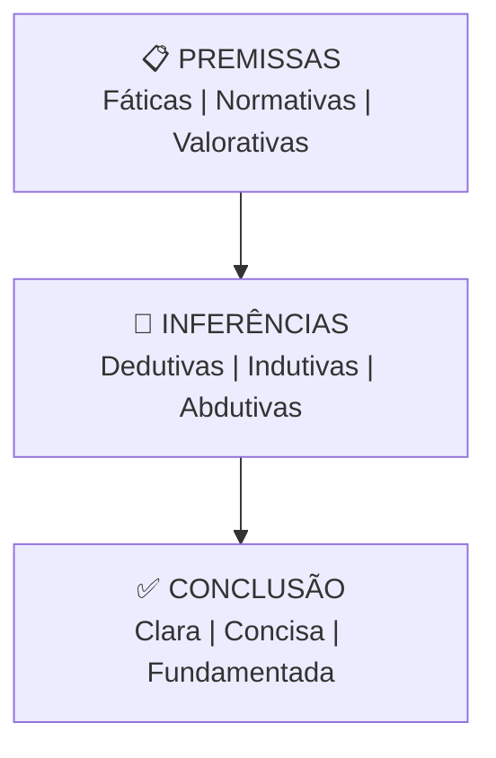

# Capítulo 5: Lógica Jurídica e Engenharia Argumentativa

> **BLOCO I — FUNDAMENTOS** | Sigma—Juris Intelligence Framework (SJIF)

---

## 5.1 A Essência da Lógica no Raciocínio Jurídico

A lógica é a **espinha dorsal** de qualquer sistema de pensamento coerente, e no Direito, sua aplicação é fundamental para a construção de argumentos sólidos e a tomada de decisões justas.

A Lógica Jurídica não se restringe à mera aplicação de regras formais, mas abrange a capacidade de estruturar o raciocínio de forma **clara, consistente e persuasiva**, conectando fatos, normas e valores.

No contexto do JIF, a Lógica Jurídica e a Engenharia Argumentativa são ferramentas essenciais para transformar informações brutas em **inteligência acionável**, garantindo que as conclusões sejam não apenas corretas, mas também convincentes.

---

## 5.2 Princípios da Lógica Formal e Informal no Direito

### 5.2.1 Lógica Formal

A **Lógica Formal** lida com a **estrutura** do raciocínio, independentemente do conteúdo. Ela busca garantir a **validade das inferências** — que a conclusão decorra necessariamente das premissas.

#### Silogismo Jurídico

A forma mais comum de raciocínio dedutivo no Direito:

```
Premissa Maior (Norma):    Todo homicídio é punível com pena de reclusão.
Premissa Menor (Fato):     João cometeu homicídio.
Conclusão (Aplicação):     João é punível com pena de reclusão.
```

#### Princípios Fundamentais

| Princípio | Definição | Aplicação no Direito |
|---|---|---|
| **Não Contradição** | Uma proposição não pode ser verdadeira e falsa ao mesmo tempo | Busca por coerência interna nas decisões e argumentos |
| **Terceiro Excluído** | Uma proposição é verdadeira ou falsa, sem terceira opção | Delimita possibilidades em disputas jurídicas |
| **Identidade** | Uma coisa é idêntica a si mesma | Garante estabilidade de conceitos e termos jurídicos |

### 5.2.2 Lógica Informal

A **Lógica Informal** (ou retórica) concentra-se na **persuasão e plausibilidade** dos argumentos em contextos práticos. Ela considera conteúdo, público e contexto.

#### Tipos de Argumentos

| Tipo | Descrição | Uso no Direito |
|---|---|---|
| **Analogia** | Comparar caso atual com caso anterior semelhante | Amplamente utilizado na jurisprudência |
| **Autoridade** | Basear-se na opinião de especialistas ou precedentes superiores | Citação de doutrina e jurisprudência |
| **Consequência** | Avaliar ação/decisão com base em resultados esperados | Argumentação teleológica |
| **Ad Hominem** | Questionar a credibilidade da pessoa | Impugnação de testemunhas (em contexto) |

#### Falácias Lógicas

Identificação de **erros no raciocínio** que comprometem validade ou persuasão:

- **Falácia de falsa causa** — correlação não implica causalidade
- **Falácia de composição** — o que vale para a parte não vale necessariamente para o todo
- **Falácia de apelo à emoção** — argumentar com emoção em vez de lógica
- **Falácia de espantalho** — distorcer o argumento da parte contrária para refutá-lo
- **Petição de princípio** — usar como premissa o que se pretende provar

> O Motor de Coerência Jurídica (Cap. 23) busca identificar e mitigar falácias automaticamente.

---

## 5.3 Estrutura de Argumentos Jurídicos

Um argumento jurídico bem construído é composto por **elementos interligados** que levam a uma conclusão lógica e persuasiva.

### Os 3 Componentes



### 1. Premissas

As proposições que servem de **base** para o argumento:

| Tipo | Descrição | Exemplo |
|---|---|---|
| **Fáticas** | Eventos e circunstâncias comprovados por provas | "O contrato foi assinado em 15/03/2025" |
| **Normativas** | Leis, regulamentos, princípios aplicáveis | "Art. 421 do CC: função social do contrato" |
| **Valorativas** | Princípios éticos, morais ou de justiça | "O princípio da boa-fé objetiva" |

### 2. Inferências

Os **passos lógicos** que conectam premissas à conclusão:

| Tipo | Descrição | Confiança |
|---|---|---|
| **Dedutivas** | Conclusão necessária (se premissas verdadeiras, conclusão obrigatória) | Alta |
| **Indutivas** | Conclusão provável (baseada em padrões observados) | Média |
| **Abdutivas** | Melhor explicação para os fatos observados | Variável |

### 3. Conclusão

A proposição final que se pretende demonstrar:
- Deve ser **clara e concisa**
- Deve ser **diretamente suportada** pelas premissas e inferências
- Deve ter **aplicabilidade prática** (pedido, recomendação, parecer)

---

## 5.4 Técnicas de Engenharia Argumentativa

A Engenharia Argumentativa é a **arte e ciência** de construir e desconstruir argumentos jurídicos de forma estratégica.

### 5.4.1 Construção de Teses

| Técnica | Descrição |
|---|---|
| **Análise de Pontos Fortes e Fracos** | Identificação das evidências e normas que favorecem ou desfavorecem a tese, usando o Motor de Coerência |
| **Hierarquização de Argumentos** | Organização em ordem de força e relevância — os mais impactantes primeiro |
| **Argumentos Subsidiários** | Criação de teses alternativas caso a principal seja rejeitada — flexibilidade estratégica |
| **Uso de Precedentes e Doutrina** | Integração estratégica para fortalecer autoridade e persuasão |
| **Narrativa Coerente** | Construção de história clara e lógica dos fatos, alinhada com a tese jurídica |

### 5.4.2 Refutação de Argumentos

| Técnica | Descrição |
|---|---|
| **Identificação de Falácias** | Motor de Coerência detecta erros lógicos, contradições ou omissões nos argumentos adversários |
| **Contestação de Premissas Fáticas** | Contraprovas ou questionamento da validade das provas adversárias |
| **Contestação de Premissas Normativas** | Inaplicabilidade da norma, interpretação equivocada, norma mais específica |
| **Ataque às Inferências** | Demonstrar que a conclusão não decorre logicamente das premissas |
| **Engenharia Reversa da Decisão** (Cap. 11) | Análise de vulnerabilidades de decisões anteriores |
| **Simulação da Parte Contrária** (Cap. 25) | Antecipação de argumentos adversários para preparar refutações |

---

## 5.5 A Lógica e a Engenharia Argumentativa como Diferencial

Ao integrar a Lógica Jurídica e a Engenharia Argumentativa, o JIF proporciona uma estrutura poderosa para:

- **Aprimorar a qualidade** das análises jurídicas
- **Aumentar a eficácia** das intervenções profissionais
- **Construir argumentos robustos** que resistam a contestações
- **Refutar teses adversas** com precisão lógica
- **Elevar o nível** do debate jurídico com rigor e persuasão

> A capacidade de construir e desconstruir argumentos com precisão lógica é um **diferencial competitivo** que o JIF oferece aos profissionais do direito.

---

## Referências Cruzadas

| Capítulo | Relação |
|---|---|
| [Cap. 1 — Governança](../00_GOVERNANCA/cap01_governanca_filosofia.md) | Princípio de coerência lógica |
| [Cap. 2 — Diretiva Mestra](../00_GOVERNANCA/cap02_diretiva_mestra.md) | Separação rigorosa de elementos |
| [Cap. 4 — Método Científico](./cap04_metodo_cientifico.md) | Teste de hipóteses usa lógica |
| [Cap. 6 — Hermenêutica](./cap06_hermeneutica.md) | Interpretação como forma de argumento |
| [Cap. 9 — Engenharia da Fundamentação](../03_FRAMEWORK/) | Construção de fundamentação robusta |
| [Cap. 11 — Engenharia Reversa](../03_FRAMEWORK/) | Desconstrução de decisões |
| [Cap. 23 — Motor de Coerência](../04_MOTORES/) | Detecção automatizada de falácias |
| [Cap. 25 — MJF](../04_MOTORES/) | Simulação da parte contrária |
| [Separação de Elementos](./metodologia/separacao_elementos.md) | Premissas vs. inferências vs. conclusões |

---
> Sigma—Juris Intelligence Framework (SJIF) v1.0 | Propriedade de Charles de Paula Eugênio — Sigma Sihf Soluções Analíticas Ltda
