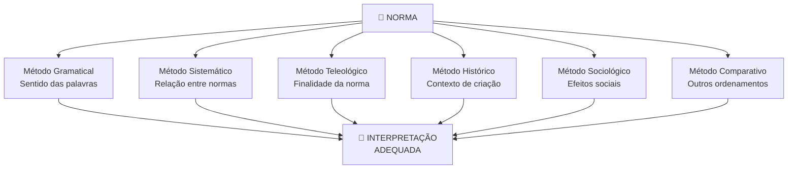
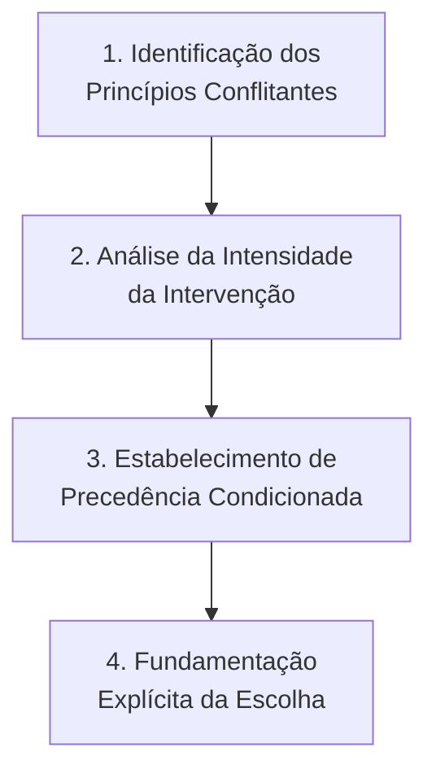

# Capítulo 6: Hermenêutica Jurídica Avançada

> **BLOCO I — FUNDAMENTOS** | Sigma—Juris Intelligence Framework (SJIF)

---

## 6.1 A Essência da Hermenêutica no Direito

A hermenêutica jurídica é a **arte e a ciência da interpretação** do Direito. Em um sistema jurídico dinâmico e complexo, a mera leitura literal das normas é insuficiente para capturar seu verdadeiro sentido e alcance.

A **Hermenêutica Jurídica Avançada**, no contexto do JIF, busca aprofundar as técnicas e teorias interpretativas, capacitando o profissional do direito a **desvendar o significado** das disposições legais, dos precedentes e dos fatos, de forma a aplicá-los de maneira justa e eficaz.

---

## 6.2 Teorias da Interpretação Jurídica

As teorias da interpretação fornecem as **bases filosóficas e metodológicas** para compreender como o Direito deve ser interpretado:

### Quadro Comparativo

| Teoria | Foco | Descrição | Limitação |
|---|---|---|---|
| **Subjetiva (Voluntarista)** | Intenção do legislador | Busca a vontade do criador da norma no momento de sua edição | Dificuldade de determinar a real intenção; contexto social muda |
| **Objetiva (Objetivista)** | Sentido autônomo da norma | O sentido da norma evolui com o tempo e as mudanças sociais, desvinculando-se do legislador | Pode levar a interpretações distantes do texto |
| **Mista** | Equilíbrio | Combina intenção do legislador com contexto social contemporâneo | Dificuldade de definir o ponto de equilíbrio |
| **Resposta Correta (Dworkin)** | Integridade do Direito | Em casos difíceis, existe uma resposta correta, descoberta por interpretação construtiva que busca a melhor justificação moral e política | Idealismo; pressupõe juiz "Hércules" |
| **Argumentação Jurídica (Alexy/MacCormick)** | Justificação racional | A correção reside na capacidade de justificação por argumentos racionais e aceitáveis na comunidade jurídica | Depende do conceito de "aceitável" |

---

## 6.3 Métodos de Interpretação: Ferramentas Práticas

Os métodos de interpretação são as **ferramentas práticas** para extrair o sentido das normas. O JIF emprega uma **abordagem multifacetada**, reconhecendo que nenhum método isolado é suficiente.

### Os 6 Métodos Interpretativos

#### 1. Método Gramatical (ou Literal)

- **Foco**: Sentido das palavras e estrutura sintática da norma
- **Função**: Ponto de partida da interpretação
- **Limitação**: Raramente suficiente por si só, devido à ambiguidade e polissemia da linguagem
- **Quando usar**: Sempre, como base inicial; decisivo quando o texto é claro e inequívoco

#### 2. Método Sistemático

- **Foco**: Relação da norma com outras normas do ordenamento jurídico
- **Função**: Busca harmonização e coerência no sistema como um todo orgânico
- **Limitação**: Complexidade do sistema pode dificultar a análise completa
- **Quando usar**: Quando o sentido literal gera ambiguidade ou conflito com outras normas

#### 3. Método Teleológico (ou Finalístico)

- **Foco**: Finalidade ou propósito da norma — o bem jurídico protegido
- **Função**: Adaptar a norma a novas realidades, buscando sua razão de existir
- **Limitação**: Pode levar a interpretações extensivas controversas
- **Quando usar**: Quando a aplicação literal geraria resultado contrário à finalidade da norma

#### 4. Método Histórico

- **Foco**: Condições históricas e sociais da criação da norma e sua evolução
- **Função**: Compreender contexto original e intenções subjacentes
- **Limitação**: O contexto histórico pode já não ser relevante
- **Quando usar**: Para compreender a ratio legis original, especialmente em normas antigas

#### 5. Método Sociológico

- **Foco**: Efeitos sociais da aplicação da norma
- **Função**: Buscar interpretação que promova justiça social e se adeque à sociedade contemporânea
- **Limitação**: Pode substituir o Direito por política ou sociologia
- **Quando usar**: Quando há necessidade de adaptar a norma à realidade social atual

#### 6. Método Comparativo

- **Foco**: Como questões semelhantes são tratadas em outros ordenamentos jurídicos
- **Função**: Inspiração e soluções para problemas interpretativos internos
- **Limitação**: Diferenças entre sistemas jurídicos podem limitar a transposição
- **Quando usar**: Em questões novas sem precedentes no direito nacional

---

## 6.4 Hermenêutica Constitucional e Interpretação de Princípios

### 6.4.1 Particularidades da Hermenêutica Constitucional

A Hermenêutica Constitucional possui particularidades devido à natureza das normas constitucionais:

- São mais **abertas e principiológicas**
- Possuem maior **carga valorativa**
- Têm **força normativa suprema**
- Servem como **fundamento** de todo o ordenamento jurídico

### 6.4.2 Princípios da Hermenêutica Constitucional

| Princípio | Descrição | Implicação Prática |
|---|---|---|
| **Unidade da Constituição** | A CF deve ser interpretada como um todo coeso e harmônico | Evitar contradição entre normas constitucionais |
| **Máxima Efetividade** | Direitos fundamentais devem ter a maior efetividade possível | Interpretação expansiva de garantias fundamentais |
| **Força Normativa** | A CF é norma jurídica suprema com efeitos diretos | Aplicabilidade imediata dos direitos fundamentais |
| **Conformidade Funcional** | Respeitar o esquema organizatório-funcional da CF | Não subverter a separação de poderes |
| **Proporcionalidade** | Medidas restritivas devem ser adequadas, necessárias e proporcionais | Ponderação em caso de conflito entre direitos |

### 6.4.3 Interpretação de Princípios e Ponderação

Os **Princípios Jurídicos** possuem caráter mais aberto e abstrato que as regras, exigindo técnica interpretativa específica: a **ponderação**.

#### Processo de Ponderação

1. **Identificação dos Princípios Conflitantes** — Reconhecer quais princípios estão em tensão
2. **Análise da Intensidade da Intervenção** — Avaliar o grau em que cada princípio é afetado
3. **Estabelecimento de Precedência Condicionada** — Definir qual princípio prevalece nas circunstâncias específicas do caso
4. **Fundamentação Explícita** — Justificar a escolha de forma transparente e auditável

> ⚠️ **Regra crítica**: A ponderação não estabelece hierarquia abstrata entre princípios. A prevalência é sempre condicionada ao **caso concreto**.

> O **Modelo de Ponderação** (Cap. 29) fornece ferramentas matemáticas para auxiliar neste processo.

---

## 6.5 A Hermenêutica como Pilar da Inteligência Jurídica

No JIF, a Hermenêutica Jurídica Avançada é um **pilar essencial** porque:

- Fornece ferramentas para interpretação **profunda e contextualizada** de normas e fatos
- Permite que o sistema não apenas identifique a lei aplicável, mas compreenda seu **espírito e finalidade**
- Garante que as análises sejam **robustas, justas e alinhadas** com os valores fundamentais do Direito
- A capacidade de aplicar **diferentes métodos e teorias** assegura flexibilidade e profundidade
- A competência em **hermenêutica constitucional e ponderação** é essencial para questões complexas

---

## Referências Cruzadas

| Capítulo | Relação |
|---|---|
| [Cap. 1 — Governança](../00_GOVERNANCA/cap01_governanca_filosofia.md) | Princípio de adaptabilidade |
| [Cap. 2 — Diretiva Mestra](../00_GOVERNANCA/cap02_diretiva_mestra.md) | Separação entre norma e interpretação |
| [Cap. 4 — Método Científico](./cap04_metodo_cientifico.md) | Hermenêutica na etapa de análise |
| [Cap. 5 — Lógica Argumentativa](./cap05_logica_argumentativa.md) | Lógica como ferramenta interpretativa |
| [Cap. 9 — Engenharia da Fundamentação](../03_FRAMEWORK/) | Interpretação na fundamentação |
| [Cap. 14 — Pesquisa Legislativa](../03_FRAMEWORK/) | Vigência e aplicabilidade de normas |
| [Cap. 29 — Modelos Matemáticos](../10_MODELOS_MATEMATICOS/) | Modelo de Ponderação |
| [Diretiva Constitucional](../02_DIRETIVA_MESTRA/diretiva_constitucional.md) | Hermenêutica constitucional aplicada |

---
> Sigma—Juris Intelligence Framework (SJIF) v1.0 | Propriedade de Charles de Paula Eugênio — Sigma Sihf Soluções Analíticas Ltda
