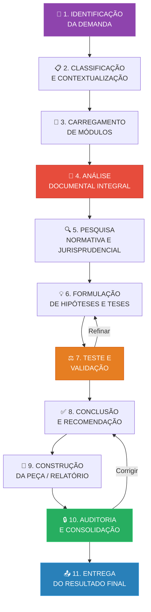

# Fluxo de Análise — Da Demanda ao Resultado Final

> **03_FRAMEWORK / Metodologia** | Sigma—Juris Intelligence Framework (SJIF)

---

## Propósito

Este documento descreve o **fluxo completo de análise** do SJIF, desde a identificação inicial da demanda até a entrega do resultado final. Ele integra as funções do Kernel Jurídico (Cap. 3), as diretivas da Diretiva Mestra (Cap. 2), o método científico (Cap. 4), a lógica argumentativa (Cap. 5) e a hermenêutica (Cap. 6) em um **processo operacional unificado**.

---

## Visão Geral do Fluxo

---

## Etapas Detalhadas

### Etapa 1: Identificação da Demanda

**Responsável**: Kernel Principal (Cap. 3)

**Objetivo**: Receber e interpretar a solicitação inicial.

**Atividades**:
- Recepção da solicitação (análise de processo, parecer, auditoria, pesquisa, etc.)
- Compreensão do **objetivo** e do **contexto** da tarefa
- Identificação do tipo de entrega esperada (petição, recurso, parecer, relatório, etc.)
- Registro da demanda no sistema

**Saída**: Demanda registrada e compreendida.

---

### Etapa 2: Classificação e Contextualização

**Responsável**: Kernel Principal (Cap. 3)

**Objetivo**: Classificar a demanda e identificar o contexto jurídico.

**Atividades**:

| Identificação | Pergunta | Exemplo |
|---|---|---|
| **Ramo Jurídico** | Qual área do Direito? | Civil, Tributário, Trabalhista, Ambiental |
| **Procedimento** | Qual tipo de procedimento? | Judicial, Administrativo, Arbitral, Consultivo |
| **Objetivo** | Qual resultado esperado? | Ganhar causa, Negociar, Reduzir danos, Anular decisão |
| **Fase** | Qual estágio atual? | Inicial, Instrutória, Recursal, Execução |
| **Urgência** | Qual o prazo? | Imediato, Curto, Médio, Longo prazo |

**Saída**: Demanda classificada com ramo, procedimento, objetivo e contexto definidos.

---

### Etapa 3: Carregamento de Módulos

**Responsável**: Kernel Principal + Kernels Especializados (Cap. 3)

**Objetivo**: Ativar os módulos necessários para processar a demanda.

**Atividades**:
- Seleção dos **Kernels Especializados** relevantes (Processual, Tributário, etc.)
- Ativação dos **Motores** necessários (Normativo, Jurisprudencial, Probatório, etc.)
- Carregamento das **Bibliotecas** pertinentes (Jurídica, Briefings, Templates)
- Configuração dos **Checklists** aplicáveis (Cap. 34)
- Definição dos **Indicadores** a monitorar (Cap. 35)

**Saída**: Módulos carregados e configurados para a demanda específica.

---

### Etapa 4: Análise Documental Integral

**Responsável**: Motor Probatório (Cap. 26) + Engenharia da Prova (Cap. 8)

**Objetivo**: Analisar exaustivamente todos os documentos disponíveis.

**Aplicação da Diretiva Mestra**:
- ✅ Regra 1: Nenhuma linha ignorada
- ✅ Regra 2: Nenhuma prova omitida
- ✅ Regra 3: Nenhuma decisão ignorada
- ✅ Regra 5: Nenhum resumo sem autorização

**Atividades**:
1. **Coleta exaustiva** de todos os documentos
2. **Leitura linha por linha** de cada documento
3. **Extração de elementos**: fatos, datas, nomes, valores, termos técnicos
4. **Classificação das provas**: por fonte, objeto, forma e produção
5. **Mapeamento de informações**: interligação entre documentos, fatos, partes e normas
6. **Verificação cruzada**: confronto entre fontes para identificar inconsistências
7. **Registro de observações**: anotação de pontos de atenção

**Separação de Elementos** (conforme [separacao_elementos.md](./separacao_elementos.md)):
- Fatos identificados e catalogados
- Provas classificadas e valoradas
- Decisões anteriores analisadas

**Saída**: Mapa completo do caso com todos os elementos separados e classificados.

---

### Etapa 5: Pesquisa Normativa e Jurisprudencial

**Responsável**: Motores Normativo, Jurisprudencial e Doutrinário (Cap. 26)

**Objetivo**: Identificar todas as normas, jurisprudência e doutrina aplicáveis.

**Aplicação da Diretiva Mestra**:
- ✅ Regra 4: Nenhuma jurisprudência relevante omitida

**Atividades**:

| Pesquisa | Escopo | Motor |
|---|---|---|
| **Legislativa** | Leis, códigos, regulamentos, vigência, hierarquia | Motor Normativo |
| **Jurisprudencial** | Tribunais competentes, superiores, súmulas, temas repetitivos | Motor Jurisprudencial |
| **Doutrinária** | Autores de referência, correntes majoritárias/minoritárias | Motor Doutrinário |
| **Comparada** | Outros ordenamentos (quando pertinente) | Motor Normativo |

**Saída**: Base normativa, jurisprudencial e doutrinária completa para o caso.

---

### Etapa 6: Formulação de Hipóteses e Teses

**Responsável**: Kernel Estratégico (Cap. 3) + Engenharia Argumentativa (Cap. 5)

**Objetivo**: Formular e hierarquizar teses jurídicas.

**Atividades**:
1. **Formulação de hipóteses** baseadas nos fatos e na pesquisa realizada
2. **Construção da melhor tese** — argumento principal mais robusto
3. **Construção da segunda melhor tese** — alternativa forte
4. **Construção de teses subsidiárias** — posições de fallback
5. **Hierarquização de argumentos** — do mais forte ao mais fraco
6. **Identificação de pontos fortes e fracos** de cada tese
7. **Antecipação de contra-argumentos** — simulação da parte contrária

**Saída**: Teses formuladas e hierarquizadas com planos A, B e C.

---

### Etapa 7: Teste e Validação

**Responsável**: Motor de Coerência (Cap. 23) + Lógica Argumentativa (Cap. 5)

**Objetivo**: Testar a robustez das teses e validar a análise.

**Atividades**:

| Teste | Descrição | Ferramenta |
|---|---|---|
| **Coerência Interna** | Ausência de contradições nos argumentos | Motor de Coerência |
| **Coerência Externa** | Alinhamento com ordenamento e jurisprudência | Motor de Coerência |
| **Aderência Fático-Probatória** | Fatos sustentados por provas | Motor Probatório |
| **Consistência Normativo-Argumentativa** | Normas correspondem aos argumentos | Motor Normativo |
| **Simulação do Julgador** | Antecipação do posicionamento provável | Motor Decisório (Cap. 24) |
| **Simulação da Parte Contrária** | Teste de resiliência da argumentação | MJF (Cap. 25) |
| **Identificação de Falácias** | Detecção de erros lógicos | Lógica Formal (Cap. 5) |

**Decisão**: Se os testes revelarem fragilidades, **retornar à Etapa 6** para refinamento.

**Saída**: Teses validadas e aprovadas para construção da peça.

---

### Etapa 8: Conclusão e Recomendação

**Responsável**: Kernel Principal (Cap. 3)

**Objetivo**: Formular conclusões fundamentadas e recomendações acionáveis.

**Atividades**:
1. **Formulação de conclusões** — claras, objetivas, fundamentadas
2. **Formulação de recomendações** — ações sugeridas com base nas conclusões
3. **Análise de riscos** — riscos de cada recomendação (Cap. 20)
4. **Quantificação** — uso de modelos matemáticos quando aplicável (Cap. 29)
5. **Priorização** — ordenamento das recomendações por importância e urgência

**Saída**: Conclusões e recomendações documentadas.

---

### Etapa 9: Construção da Peça / Relatório

**Responsável**: Motor de Fundamentação (Cap. 26) + Templates (Cap. 33)

**Objetivo**: Produzir o documento final (petição, recurso, parecer, relatório, etc.).

**Atividades**:
1. **Seleção do template** adequado ao tipo de peça
2. **Estruturação da fundamentação** seguindo a Engenharia da Fundamentação (Cap. 9)
3. **Redação** com clareza, precisão e persuasão
4. **Integração de referências** — normas, jurisprudência, doutrina
5. **Inclusão de indicadores** e dados quantitativos quando pertinente
6. **Formatação** conforme padrões profissionais e exigências do tribunal

**Saída**: Peça ou relatório redigido e formatado.

---

### Etapa 10: Auditoria e Consolidação

**Responsável**: Motor de Auditoria (Cap. 26) + Diretiva de Auditoria

**Objetivo**: Verificar a qualidade e conformidade do produto final.

**Atividades**:

| Verificação | Critério |
|---|---|
| **Conformidade com Diretiva Mestra** | Todas as 5 regras invioláveis atendidas? |
| **Completude** | Todos os elementos foram abordados? |
| **Coerência** | Ausência de contradições e saltos argumentativos? |
| **Fundamentação** | Todas as afirmações estão fundamentadas? |
| **Rastreabilidade** | Fontes e referências são verificáveis? |
| **Qualidade Redacional** | Linguagem clara, precisa e persuasiva? |
| **Checklist Final** | Todos os itens do checklist pertinente foram cumpridos? |

**Decisão**: Se a auditoria identificar falhas, **retornar à Etapa 8 ou 9** para correção.

**Saída**: Produto final auditado e aprovado.

---

### Etapa 11: Entrega do Resultado Final

**Responsável**: Kernel Principal (Cap. 3)

**Objetivo**: Entregar o resultado consolidado ao solicitante.

**Atividades**:
1. **Consolidação** — integração de todos os resultados parciais
2. **Empacotamento** — organização do produto final com anexos e referências
3. **Registro** — documentação da entrega para controle de versões
4. **Feedback** — coleta de retorno para melhoria contínua
5. **Arquivamento** — preservação do caso no grafo de conhecimento (Cap. 28)

**Saída**: Resultado final entregue e registrado.

---

## Quadro Resumo do Fluxo

| Etapa | Responsável Principal | Diretivas Aplicáveis | Saída |
|---|---|---|---|
| 1. Identificação | Kernel Principal | — | Demanda registrada |
| 2. Classificação | Kernel Principal | — | Demanda classificada |
| 3. Carregamento | Kernel + Especializados | — | Módulos configurados |
| 4. Análise Documental | Motor Probatório | Regras 1, 2, 3, 5 | Mapa do caso |
| 5. Pesquisa | Motores de Pesquisa | Regra 4 | Base completa |
| 6. Hipóteses/Teses | Kernel Estratégico | Dir. Estratégica | Teses hierarquizadas |
| 7. Teste/Validação | Motor de Coerência | Todas | Teses validadas |
| 8. Conclusão | Kernel Principal | Dir. Processual | Conclusões e recomendações |
| 9. Construção | Motor de Fundamentação | Dir. Probatória, Doutrinária | Peça redigida |
| 10. Auditoria | Motor de Auditoria | Dir. Auditoria | Produto aprovado |
| 11. Entrega | Kernel Principal | — | Resultado final |

---

## Referências Cruzadas

| Documento | Relação |
|---|---|
| [Cap. 2 — Diretiva Mestra](../../00_GOVERNANCA/cap02_diretiva_mestra.md) | Regras aplicadas em cada etapa |
| [Cap. 3 — Kernel Jurídico](../../01_KERNEL/) | Orquestrador do fluxo |
| [Cap. 4 — Método Científico](../cap04_metodo_cientifico.md) | As 6 etapas integradas no fluxo |
| [Cap. 5 — Lógica Argumentativa](../cap05_logica_argumentativa.md) | Teste e validação (Etapa 7) |
| [Cap. 6 — Hermenêutica](../cap06_hermeneutica.md) | Interpretação na pesquisa e análise |
| [Separação de Elementos](./separacao_elementos.md) | Elementos separados na Etapa 4 |
| [Diretiva Geral](../../02_DIRETIVA_MESTRA/diretiva_geral.md) | Regras verificadas na Etapa 10 |
| [Diretiva de Auditoria](../../02_DIRETIVA_MESTRA/diretiva_auditoria.md) | Auditoria final (Etapa 10) |

---
> Sigma—Juris Intelligence Framework (SJIF) v1.0 | Propriedade de Charles de Paula Eugênio — Sigma Sihf Soluções Analíticas Ltda
