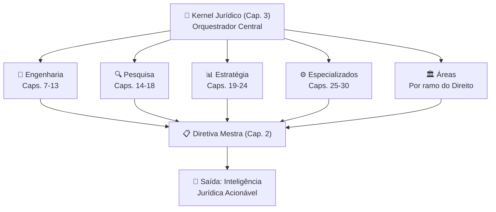

# 04_MOTORES — Motores de Inteligência Jurídica

## Visão Geral

O diretório `04_MOTORES` é o **núcleo operacional** do Sigma—Juris Intelligence Framework (SJIF), contendo os motores especializados que processam, analisam e transformam informações jurídicas em **inteligência acionável**. Os motores são organizados em **5 categorias** funcionais, cada uma com responsabilidades específicas dentro da arquitetura do framework.

> **Princípio:** Os motores não produzem Direito — eles processam, analisam e organizam o conhecimento jurídico sob a coordenação do Kernel Jurídico (Cap. 3).

---

## Arquitetura dos Motores

```
04_MOTORES/
├── engenharia/          ← Motores de Engenharia Jurídica (Caps. 7–13)
│   ├── README.md
│   ├── cap07_eng_processual.md
│   ├── cap08_eng_prova.md
│   ├── cap09_eng_fundamentacao.md
│   ├── cap10_eng_pedidos.md
│   ├── cap11_eng_reversa.md
│   ├── cap12_eng_recursal.md
│   └── cap13_eng_execucao.md
│
├── pesquisa/            ← Motores de Pesquisa Jurídica (Caps. 14–18)
│   ├── README.md
│   ├── cap14_pesq_legislativa.md
│   ├── cap15_pesq_jurisprudencial.md
│   ├── cap16_pesq_doutrinaria.md
│   ├── cap17_benchmark.md
│   └── cap18_inteligencia_comparada.md
│
├── estrategia/          ← Motores de Análise Estratégica (Caps. 19–24)
│   ├── README.md
│   ├── cap19_gestao_estrategica.md
│   ├── cap20_gestao_riscos.md
│   ├── cap21_compliance.md
│   ├── cap22_auditoria.md
│   ├── cap23_motor_coerencia.md
│   └── cap24_motor_decisorio.md
│
├── especializados/      ← Motores Especializados (Caps. 25–30)
│   ├── cap25_modulo_forense.md
│   ├── cap26_motores_especializados.md
│   ├── cap27_ontologia.md
│   ├── cap28_grafo_conhecimento.md
│   ├── cap29_modelos_matematicos.md
│   └── cap30_ia_aplicada.md
│
└── areas/               ← Motores por Área do Direito
    ├── empresarial.md
    ├── tributario.md
    ├── trabalhista.md
    ├── minerario.md
    ├── ambiental.md
    └── agrario.md
```

---

## Categorias de Motores

### 🔧 Engenharia Jurídica (Caps. 7–13)

Motores focados na **construção e desconstrução** de peças, processos e decisões judiciais.

| Motor | Capítulo | Função |
|:------|:---------|:-------|
| Engenharia Processual | Cap. 7 | Mapeamento e otimização de fluxos processuais |
| Engenharia da Prova | Cap. 8 | Análise documental integral, classificação e valoração |
| Engenharia da Fundamentação | Cap. 9 | Construção de raciocínios lógicos e coerentes |
| Engenharia dos Pedidos | Cap. 10 | Formulação estratégica de pedidos judiciais |
| Engenharia Reversa | Cap. 11 | Reconstrução do raciocínio do julgador |
| Engenharia Recursal | Cap. 12 | Análise de cabimento e estratégia recursal |
| Engenharia da Execução | Cap. 13 | Efetivação de decisões e mapeamento de bens |

📁 **Diretório:** [engenharia/](engenharia/README.md)

---

### 🔍 Pesquisa Jurídica (Caps. 14–18)

Motores dedicados à **localização, análise e interpretação** de fontes do Direito.

| Motor | Capítulo | Função |
|:------|:---------|:-------|
| Pesquisa Legislativa | Cap. 14 | Localização e análise de normas jurídicas |
| Pesquisa Jurisprudencial | Cap. 15 | Padrões decisórios, precedentes e súmulas |
| Pesquisa Doutrinária | Cap. 16 | Fontes doutrinárias e correntes de pensamento |
| Benchmark Jurídico | Cap. 17 | Comparação de práticas e desempenho |
| Inteligência Comparada | Cap. 18 | Análise de sistemas jurídicos estrangeiros |

📁 **Diretório:** [pesquisa/](pesquisa/README.md)

---

### 📊 Análise Estratégica (Caps. 19–24)

Motores focados em **planejamento, gestão de riscos e otimização** da atuação jurídica.

| Motor | Capítulo | Função |
|:------|:---------|:-------|
| Gestão Estratégica | Cap. 19 | Objetivos SMART, estratégias, KPIs/KRIs |
| Gestão de Riscos | Cap. 20 | Identificação, avaliação e mitigação de riscos |
| Compliance e Governança | Cap. 21 | Programas de conformidade, ESG, anticorrupção |
| Auditoria Jurídica | Cap. 22 | Due diligence, auditorias, passivos e contingências |
| Motor de Coerência | Cap. 23 | Avaliação da qualidade técnica e consistência |
| Motor Decisório | Cap. 24 | Padrões de julgadores e engenharia cognitiva |

📁 **Diretório:** [estrategia/](estrategia/README.md)

---

### ⚙️ Motores Especializados (Caps. 25–30)

Módulos avançados de **integração, ontologia, grafos, modelos matemáticos e IA**.

| Motor | Capítulo | Função |
|:------|:---------|:-------|
| Módulo Jurídico Forense | Cap. 25 | Análise multicamadas de processos judiciais |
| Motores Especializados | Cap. 26 | Catálogo de todos os motores do framework |
| Ontologia Jurídica | Cap. 27 | Modelo formal de conceitos e vocabulário jurídico |
| Grafo de Conhecimento | Cap. 28 | Rede de relações entre entidades jurídicas |
| Modelos Matemáticos | Cap. 29 | Ponderação, probabilidade, multicritério, Bayesiano |
| IA Aplicada | Cap. 30 | NLP, aprendizado de máquina, ética da IA jurídica |

---

### 🏛️ Motores por Área do Direito

Motores customizados para **áreas específicas** do ordenamento jurídico.

| Área | Foco |
|:-----|:-----|
| Empresarial | Compliance, governança corporativa, contratos |
| Tributário | Legislação fiscal, planejamento e contencioso |
| Trabalhista | Contencioso, consultoria e compliance trabalhista |
| Minerário | Concessões, licenciamentos, regulação |
| Ambiental | Licenciamentos, infrações, passivos ambientais |
| Agrário | Posse, propriedade rural, legislação ambiental aplicada |

---

## Fluxo de Operação dos Motores



---

## Capítulos Relacionados

| Bloco | Capítulos | Diretório |
|:------|:----------|:----------|
| [Fundamentos](../00_GOVERNANCA/) | Caps. 1–6 | `00_GOVERNANCA/` a `03_FRAMEWORK/` |
| [Bibliotecas](../05_BIBLIOTECAS/) | Caps. 31–36 | `05_BIBLIOTECAS/` |
| [Documentação](../12_DOCUMENTACAO/) | Caps. 37–40 | `12_DOCUMENTACAO/` |

---

> Sigma—Juris Intelligence Framework (SJIF) v1.0 | Propriedade de Charles de Paula Eugênio — Sigma Sihf Soluções Analíticas Ltda
