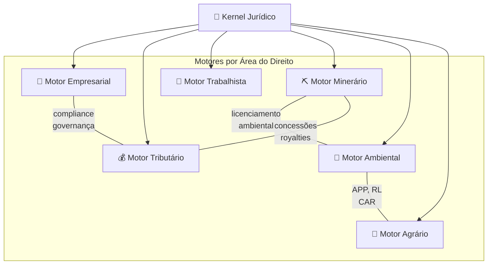

# 04_MOTORES / Áreas — Motores Especializados por Domínio Jurídico

> **Sigma—Juris Intelligence Framework (SJIF) v1.0**

## Descrição

Este diretório contém a documentação dos **Motores Especializados por Área do Direito** do Juris Intelligence Framework (JIF). Cada motor é projetado para atender às particularidades de um ramo jurídico específico, integrando legislação, jurisprudência, doutrina e práticas especializadas de cada domínio.

## Arquitetura dos Motores por Área

## Conteúdo do Diretório

| Arquivo | Motor | Descrição |
|---------|-------|-----------|
| [motor_empresarial.md](motor_empresarial.md) | Empresarial | Direito societário, compliance, governança, contratos |
| [motor_tributario.md](motor_tributario.md) | Tributário | Direito fiscal, planejamento tributário, contencioso |
| [motor_trabalhista.md](motor_trabalhista.md) | Trabalhista | Direito do trabalho, contencioso, compliance trabalhista |
| [motor_minerario.md](motor_minerario.md) | Minerário | Direito minerário, concessões, licenciamento |
| [motor_ambiental.md](motor_ambiental.md) | Ambiental | Direito ambiental, licenciamento, passivos |
| [motor_agrario.md](motor_agrario.md) | Agrário | Direito agrário, propriedade rural, APP/RL |

## Relação com Kernels Especializados

Cada Motor por Área está vinculado a um **Kernel Especializado** correspondente (Capítulo 3), que orquestra sua execução:

| Motor | Kernel Correspondente |
|-------|----------------------|
| Motor Empresarial | Kernel Empresarial |
| Motor Tributário | Kernel Tributário |
| Motor Trabalhista | Kernel Trabalhista |
| Motor Minerário | Kernel Minerário |
| Motor Ambiental | Kernel Ambiental |
| Motor Agrário | Kernel Agrário |

## Interconexões entre Áreas

As áreas do Direito não são estanques; os motores por área possuem **interconexões naturais**:

- **Minerário ↔ Ambiental** — Licenciamento ambiental é requisito para atividade minerária
- **Ambiental ↔ Agrário** — APPs, Reserva Legal e CAR integram ambos os domínios
- **Empresarial ↔ Tributário** — Compliance fiscal, governança e planejamento tributário
- **Minerário ↔ Tributário** — CFEM (royalties), tributação de atividade minerária
- **Trabalhista ↔ Empresarial** — Compliance trabalhista na governança corporativa
- **Agrário ↔ Trabalhista** — Relações de trabalho rural, NR-31

## Capítulos Relacionados

- [Cap. 3 — Kernel Jurídico](../../01_KERNEL/) — Kernels especializados por área
- [Cap. 26 — Motores Especializados](../especializados/cap26_motores_especializados.md) — Visão geral de todos os motores
- [Cap. 31 — Biblioteca Jurídica](../../05_BIBLIOTECAS/) — Conhecimento organizado por área
- [Cap. 32 — Biblioteca de Briefings](../../06_BRIEFINGS/) — Briefings especializados por área

---
> Sigma—Juris Intelligence Framework (SJIF) v1.0 | Propriedade de Charles de Paula Eugênio — Sigma Sihf Soluções Analíticas Ltda
