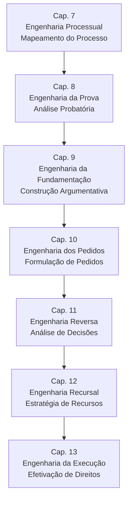

# 04_MOTORES / engenharia — Motores de Engenharia Jurídica

## Visão Geral

O diretório `engenharia/` contém os motores responsáveis pela **construção, desconstrução e otimização** de peças processuais, provas, decisões judiciais e estratégias recursais. Estes motores constituem o **BLOCO II — Engenharia Jurídica** do SJIF (Capítulos 7–13) e são o coração da capacidade analítica e construtiva do framework.

> **Princípio:** A Engenharia Jurídica aplica métodos sistemáticos e rigorosos à construção e análise de todos os elementos processuais, garantindo precisão técnica e coerência lógica.

---

## Conteúdo do Diretório

| Arquivo | Capítulo | Título | Resumo |
|:--------|:---------|:-------|:-------|
| `cap07_eng_processual.md` | Cap. 7 | **Engenharia Processual** | Mapeamento de fluxos processuais, identificação de fases, competências, partes, pedidos, causa de pedir, provas e cronologia |
| `cap08_eng_prova.md` | Cap. 8 | **Engenharia da Prova** | Análise documental integral (leitura linha por linha), classificação, valoração e estratégias de produção/contestação |
| `cap09_eng_fundamentacao.md` | Cap. 9 | **Engenharia da Fundamentação** | Estrutura de fundamentação robusta, construção de raciocínios lógicos, identificação de falhas (omissões, contradições, saltos) |
| `cap10_eng_pedidos.md` | Cap. 10 | **Engenharia dos Pedidos** | Classificação e formulação de pedidos, relação pedidos-fatos-fundamentos, pedidos principais, subsidiários e alternativos |
| `cap11_eng_reversa.md` | Cap. 11 | **Engenharia Reversa das Decisões** | Reconstrução do raciocínio do julgador, análise de coerência, identificação de vulnerabilidades recursais |
| `cap12_eng_recursal.md` | Cap. 12 | **Engenharia Recursal** | Análise de cabimento, prazos, probabilidade de sucesso, estruturação de peças recursais |
| `cap13_eng_execucao.md` | Cap. 13 | **Engenharia da Execução** | Mapeamento de bens, estratégias de efetivação de decisões, gestão de cumprimento de sentença |

---

## Fluxo de Engenharia

---

## Capítulos Relacionados

| Capítulo | Relação |
|:---------|:--------|
| [Cap. 2 — Diretiva Mestra](../../02_DIRETIVA_MESTRA/cap02_diretiva_mestra.md) | Nenhuma linha ignorada, nenhuma prova omitida |
| [Cap. 5 — Lógica Jurídica](../../03_FRAMEWORK/cap05_logica_argumentativa.md) | Base lógica para toda engenharia |
| [Cap. 14–18 — Pesquisa](../pesquisa/README.md) | Fontes normativas, jurisprudenciais e doutrinárias |
| [Cap. 23 — Motor de Coerência](../estrategia/cap23_motor_coerencia.md) | Validação da qualidade técnica |
| [Cap. 25 — MJF](../especializados/cap25_modulo_forense.md) | Integração no módulo forense |

---

> Sigma—Juris Intelligence Framework (SJIF) v1.0 | Propriedade de Charles de Paula Eugênio — Sigma Sihf Soluções Analíticas Ltda
