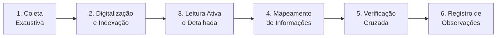

# Capítulo 8: Engenharia da Prova

## 8.1 A Prova como Pilar da Decisão Jurídica

A prova é o **elemento central** para a formação do convencimento do julgador e, consequentemente, para a justiça da decisão jurídica. A Engenharia da Prova, no contexto do Juris Intelligence Framework (JIF), é a disciplina que se dedica à análise sistemática, à valoração e à gestão de todos os elementos probatórios em um processo.

> [!IMPORTANT]
> A Diretiva Mestra Jurídica do JIF é categórica: **leitura linha por linha, nenhuma prova omitida, nenhum documento ignorado**.

---

## 8.2 Análise Documental Integral: O Rigor da Diretiva Mestra

A Análise Documental Integral é a aplicação prática do princípio fundamental do JIF — garantir que cada peça de informação seja meticulosamente examinada.

### 8.2.1 Etapas da Análise Documental Integral

1. **Coleta Exaustiva** — Reunião de todos os documentos e informações relacionados ao caso, independentemente de sua aparente relevância inicial: contratos, correspondências, registros financeiros, mídias digitais, laudos, depoimentos, etc.

2. **Digitalização e Indexação** — Transformação de documentos físicos em formato digital e organização em sistema indexado, com busca rápida e acesso facilitado.

3. **Leitura Ativa e Detalhada** — Exame minucioso de cada documento, linha por linha, com foco em:
   - Fatos, datas, nomes, valores
   - Termos técnicos e cláusulas relevantes
   - Ferramentas de PLN para extração de entidades e relações

4. **Mapeamento de Informações** — Criação de um mapa completo do processo, interligando documentos aos fatos, partes, pedidos e normas. Utiliza o Grafo de Conhecimento Jurídico (Cap. 28) para relações semânticas.

5. **Verificação Cruzada** — Confronto das informações com outras fontes (outros documentos, depoimentos, legislação) para identificar inconsistências, contradições ou lacunas.

6. **Registro de Observações** — Anotação de quaisquer observações, dúvidas ou pontos de atenção para fases posteriores da análise.

---

## 8.3 Classificação e Valoração das Provas

### 8.3.1 Classificação das Provas

| Critério | Categorias |
|----------|-----------|
| **Quanto à Fonte** | Documental (escrita, visual, sonora), Testemunhal (depoimentos), Pericial (laudos técnicos), Confissão, Inspeção Judicial |
| **Quanto ao Objeto** | Direta (prova o fato principal), Indireta (prova fato secundário que leva ao principal) |
| **Quanto à Forma** | Oral, Escrita, Material |
| **Quanto à Produção** | Pré-constituída (antes do processo), Constituída (durante o processo) |

### 8.3.2 Valoração das Provas

A valoração é o processo de atribuir peso e credibilidade a cada evidência. Embora a valoração final caiba ao julgador, o JIF auxilia na análise objetiva através do Motor de Coerência Jurídica (Cap. 23) e Modelos Matemáticos (Cap. 29):

- **Aderência aos Fatos** — Quão diretamente a prova se relaciona com os fatos alegados
- **Consistência Interna** — Se a prova é coerente em si mesma e com outras provas
- **Confiabilidade da Fonte** — Credibilidade da origem (documento oficial vs. depoimento informal)
- **Relevância Jurídica** — Importância da prova para aplicação das normas jurídicas
- **Ponderação de Peso** — Peso relativo considerando natureza e contexto (Modelo de Peso das Provas, Cap. 29)
- **Identificação de Vulnerabilidades** — Fragilidades: contradições, omissões ou falta de suporte por outras evidências

---

## 8.4 Estratégias de Produção e Contestação de Provas

### 8.4.1 Produção de Provas

| Estratégia | Descrição |
|-----------|-----------|
| **Planejamento Probatório** | Definição das provas necessárias para sustentar a tese, considerando custos, prazos e probabilidade de obtenção |
| **Requisição de Documentos** | Mecanismos legais para obter documentos de terceiros ou da parte contrária |
| **Prova Testemunhal** | Seleção e preparação de testemunhas, com foco em relevância e credibilidade |
| **Prova Pericial** | Contratação de peritos especializados para laudos técnicos |
| **Inspeção Judicial** | Solicitação de vistoria do local ou objeto da lide |

### 8.4.2 Contestação de Provas

| Estratégia | Descrição |
|-----------|-----------|
| **Impugnação de Documentos** | Questionamento de autenticidade, validade ou conteúdo |
| **Contradita de Testemunhas** | Argumentação sobre parcialidade ou inidoneidade |
| **Impugnação de Laudos Periciais** | Pareceres técnicos divergentes ou questionamento de metodologia |
| **Alegação de Prova Ilícita** | Argumentação de obtenção por meios ilegais |
| **Análise de Coerência** | Motor de Coerência para identificar inconsistências entre provas e fatos |

---

## 8.5 O Motor da Prova do JIF

O **Motor da Prova** é o componente que automatiza e auxilia nas tarefas da Engenharia da Prova:

- **Mapeamento de Provas** — Inventário detalhado com classificação, valoração e relação com fatos e pedidos
- **Análise de Lacunas Probatórias** — Identificação de áreas com provas insuficientes
- **Sugestão de Meios de Prova** — Recomendações baseadas na tese jurídica e lacunas identificadas
- **Auditoria Probatória** — Verificação de conformidade com diretivas mestras e princípios de validade/licitude
- **Visualização de Evidências** — Apresentação gráfica das relações entre provas, fatos e argumentos

> [!TIP]
> Ao integrar a Engenharia da Prova, o JIF eleva a gestão probatória a um nível **estratégico**, permitindo teses mais robustas, antecipação de desafios e apresentação persuasiva de evidências.

## Referências Cruzadas

- **Capítulo 2** — Diretiva Mestra Jurídica
- **Capítulo 7** — [Engenharia Processual](cap07_eng_processual.md)
- **Capítulo 9** — [Engenharia da Fundamentação](cap09_eng_fundamentacao.md)
- **Capítulo 23** — Motor de Coerência Jurídica
- **Capítulo 28** — Grafo de Conhecimento Jurídico
- **Capítulo 29** — Modelos Matemáticos Aplicados ao Direito

---
> Sigma—Juris Intelligence Framework (SJIF) v1.0 | Propriedade de Charles de Paula Eugênio — Sigma Sihf Soluções Analíticas Ltda
