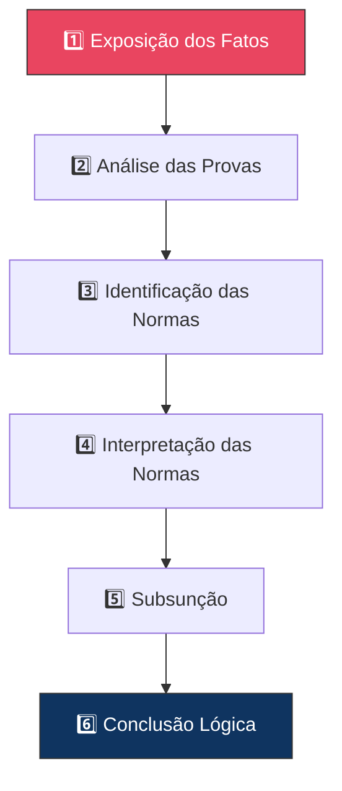

# Capítulo 9: Engenharia da Fundamentação

## 9.1 A Fundamentação como Pilar da Legitimidade Jurídica

A fundamentação é o **cerne da legitimidade** de qualquer decisão ou peça jurídica. É através dela que se demonstra a conexão lógica e jurídica entre os fatos, as provas, as normas e a conclusão. A Engenharia da Fundamentação, no contexto do JIF, é a disciplina dedicada à construção de raciocínios jurídicos **robustos, coerentes e persuasivos**.

> [!IMPORTANT]
> Cada argumento deve ser solidamente embasado, evitando omissões, contradições e saltos argumentativos. A Diretiva Mestra exige a não omissão de fatos e a fidelidade às evidências.

---

## 9.2 Estrutura de uma Fundamentação Jurídica Robusta — Os 6 Elementos

Uma fundamentação jurídica robusta é uma **estrutura lógica e organizada** que guia o leitor (ou julgador) através do raciocínio que leva à conclusão.

### 1. Exposição dos Fatos

Apresentação clara, concisa e objetiva dos fatos relevantes. Deve ser baseada nas provas e evitar juízos de valor.

### 2. Análise das Provas

Demonstração de como os fatos alegados são comprovados pelas evidências apresentadas. A valoração das provas ([Cap. 8](cap08_eng_prova.md)) é crucial, explicando por que certas provas são relevantes e críveis.

### 3. Identificação das Normas Aplicáveis

Apresentação das disposições legais (leis, regulamentos, princípios, precedentes) que regem a matéria. A pesquisa normativa e jurisprudencial (Cap. 14 e 15) é fundamental.

### 4. Interpretação das Normas

Explicação do sentido e alcance das normas identificadas, utilizando os métodos hermenêuticos (Cap. 6). Deve-se demonstrar alinhamento com a jurisprudência dominante e a doutrina relevante.

### 5. Subsunção (Aplicação do Direito ao Caso Concreto)

Demonstração da relação entre os fatos provados e as normas interpretadas — como a situação fática se encaixa na hipótese normativa, levando à consequência jurídica desejada.

### 6. Conclusão Lógica

A proposição final que decorre de todo o raciocínio exposto. Deve ser uma consequência **natural e inquestionável** das premissas apresentadas.

---

## 9.3 Construção de Raciocínios Lógicos e Coerentes

### 9.3.1 Técnicas de Construção

| Técnica | Descrição | Aplicação |
|---------|-----------|-----------|
| **Raciocínio Dedutivo** | De premissas gerais (normas) para conclusões específicas | Silogismo jurídico (Cap. 5) |
| **Raciocínio Indutivo** | De casos específicos (precedentes) para inferir regra geral | Análise jurisprudencial |
| **Raciocínio Abdutivo** | Melhor explicação para um conjunto de fatos | Reconstrução de eventos |
| **Ponderação de Princípios** | Demonstrar prevalência de um princípio no caso concreto | Conflito entre princípios (Cap. 6) |
| **Uso de Analogia** | Aplicar solução de caso semelhante a caso novo | Justificar semelhanças relevantes |
| **Argumentação por Coerência** | Harmonizar todos os elementos para reforçar a conclusão | Construção integral |

### 9.3.2 Coerência e Consistência

O Motor de Coerência Jurídica (Cap. 23) avalia:

- **Coerência Interna** — Ausência de contradições dentro da própria fundamentação
- **Coerência Externa** — Alinhamento com ordenamento jurídico, jurisprudência e doutrina
- **Consistência Fático-Probatória** — Aderência dos fatos alegados às provas produzidas
- **Consistência Normativo-Argumentativa** — Correspondência entre normas invocadas e argumentos desenvolvidos

---

## 9.4 Identificação e Correção de Falhas na Fundamentação

> [!WARNING]
> A identificação de falhas é parte crucial da Engenharia da Fundamentação. Uma falha não detectada pode comprometer toda a peça ou decisão jurídica.

### 9.4.1 Os 8 Tipos de Falhas Comuns

| # | Tipo de Falha | Descrição | Consequência |
|---|--------------|-----------|-------------|
| 1 | **Omissões** | Falta de análise de fatos relevantes, provas essenciais, normas aplicáveis, argumentos ou precedentes | Nulidade potencial da decisão |
| 2 | **Contradições** | Argumentos que se opõem dentro da fundamentação ou em relação a outros elementos | Perda de credibilidade |
| 3 | **Saltos Argumentativos** | Ausência de conexão lógica entre premissas e conclusão | Lacunas no raciocínio |
| 4 | **Fundamentação Insuficiente** | Argumentos superficiais ou genéricos que não demonstram a razão da decisão | Fragilidade da tese |
| 5 | **Fundamentação Aparente** | Parece completa mas é vazia de conteúdo ou meramente formal | Risco de anulação |
| 6 | **Erro Material** | Equívocos de fato ou de cálculo | Compromete a conclusão |
| 7 | **Erro de Premissa** | Partir de fato ou norma equivocada | Base falsa invalida raciocínio |
| 8 | **Erro de Interpretação** | Aplicação incorreta dos métodos hermenêuticos | Sentido distorcido da norma |

### 9.4.2 Técnicas de Correção

- **Auditoria Jurídica (Cap. 22)** — Análise sistemática para identificar falhas
- **Engenharia Reversa das Decisões ([Cap. 11](cap11_eng_reversa_decisoes.md))** — Desconstruir raciocínio para identificar vulnerabilidades
- **Revisão Lógica** — Reestruturar o raciocínio eliminando inconsistências
- **Complementação de Argumentos** — Adicionar provas, normas ou interpretações para preencher lacunas
- **Reescrita e Reorganização** — Melhorar clareza, fluidez e persuasão

---

## 9.5 O Motor de Fundamentação do JIF

O **Motor de Fundamentação** automatiza e auxilia na construção e auditoria de fundamentações jurídicas:

| Funcionalidade | Descrição |
|---------------|-----------|
| **Geração de Esqueletos** | Estruturas pré-definidas para diferentes tipos de peças, garantindo inclusão de todos os elementos essenciais |
| **Análise de Coerência e Consistência** | Avaliação automática da lógica interna e externa, apontando contradições, omissões e saltos |
| **Sugestão de Argumentos** | Com base nos fatos, provas e normas, sugere argumentos e precedentes aplicáveis |
| **Identificação de Falhas** | Aponta os 8 tipos de falhas comuns na fundamentação |
| **Otimização da Linguagem** | Sugestões para melhorar clareza, precisão e persuasão |

## Referências Cruzadas

- **Capítulo 2** — Diretiva Mestra Jurídica
- **Capítulo 5** — Lógica Jurídica e Engenharia Argumentativa
- **Capítulo 6** — Hermenêutica Jurídica Avançada
- **Capítulo 8** — [Engenharia da Prova](cap08_eng_prova.md)
- **Capítulo 11** — [Engenharia Reversa das Decisões](cap11_eng_reversa_decisoes.md)
- **Capítulo 22** — Auditoria Jurídica
- **Capítulo 23** — Motor de Coerência Jurídica

---
> Sigma—Juris Intelligence Framework (SJIF) v1.0 | Propriedade de Charles de Paula Eugênio — Sigma Sihf Soluções Analíticas Ltda
