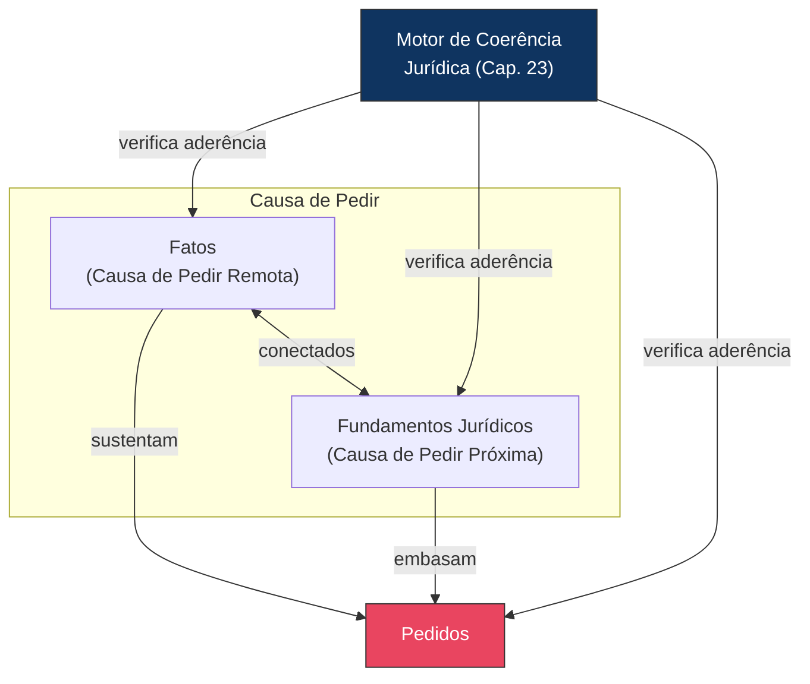

# Capítulo 10: Engenharia dos Pedidos

## 10.1 A Importância Estratégica dos Pedidos no Processo Jurídico

Os pedidos representam a **materialização da pretensão jurídica**, o objetivo final que a parte busca alcançar por meio do processo. A Engenharia dos Pedidos, no contexto do JIF, é a disciplina que se dedica à formulação estratégica, à classificação e à estruturação dos pedidos judiciais, administrativos ou arbitrais.

> [!IMPORTANT]
> Um pedido bem formulado é **claro, preciso, juridicamente fundamentado** e alinhado aos fatos e provas, maximizando as chances de sucesso e evitando ambiguidades que possam comprometer o resultado.

---

## 10.2 Classificação e Formulação de Pedidos Judiciais

### 10.2.1 Classificação dos Pedidos

#### Quanto à Natureza da Prestação Jurisdicional

| Tipo | Finalidade | Exemplo |
|------|-----------|---------|
| **Declaratórios** | Declaração de existência, inexistência ou modo de ser de uma relação jurídica | Declaração de nulidade de contrato |
| **Constitutivos** | Criação, modificação ou extinção de relação jurídica | Divórcio, usucapião, anulação de ato administrativo |
| **Condenatórios** | Condenação do réu ao cumprimento de obrigação | Pagamento de indenização, entrega de coisa, fazer/não fazer |
| **Executivos (Mandamentais)** | Satisfação imediata de direito já reconhecido | Execução de título extrajudicial, mandado de segurança |

#### Quanto à Cumulação

| Tipo | Descrição | Exemplo |
|------|-----------|---------|
| **Simples** | Pedidos independentes, julgamento separado | Indenização por danos materiais e morais |
| **Sucessiva** | Julgamento depende do acolhimento do anterior | Anulação de contrato → restituição de valores |
| **Alternativa** | Réu pode cumprir qualquer um dos pedidos | Entrega de bem ou equivalente em dinheiro |
| **Subsidiária (Eventual)** | Pedido principal + pedidos secundários (se principal rejeitado) | Reintegração de posse; subsidiariamente, indenização |

### 10.2.2 Formulação dos Pedidos

Requisitos essenciais para um pedido eficaz:

- **Clareza e Precisão** — Expressão inequívoca, sem ambiguidades
- **Especificidade** — Em regra, pedidos certos e determinados (quantificados e detalhados)
- **Conformidade Legal** — Consonância com normas processuais e materiais
- **Rastreabilidade** — Cada pedido rastreável aos fatos e fundamentos da petição inicial

---

## 10.3 A Tríade: Fatos — Fundamentos — Pedidos

A Engenharia dos Pedidos enfatiza a **interdependência** entre os pedidos, os fatos e os fundamentos jurídicos. Essa tríade forma a causa de pedir.

### Fatos (Causa de Pedir Remota)

Eventos e circunstâncias que deram origem à pretensão. Os pedidos devem ser uma **consequência lógica e jurídica** dos fatos narrados. A ausência de fatos que justifiquem um pedido pode levar à sua improcedência.

### Fundamentos Jurídicos (Causa de Pedir Próxima)

Normas, princípios, jurisprudência e doutrina que conferem amparo legal aos pedidos. Cada pedido deve ter um **fundamento jurídico claro e consistente**. A correta subsunção dos fatos à norma é crucial.

### Coerência e Congruência

Deve haver uma relação de coerência e congruência entre fatos, fundamentos e pedidos. O JIF, através do Motor de Coerência Jurídica (Cap. 23), verifica essa aderência, identificando inconsistências que possam fragilizar a demanda.

---

## 10.4 Estratégias para Pedidos

### 10.4.1 Pedidos Principais

O pedido principal é a pretensão central, formulada com a **maior robustez possível**:

- **Foco na Força Probatória** — O pedido principal deve ser aquele para o qual se possui a prova mais contundente e a fundamentação mais sólida
- **Clareza e Objetividade** — Evitar ambiguidade que desvie o foco da pretensão principal
- **Alinhamento com o Objetivo do Cliente** — Refletir o resultado mais desejado pelo cliente

### 10.4.2 Pedidos Subsidiários (Eventuais)

Formulados para análise caso o pedido principal não seja acolhido. Funcionam como uma **rede de segurança estratégica**:

- Garantem que a parte não saia de mãos vazias
- Devem ter fundamentação própria e independente
- Organizados em ordem de preferência decrescente

### 10.4.3 Pedidos Alternativos

Quando a obrigação comporta cumprimento de mais de uma forma:

- O devedor pode escolher qual forma de cumprimento
- Ambas as formas devem ser juridicamente válidas
- A parte aceita qualquer das alternativas

> [!TIP]
> A formulação estratégica de pedidos **principais, subsidiários e alternativos** é um diferencial competitivo que permite antecipar cenários e maximizar chances de sucesso.

---

## 10.5 O Motor de Pedidos do JIF

O JIF auxilia na formulação e auditoria de pedidos através de:

| Funcionalidade | Descrição |
|---------------|-----------|
| **Análise de Congruência** | Verificação automática da correspondência entre pedidos, fatos e fundamentos |
| **Sugestão de Pedidos** | Com base nos fatos e normas identificados, sugere pedidos cabíveis |
| **Classificação Automática** | Categorização dos pedidos por tipo e natureza |
| **Auditoria de Completude** | Verificação se todos os pedidos necessários foram formulados |
| **Otimização de Redação** | Sugestões para tornar os pedidos mais claros e precisos |

## Referências Cruzadas

- **Capítulo 7** — [Engenharia Processual](cap07_eng_processual.md)
- **Capítulo 8** — [Engenharia da Prova](cap08_eng_prova.md)
- **Capítulo 9** — [Engenharia da Fundamentação](cap09_eng_fundamentacao.md)
- **Capítulo 23** — Motor de Coerência Jurídica
- **Capítulo 33** — Biblioteca de Templates

---
> Sigma—Juris Intelligence Framework (SJIF) v1.0 | Propriedade de Charles de Paula Eugênio — Sigma Sihf Soluções Analíticas Ltda
