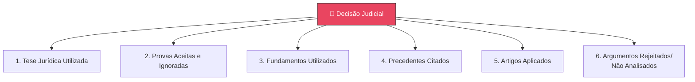
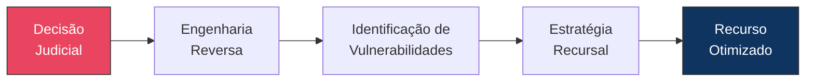

# Capítulo 11: Engenharia Reversa das Decisões Judiciais

## 11.1 A Necessidade de Desvendar o Raciocínio Decisório

No complexo cenário jurídico, a capacidade de compreender profundamente o raciocínio que fundamenta uma decisão judicial é um **diferencial estratégico**. A Engenharia Reversa das Decisões Judiciais é a disciplina que se dedica a desconstruir e analisar criticamente as sentenças, acórdãos e outras manifestações decisórias.

> [!IMPORTANT]
> O objetivo não é apenas entender o resultado, mas **identificar a lógica subjacente, as premissas utilizadas, as provas valoradas e as vulnerabilidades argumentativas** — elementos essenciais para a estratégia recursal.

---

## 11.2 Reconstrução do Raciocínio do Julgador

A Engenharia Reversa começa com a **reconstrução meticulosa** do processo mental que levou o julgador à sua conclusão, guiada pela Diretiva Mestra Jurídica (Cap. 2).

### 11.2.1 Os 6 Elementos a Serem Reconstruídos

1. **Tese Jurídica Utilizada** — Identificar a principal tese que o julgador adotou para resolver a controvérsia: teoria específica, entendimento doutrinário ou interpretação particular de norma.

2. **Provas Aceitas e Ignoradas** — Analisar quais provas foram expressamente consideradas e valoradas, e quais foram desconsideradas ou sequer mencionadas. Comparação com as provas apresentadas ([Cap. 8](cap08_eng_prova.md)) é fundamental para identificar omissões ou valorações equivocadas.

3. **Fundamentos Utilizados** — Discernir os argumentos jurídicos e fáticos que serviram de base: legislação citada, precedentes invocados, princípios jurídicos aplicados.

4. **Precedentes Citados** — Verificar quais precedentes (súmulas, acórdãos, teses repetitivas) foram mencionados, como foram utilizados, se a citação foi pertinente e se o precedente foi corretamente aplicado ao caso concreto.

5. **Artigos Aplicados** — Identificar os dispositivos legais específicos utilizados, analisando se a subsunção dos fatos à norma foi adequada.

6. **Argumentos Rejeitados e Não Analisados** — Observar quais argumentos foram explicitamente rejeitados e, mais importante, quais argumentos relevantes foram **ignorados ou sequer analisados**. A omissão pode configurar nulidade da decisão.

---

## 11.3 Análise Crítica e Identificação de Vulnerabilidades

Após a reconstrução, a etapa seguinte é a **análise crítica** para identificar coerência lógica e vulnerabilidades. O Motor de Coerência Jurídica (Cap. 23) é ferramenta essencial.

### 11.3.1 Perguntas-Chave para Análise Crítica

| Pergunta | O que Verificar |
|----------|----------------|
| **A decisão possui coerência lógica?** | Se premissas (fatos, provas, fundamentos) levam logicamente à conclusão |
| **Existe salto argumentativo?** | Se o julgador pulou etapas no raciocínio, apresentando conclusão sem justificação intermediária |
| **Existe contradição?** | Inconsistências internas onde uma parte contradiz outra, ou decisão contradiz fatos/normas |
| **Existe fundamentação aparente?** | Fundamentação meramente formal, sem análise real, ou argumentos genéricos |
| **Existe fundamentação insuficiente?** | Decisão que não aborda todos os pontos ou justificação superficial |
| **Existe omissão?** | Ausência de análise de pedidos, provas, argumentos ou questões prejudiciais |
| **Existe erro material?** | Equívocos de fato, cálculo ou transcrição |
| **Existe erro de premissa?** | Decisão baseada em fato equivocado ou interpretação errônea de norma |
| **Existe erro de interpretação?** | Aplicação inadequada dos métodos hermenêuticos |
| **Existe violação processual?** | Desrespeito ao contraditório, ampla defesa ou devido processo legal |

### 11.3.2 Identificação de Vulnerabilidades para Fins Recursais

> [!WARNING]
> A pergunta central da Engenharia Reversa: **"Se esta sentença fosse anulada, por onde ela seria anulada? Onde existe a maior vulnerabilidade?"**

As vulnerabilidades podem ser classificadas em:

| # | Vulnerabilidade | Descrição |
|---|----------------|-----------|
| 1 | **Contradições** | Uma parte da decisão contradiz outra, ou a decisão contradiz fatos provados ou normas |
| 2 | **Omissões** | Pedidos não analisados, provas ignoradas, argumentos ignorados, documentos ignorados, questões prejudiciais não enfrentadas |
| 3 | **Fundamentação Insuficiente** | A decisão apenas afirma, não demonstra; não há justificação clara e convincente |
| 4 | **Violação do Contraditório** | Argumento relevante sem apreciação, cerceamento de defesa |
| 5 | **Violação da Ampla Defesa** | Prova desconsiderada sem justificativa, impedimento de produção de prova |
| 6 | **Violação do Devido Processo Legal** | Desrespeito a qualquer etapa ou garantia processual |
| 7 | **Inconsistência Lógica** | Erros de raciocínio que comprometem a validade da conclusão |
| 8 | **Erros Cronológicos, Matemáticos ou Documentais** | Equívocos factuais facilmente demonstráveis |

---

## 11.4 A Engenharia Reversa como Ferramenta Estratégica

A Engenharia Reversa é uma ferramenta poderosa no JIF que permite:

- **Compreensão profunda** — não apenas reagir, mas entender a decisão em profundidade
- **Antecipação de desafios** — prever os obstáculos recursais
- **Estratégia recursal eficaz** — construir recursos mais precisos e persuasivos
- **Aprendizado contínuo** — alimentar o Motor Decisório Jurídico (Cap. 24) com informações sobre padrões de julgamento

> [!NOTE]
> A aplicação dessa engenharia reversa deve sempre trabalhar com **evidências jurídicas verificáveis** (processo, legislação, precedentes, doutrina e fatos dos autos), mantendo a solidez técnica e a ética na análise.

## Referências Cruzadas

- **Capítulo 2** — Diretiva Mestra Jurídica
- **Capítulo 8** — [Engenharia da Prova](cap08_eng_prova.md)
- **Capítulo 9** — [Engenharia da Fundamentação](cap09_eng_fundamentacao.md)
- **Capítulo 12** — [Engenharia Recursal](cap12_eng_recursal.md)
- **Capítulo 23** — Motor de Coerência Jurídica
- **Capítulo 24** — Motor Decisório Jurídico

---
> Sigma—Juris Intelligence Framework (SJIF) v1.0 | Propriedade de Charles de Paula Eugênio — Sigma Sihf Soluções Analíticas Ltda
