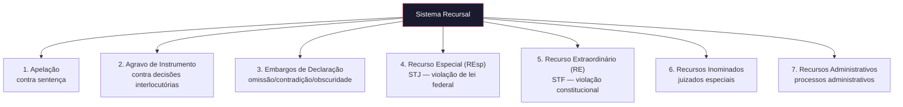

# Capítulo 12: Engenharia Recursal

## 12.1 A Importância Estratégica dos Recursos no Processo Jurídico

O sistema recursal é um **pilar fundamental** do devido processo legal, garantindo às partes a revisão de decisões judiciais e a busca pela correção de eventuais erros ou injustiças. A Engenharia Recursal, no contexto do JIF, é a disciplina que se dedica à análise estratégica do cabimento, prazos, probabilidade de sucesso e custos dos recursos.

> [!IMPORTANT]
> A Engenharia Recursal visa otimizar a estratégia recursal, **maximizando as chances de reforma ou anulação** de decisões desfavoráveis com o menor custo e risco possíveis.

---

## 12.2 Análise de Cabimento, Prazos e Probabilidade de Sucesso

### 12.2.1 Análise de Cabimento

O cabimento refere-se à **adequação legal** do recurso para impugnar uma determinada decisão:

| Critério | Verificação |
|----------|-------------|
| **Natureza da Decisão** | Se a decisão é passível de recurso (sentença, acórdão, decisão interlocutória, despacho) |
| **Previsão Legal** | Se o recurso está expressamente previsto em lei para a decisão (princípio da taxatividade) |
| **Requisitos Específicos** | Se a decisão preenche requisitos específicos do tipo de recurso (omissão/contradição para ED, matéria de direito para REsp) |
| **Interesse Recursal** | Se a parte sucumbiu total ou parcialmente, demonstrando necessidade e utilidade |

### 12.2.2 Prazos Recursais

> [!WARNING]
> O cumprimento dos prazos é requisito de **admissibilidade fundamental**. Sua inobservância leva à preclusão — perda irreversível do direito de recorrer.

- **Contagem do Prazo** — Início e fim considerando regras específicas, feriados e suspensões
- **Duplicidade de Prazos** — Prazos diferenciados para Fazenda Pública e Ministério Público
- **Preclusão** — Monitoramento contínuo para evitar a perda do direito

### 12.2.3 Probabilidade de Sucesso e Custos

Avaliação estratégica utilizando Modelos Matemáticos (Cap. 29) e Biblioteca de Estratégias (Cap. 36):

| Fator | Análise |
|-------|---------|
| **Precedentes** | Pesquisa jurisprudencial (Cap. 15) sobre decisões do tribunal que julgará o recurso |
| **Vulnerabilidades** | Engenharia Reversa da Decisão ([Cap. 11](cap11_eng_reversa_decisoes.md)) para identificar pontos exploráveis |
| **Custos** | Custas processuais, honorários, despesas com peritos e outros gastos |
| **Riscos** | Possibilidade de agravamento em segunda instância ou tribunais superiores |
| **Benefícios** | Potenciais ganhos financeiros e estratégicos com a reforma |

---

## 12.3 Estruturação de Peças Recursais

### 12.3.1 Elementos Essenciais

Toda peça recursal bem estruturada deve conter:

1. **Endereçamento** — Correta indicação do órgão jurisdicional destinatário
2. **Qualificação das Partes** — Identificação completa dos envolvidos
3. **Breve Síntese da Decisão Recorrida** — Resumo dos pontos principais impugnados
4. **Fundamentação Recursal** — Parte mais crítica, construída com base na Engenharia da Fundamentação ([Cap. 9](cap09_eng_fundamentacao.md)):
   - **Preliminares** — Questões processuais que podem levar à nulidade (cerceamento de defesa, violação do contraditório)
   - **Mérito** — Argumentos de fato e de direito demonstrando o equívoco da decisão
5. **Pedido Recursal** — Formulação clara e específica do que se busca (reforma, anulação, provimento parcial)

### 12.3.2 Os 7 Tipos de Recursos

| # | Recurso | Cabimento | Tribunal |
|---|---------|-----------|---------|
| 1 | **Apelação** | Contra sentença | Tribunal de Justiça / TRF |
| 2 | **Agravo de Instrumento** | Contra decisões interlocutórias | Tribunal de Justiça / TRF |
| 3 | **Embargos de Declaração** | Omissão, contradição, obscuridade ou erro material | Mesmo órgão prolator |
| 4 | **Recurso Especial** | Violação de lei federal ou divergência jurisprudencial | Superior Tribunal de Justiça (STJ) |
| 5 | **Recurso Extraordinário** | Violação da Constituição Federal | Supremo Tribunal Federal (STF) |
| 6 | **Recursos Inominados** | Sentenças em juizados especiais | Turma Recursal |
| 7 | **Recursos Administrativos** | Decisões em processos administrativos | Órgão superior |

---

## 12.4 Estratégias para Maximizar o Êxito Recursal

- **Foco nos Pontos-Chave** — Concentrar argumentação nos pontos mais vulneráveis da decisão e nos argumentos mais fortes
- **Clareza e Concisão** — Apresentar argumentos de forma direta e objetiva
- **Precedentes Qualificados** — Citar jurisprudência dominante e precedentes vinculantes
- **Ponderação de Riscos** — Avaliar cuidadosamente riscos, especialmente em tribunais superiores
- **Sustentação Oral** — Preparação eficaz, quando cabível, para reforçar argumentos
- **Acompanhamento Processual** — Monitoramento constante do andamento, despachos e pautas

---

## 12.5 O Motor Recursal do JIF

O **Motor Recursal** automatiza e auxilia nas tarefas da Engenharia Recursal:

| Funcionalidade | Descrição |
|---------------|-----------|
| **Análise de Cabimento Automatizada** | Sugestão do recurso cabível com base na natureza da decisão e requisitos legais |
| **Cálculo de Prazos** | Monitoramento automático com alertas e lembretes |
| **Análise Preditiva de Sucesso** | Modelos estatísticos e IA para estimar probabilidade de provimento |
| **Geração de Esqueletos** | Templates pré-preenchidos para diferentes tipos de recursos |
| **Auditoria Recursal** | Verificação de conformidade com requisitos legais e diretivas mestras |
| **Sugestão de Argumentos** | Com base na Engenharia Reversa, sugere argumentos mais eficazes |

## Referências Cruzadas

- **Capítulo 9** — [Engenharia da Fundamentação](cap09_eng_fundamentacao.md)
- **Capítulo 11** — [Engenharia Reversa das Decisões](cap11_eng_reversa_decisoes.md)
- **Capítulo 15** — Pesquisa Jurisprudencial
- **Capítulo 23** — Motor de Coerência Jurídica
- **Capítulo 29** — Modelos Matemáticos Aplicados ao Direito
- **Capítulo 33** — Biblioteca de Templates
- **Capítulo 36** — Biblioteca de Estratégias

---
> Sigma—Juris Intelligence Framework (SJIF) v1.0 | Propriedade de Charles de Paula Eugênio — Sigma Sihf Soluções Analíticas Ltda
