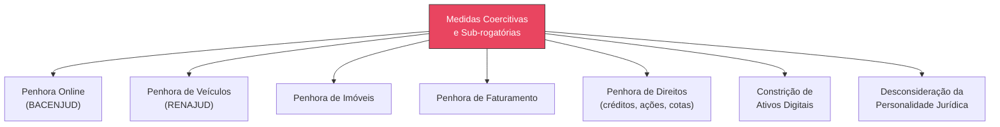

# Capítulo 13: Engenharia da Execução

## 13.1 A Efetivação do Direito: O Desafio da Execução

Uma decisão judicial favorável, por mais justa que seja, só se concretiza plenamente com a sua **efetiva execução**. A Engenharia da Execução, no contexto do JIF, é a disciplina que se dedica à otimização e à gestão estratégica dos processos de cumprimento de sentença e execução de títulos extrajudiciais.

> [!NOTE]
> Em um cenário onde a complexidade na localização de bens e a morosidade processual são desafios constantes, a Engenharia da Execução visa garantir a **máxima efetividade** do direito reconhecido, transformando a vitória no processo de conhecimento em resultado prático e tangível.

---

## 13.2 Mapeamento de Bens e Direitos do Devedor

O sucesso de um processo de execução depende, em grande parte, da capacidade de **identificar e localizar bens e direitos** passíveis de penhora.

### 13.2.1 Fontes de Informação para Mapeamento

| # | Fonte | Descrição |
|---|-------|-----------|
| 1 | **Bancos de Dados Públicos** | Registros de imóveis, veículos (DETRAN/RENAJUD), juntas comerciais, cartórios de protesto, BACENJUD, INFOJUD, RENAJUD, SNIPER |
| 2 | **Pesquisa Online** | Análise de perfis públicos em redes sociais, notícias e informações disponíveis que indiquem patrimônio ou atividades econômicas |
| 3 | **Investigação Patrimonial** | Contratação de investigadores especializados em casos complexos |
| 4 | **Declarações de IR** | Acesso mediante autorização judicial para revelar bens, direitos e rendimentos |
| 5 | **Registros de Empresas** | Dados de empresas das quais o devedor seja sócio ou administrador |

### 13.2.2 Técnicas de Análise de Patrimônio

- **Análise de Fluxo Financeiro** — Estudo de movimentações bancárias para identificar padrões de gastos, recebimentos e transferências suspeitas
- **Identificação de Blindagem Patrimonial** — Análise de estruturas societárias complexas, doações, vendas simuladas ou manobras para ocultar patrimônio
- **Valoração de Ativos** — Estimativa do valor de mercado dos bens para avaliar suficiência do patrimônio
- **Análise de Conexões** — Mapeamento de relações entre devedor e terceiros (familiares, sócios, empresas) utilizados para ocultação

---

## 13.3 Estratégias para Efetivação de Decisões Judiciais

### 13.3.1 Medidas Coercitivas e Sub-rogatórias

| Medida | Descrição | Observações |
|--------|-----------|-------------|
| **Penhora Online (BACENJUD)** | Bloqueio de valores em contas bancárias | O JIF otimiza frequência e momento das solicitações |
| **Penhora de Veículos (RENAJUD)** | Restrição de circulação e transferência de veículos | Sistema integrado com DETRAN |
| **Penhora de Imóveis** | Averbação da penhora em matrículas | Impede alienação |
| **Penhora de Faturamento** | Bloqueio de percentual do faturamento empresarial | Para empresas devedoras |
| **Penhora de Direitos** | Créditos, ações, cotas sociais, aluguéis | Patrimônio intangível |
| **Constrição de Ativos Digitais** | Criptomoedas, ativos em plataformas digitais | Tendência crescente |
| **Desconsideração da Personalidade Jurídica** | Atingir patrimônio dos sócios | Medida excepcional, exige abuso demonstrado |

### 13.3.2 Medidas Indutivas

| Medida | Descrição | Efeito Esperado |
|--------|-----------|----------------|
| **Inclusão em Cadastros de Inadimplentes** | Registro em SPC/SERASA | Induzir ao pagamento via restrição de crédito |
| **Protesto Judicial** | Formalização da dívida em cartório | Publicidade e restrições ao crédito |
| **Suspensão de CNH e Passaporte** | Medidas atípicas de coerção | Compelir ao cumprimento (exige fundamentação robusta) |
| **Leilões e Hastas Públicas** | Alienação de bens penhorados | Satisfação direta do crédito |

---

## 13.4 Gestão de Processos de Execução e Cumprimento de Sentença

### 13.4.1 Monitoramento e Automação

- **Acompanhamento Automatizado** — Monitoramento constante com alertas para prazos, movimentações e decisões
- **Geração de Petições e Requerimentos** — Automação de petições de penhora, requisições a bancos de dados e documentos padronizados
- **Gestão de Ativos Penhorados** — Controle, avaliação, guarda e preparação para alienação

### 13.4.2 Análise de Desempenho e Otimização

| Indicador (KPI) | Métrica |
|-----------------|---------|
| **Taxa de Sucesso** | % de execuções com recuperação efetiva de crédito |
| **Tempo Médio de Execução** | Dias entre início da execução e satisfação do crédito |
| **Custo por Processo** | Valor gasto em cada processo de execução |
| **Valor Recuperado** | Total financeiro efetivamente recuperado |
| **Padrões de Devedores** | Tipos de bens mais comuns, estratégias de ocultação |

---

## 13.5 O Motor de Execução do JIF

O **Motor de Execução** automatiza e auxilia nas tarefas da Engenharia da Execução:

| Funcionalidade | Descrição |
|---------------|-----------|
| **Mapeamento Patrimonial Inteligente** | Integração com diversas fontes de dados para identificar e cruzar informações sobre patrimônio |
| **Sugestão de Medidas Executivas** | Com base no perfil do devedor e patrimônio identificado, sugere medidas mais eficazes |
| **Automação de Requerimentos** | Geração automática de petições e requisições (BACENJUD, INFOJUD, RENAJUD) |
| **Análise de Risco de Inexecução** | Avaliação da probabilidade de insucesso considerando perfil e complexidade |
| **Monitoramento de Ativos** | Acompanhamento de bens penhorados com alertas sobre movimentações |

> [!TIP]
> Ao integrar a Engenharia da Execução, o JIF transforma a fase de cumprimento de sentença em um **processo estratégico e eficiente**, garantindo que o direito reconhecido seja efetivamente concretizado.

## Referências Cruzadas

- **Capítulo 7** — [Engenharia Processual](cap07_eng_processual.md)
- **Capítulo 22** — Auditoria Jurídica
- **Capítulo 29** — Modelos Matemáticos Aplicados ao Direito
- **Capítulo 35** — Biblioteca de Indicadores (KPIs e KRIs)
- **Capítulo 36** — Biblioteca de Estratégias

---
> Sigma—Juris Intelligence Framework (SJIF) v1.0 | Propriedade de Charles de Paula Eugênio — Sigma Sihf Soluções Analíticas Ltda
