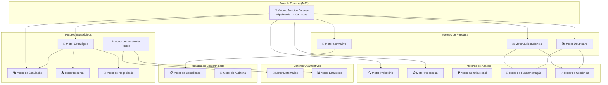

# 04_MOTORES / Especializados — Visão Geral

> **Sigma—Juris Intelligence Framework (SJIF) v1.0**

## Descrição

Este diretório contém a documentação detalhada de todos os **Motores Especializados** do Juris Intelligence Framework (JIF). Os motores são o coração operacional do sistema, responsáveis por processar, analisar e gerar insights a partir de diferentes tipos de dados jurídicos. Cada motor é projetado para executar funções específicas e complexas dentro do domínio jurídico, permitindo que o sistema realize tarefas que, de outra forma, exigiriam horas de trabalho humano especializado.

## Arquitetura dos Motores Especializados

## Conteúdo do Diretório

### Capítulos Principais

| Arquivo | Capítulo | Descrição |
|---------|----------|-----------|
| [cap25_modulo_forense.md](cap25_modulo_forense.md) | Cap. 25 | Módulo Jurídico Forense (MJF) — Pipeline de 10 Camadas |
| [cap26_motores_especializados.md](cap26_motores_especializados.md) | Cap. 26 | Visão geral de todos os motores especializados e interconexões |

### Motores de Pesquisa e Legislação

| Arquivo | Motor | Descrição |
|---------|-------|-----------|
| [motor_normativo.md](motor_normativo.md) | Normativo | Pesquisa legislativa, consolidação, vigência, hierarquia |
| [motor_jurisprudencial.md](motor_jurisprudencial.md) | Jurisprudencial | Busca semântica, precedentes vinculantes, padrões decisórios |
| [motor_doutrinario.md](motor_doutrinario.md) | Doutrinário | Pesquisa doutrinária, correntes de pensamento, influência |

### Motores de Análise Jurídica

| Arquivo | Motor | Descrição |
|---------|-------|-----------|
| [motor_probatorio.md](motor_probatorio.md) | Probatório | Inventário de provas, análise de lacunas, visualização |
| [motor_processual.md](motor_processual.md) | Processual | Mapeamento processual, conformidade, alertas |
| [motor_constitucional.md](motor_constitucional.md) | Constitucional | Análise constitucional, direitos fundamentais |
| [motor_fundamentacao.md](motor_fundamentacao.md) | Fundamentação | Esqueleto argumentativo, análise de coerência |
| [motor_coerencia.md](motor_coerencia.md) | Coerência | Matriz de consistência, pontuação de qualidade |

### Motores Estratégicos e de Simulação

| Arquivo | Motor | Descrição |
|---------|-------|-----------|
| [motor_estrategico.md](motor_estrategico.md) | Estratégico | SWOT jurídico, modelagem de cenários, sugestão de estratégias |
| [motor_simulacao.md](motor_simulacao.md) | Simulação | Simulação do julgador e da parte contrária |
| [motor_recursal.md](motor_recursal.md) | Recursal | Admissibilidade, prazos, predição de sucesso |
| [motor_negociacao.md](motor_negociacao.md) | Negociação | Estratégia negocial, análise BATNA |
| [motor_gestao_riscos.md](motor_gestao_riscos.md) | Gestão de Riscos | Identificação de riscos, matrizes, mitigação |

### Motores Quantitativos

| Arquivo | Motor | Descrição |
|---------|-------|-----------|
| [motor_matematico.md](motor_matematico.md) | Matemático | Análise estatística, modelos preditivos, simulador |
| [motor_estatistico.md](motor_estatistico.md) | Estatístico | Estatística descritiva e inferencial para dados jurídicos |

### Motores de Conformidade e Auditoria

| Arquivo | Motor | Descrição |
|---------|-------|-----------|
| [motor_compliance.md](motor_compliance.md) | Compliance | Obrigações regulatórias, monitoramento de conformidade |
| [motor_auditoria.md](motor_auditoria.md) | Auditoria | Checklists automatizados, revisão documental por IA |

## Capítulos Relacionados

- [Cap. 27 — Ontologia Jurídica](../../05_BIBLIOTECAS/) — Modelo formal de conceitos e relações
- [Cap. 28 — Grafo de Conhecimento Jurídico](../../05_BIBLIOTECAS/) — Rede semântica de entidades jurídicas
- [Cap. 29 — Modelos Matemáticos](../../10_MODELOS_MATEMATICOS/) — Fundamentos quantitativos
- [Cap. 30 — Inteligência Artificial](../../11_INTELIGENCIA_ARTIFICIAL/) — IA aplicada ao Direito
- [Motores por Área do Direito](../areas/) — Motores especializados por domínio jurídico

## Princípio de Interconexão

> Os motores **não operam isoladamente**. Eles são interconectados e trabalham em sinergia para fornecer uma inteligência jurídica abrangente. O Motor Normativo alimenta o Motor de Compliance; o Motor Jurisprudencial e o Motor Doutrinário fornecem subsídios para o Motor de Coerência e o Motor Decisório; o Motor de Gestão de Riscos utiliza informações de todos os demais motores.

---
> Sigma—Juris Intelligence Framework (SJIF) v1.0 | Propriedade de Charles de Paula Eugênio — Sigma Sihf Soluções Analíticas Ltda
