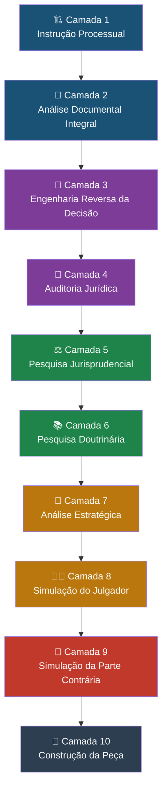

# Capítulo 25 — Módulo Jurídico Forense (MJF)

> **Sigma—Juris Intelligence Framework (SJIF) v1.0 | BLOCO V — Módulos e Motores Especializados**

## 25.1 O Módulo Jurídico Forense: Uma Abordagem Multicamadas para Análise Processual

O **Módulo Jurídico Forense (MJF)** é um dos componentes mais sofisticados do Juris Intelligence Framework (JIF), projetado para ser acionado sempre que a demanda envolver **processos, contratos, recursos, sentenças ou pareceres**. Ele representa uma abordagem multicamadas para a análise processual, integrando diversas funcionalidades do JIF para fornecer uma compreensão profunda e estratégica de qualquer litígio.

O MJF não se limita a coletar dados; ele os **processa, analisa e transforma em inteligência acionável**, permitindo uma atuação jurídica mais precisa e eficaz.

## Pipeline de 10 Camadas



---

## 25.2 Camada 1 — Instrução Processual

A primeira camada foca na coleta e organização das **informações básicas do processo**, estabelecendo o contexto para as análises subsequentes.

### 25.2.1 Elementos Identificados

| Elemento | Descrição |
|----------|-----------|
| **Tipo de Ação** | Classificação da natureza jurídica da demanda (e.g., ação de cobrança, indenizatória, mandado de segurança) |
| **Fase Processual** | Estágio atual do processo (conhecimento, instrutória, recursal, execução) |
| **Competência** | Órgão jurisdicional competente para julgar a causa |
| **Partes** | Qualificação completa de todas as partes envolvidas e representantes legais |
| **Pedidos** | Análise detalhada dos pedidos principais e subsidiários, e sua relação com a causa de pedir |
| **Causa de Pedir** | Fatos e fundamentos jurídicos que embasam os pedidos |
| **Provas** | Levantamento das provas existentes e identificação das que precisam ser produzidas |
| **Cronologia** | Reconstrução da sequência temporal dos eventos processuais e fatos relevantes |
| **Documentos Anexados** | Organização e indexação de todos os documentos que instruem o processo |
| **Decisões Anteriores** | Análise de todas as decisões já proferidas no processo |

> **Referência cruzada**: Engenharia Processual — [Capítulo 7](../../03_FRAMEWORK/)

---

## 25.3 Camada 2 — Análise Documental Integral

Aplica a **Diretiva Mestra** do JIF de forma rigorosa, garantindo que nenhuma informação seja negligenciada. O objetivo é gerar um **mapa completo do processo**.

### 25.3.1 Diretivas Aplicadas

- ✅ **Leitura linha por linha** — Cada palavra e frase é examinada minuciosamente
- ✅ **Nenhuma página ignorada** — Todos os documentos, independentemente do tamanho, são processados
- ✅ **Nenhuma prova omitida** — Todas as evidências são consideradas e avaliadas
- ✅ **Nenhuma petição ignorada** — Todas as manifestações das partes são analisadas
- ✅ **Nenhuma decisão ignorada** — Todas as deliberações judiciais são incluídas
- ✅ **Nenhuma movimentação ignorada** — O histórico completo é mapeado

O resultado é um **mapa completo do processo**, que interliga documentos, fatos, partes e decisões, fornecendo uma visão holística do litígio.

> **Referência cruzada**: Diretiva Mestra — [Capítulo 2](../../02_DIRETIVA_MESTRA/); Engenharia da Prova — [Capítulo 8](../../03_FRAMEWORK/); Grafo de Conhecimento — [Capítulo 28](../../05_BIBLIOTECAS/)

---

## 25.4 Camada 3 — Engenharia Reversa da Decisão

Uma das camadas mais poderosas do MJF, que **reconstrói o raciocínio utilizado pelo julgador**, permitindo uma análise crítica aprofundada.

### 25.4.1 Perguntas-Chave para Reconstrução do Raciocínio

1. Qual **tese jurídica** ele utilizou?
2. Quais **provas** ele aceitou?
3. Quais **provas ignorou**?
4. Quais **fundamentos** utilizou?
5. Quais **precedentes** citou?
6. Quais **artigos** aplicou?
7. Quais **argumentos rejeitou**?
8. Quais **argumentos sequer analisou**?
9. A decisão possui **coerência lógica**?
10. Existe **salto argumentativo**?
11. Existe **contradição**?
12. Existe **fundamentação aparente**?
13. Existe **fundamentação insuficiente**?
14. Existe **omissão**?
15. Existe **erro material**?
16. Existe **erro de premissa**?
17. Existe **erro de interpretação**?

> **Referência cruzada**: Engenharia Reversa das Decisões — [Capítulo 11](../../03_FRAMEWORK/)

---

## 25.5 Camada 4 — Auditoria Jurídica

O sistema procura **vulnerabilidades** na decisão ou na construção jurídica, aplicando os princípios da Auditoria Jurídica e utilizando o Motor de Coerência Jurídica.

### 25.5.1 Vulnerabilidades Buscadas

| Vulnerabilidade | Exemplos |
|-----------------|----------|
| **Contradições** | Uma parte da decisão contradiz outra |
| **Omissões** | Pedidos não analisados, provas ignoradas, argumentos ignorados, documentos ignorados, questões prejudiciais não enfrentadas |
| **Fundamentação insuficiente** | A decisão apenas afirma, não demonstra |
| **Violação do contraditório** | Argumento relevante sem apreciação |
| **Violação da ampla defesa** | Prova desconsiderada sem justificativa |
| **Violação do devido processo legal** | Inconsistência lógica, erros cronológicos, erros matemáticos, erros documentais |

> **Referência cruzada**: Auditoria Jurídica — [Capítulo 22](../../04_MOTORES/); Motor de Coerência — [Capítulo 23](../../04_MOTORES/)

---

## 25.6 Camada 5 — Pesquisa Jurisprudencial

Pesquisa automatizada e aprofundada da jurisprudência relevante.

### 25.6.1 Elementos Pesquisados

- 🏛️ Tribunal competente
- 🏛️ Tribunais Superiores
- ⚖️ Jurisprudência dominante
- 📌 Precedentes vinculantes
- 🔁 Temas repetitivos
- 📋 Súmulas
- 📎 Orientações
- ⚡ Incidentes
- 🔁 Recursos repetitivos
- 🌐 Repercussão geral

> **Referência cruzada**: Motor Jurisprudencial — [motor_jurisprudencial.md](motor_jurisprudencial.md); Pesquisa Jurisprudencial — [Capítulo 15](../../03_FRAMEWORK/)

---

## 25.7 Camada 6 — Pesquisa Doutrinária

Busca automatizada na doutrina, complementando a pesquisa jurisprudencial.

### 25.7.1 Elementos Pesquisados

- 📖 Doutrina majoritária
- 📖 Doutrina minoritária
- 👤 Autores
- 💬 Comentários
- 📕 Livros
- 📰 Artigos
- 📓 Revistas

> **Referência cruzada**: Motor Doutrinário — [motor_doutrinario.md](motor_doutrinario.md); Pesquisa Doutrinária — [Capítulo 16](../../03_FRAMEWORK/)

---

## 25.8 Camada 7 — Análise Estratégica

Com base em todas as informações das camadas anteriores, esta camada constrói as **melhores teses e planos estratégicos**.

### 25.8.1 Construção de Teses e Planos

```
🥇 Melhor Tese
│   └── Plano A — Estratégia principal
🥈 Segunda Melhor Tese
│   └── Plano B — Estratégia alternativa
🥉 Terceira Tese
│   └── Plano C — Estratégia de contingência
📎 Teses Subsidiárias
    └── Argumentos de reserva
```

> **Referência cruzada**: Motor Estratégico — [motor_estrategico.md](motor_estrategico.md); Gestão Estratégica — [Capítulo 19](../../04_MOTORES/)

---

## 25.9 Camada 8 — Simulação do Julgador

Utiliza a **Engenharia Cognitiva do Julgador** para simular o raciocínio de um julgador, com base em padrões decisórios documentados.

### 25.9.1 Perguntas para Simulação

1. **Se eu fosse o juiz**, como decidiria?
2. **Se eu fosse o desembargador?** Mudaria?
3. **Se eu fosse o ministro?** Mudaria?
4. **Por quê?**

A simulação se baseia em padrões observáveis nas decisões públicas, avaliando frequência de fundamentos, teses acolhidas/rejeitadas, precedentes citados, estrutura da fundamentação e temas de maior rigor ou flexibilidade.

> **Referência cruzada**: Motor Decisório Jurídico — [Capítulo 24](../../04_MOTORES/); Motor de Simulação — [motor_simulacao.md](motor_simulacao.md)

---

## 25.10 Camada 9 — Simulação da Parte Contrária

O sistema constrói a **melhor defesa possível da parte contrária** e, em seguida, **tenta destruí-la**, fortalecendo enormemente a argumentação da parte que utiliza o MJF. Esta camada é crucial para **antecipar argumentos e preparar refutações eficazes**.

---

## 25.11 Camada 10 — Construção da Peça

Somente **após todas as análises e simulações**, o MJF auxilia na produção da peça jurídica, garantindo que ela seja **robusta, coerente e estrategicamente formulada**.

### 25.11.1 Tipos de Peças Produzidas

| Tipo | Descrição |
|------|-----------|
| **Petição** | Peça inaugural ou intermediária |
| **Recurso** | Peça recursal genérica |
| **Memorial** | Síntese argumentativa |
| **Parecer** | Opinião jurídica fundamentada |
| **Manifestação** | Pronunciamento processual |
| **Embargos** | Embargos de declaração, infringentes, etc. |
| **Agravo** | Agravo de instrumento, interno, etc. |
| **Apelação** | Recurso de apelação |
| **Contrarrazões** | Resposta a recurso da parte adversa |

> **Referência cruzada**: Biblioteca de Templates — [Capítulo 33](../../07_TEMPLATES/); Motor de Fundamentação — [motor_fundamentacao.md](motor_fundamentacao.md)

---

## 25.12 Engenharia Cognitiva do Julgador e Engenharia Reversa da Sentença

O MJF incorpora módulos especializados complementares:

### Engenharia Cognitiva do Julgador

Analisa o **padrão decisório documentado**, avaliando:
- Frequência de fundamentos
- Teses acolhidas/rejeitadas
- Precedentes citados
- Estrutura da fundamentação
- Temas de maior rigor ou flexibilidade

Permite **adaptar a forma de apresentação** da argumentação sem distorcer fatos ou fundamentos.

### Engenharia Reversa da Sentença

A IA tenta responder:

> *"Se esta sentença fosse anulada, por onde ela seria anulada? Onde existe a maior vulnerabilidade? Quais fundamentos são frágeis? Onde está a omissão? Onde está a contradição? Onde há ausência de fundamentação? Onde existe erro lógico? Onde existe violação processual?"*

---

## 25.13 O MJF como Módulo Jurídico Especializado do JIF

O Módulo Jurídico Forense trabalha **sempre com evidências jurídicas verificáveis**: processo, legislação, precedentes, doutrina e fatos dos autos.

> [!IMPORTANT]
> Ao analisar um julgador, o foco deve ser em **padrões observáveis nas decisões públicas** e nunca em especulações sobre preferências pessoais ou tentativas de manipulação. O módulo permanece **tecnicamente sólido, eticamente adequado** e útil para construir a argumentação mais consistente possível dentro dos limites do Direito.

---

## Integração com Outros Motores

| Motor | Função no MJF |
|-------|---------------|
| [Motor Normativo](motor_normativo.md) | Base legislativa para fundamentação |
| [Motor Jurisprudencial](motor_jurisprudencial.md) | Pesquisa de precedentes (Camada 5) |
| [Motor Doutrinário](motor_doutrinario.md) | Pesquisa doutrinária (Camada 6) |
| [Motor de Coerência](motor_coerencia.md) | Auditoria de consistência (Camada 4) |
| [Motor Estratégico](motor_estrategico.md) | Construção de teses (Camada 7) |
| [Motor de Simulação](motor_simulacao.md) | Simulações (Camadas 8 e 9) |
| [Motor de Fundamentação](motor_fundamentacao.md) | Construção da peça (Camada 10) |

---
> Sigma—Juris Intelligence Framework (SJIF) v1.0 | Propriedade de Charles de Paula Eugênio — Sigma Sihf Soluções Analíticas Ltda
