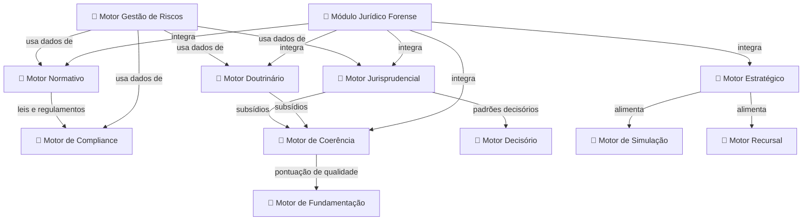

# Capítulo 26 — Motores Especializados

> **Sigma—Juris Intelligence Framework (SJIF) v1.0 | BLOCO V — Módulos e Motores Especializados**

## 26.1 A Modularidade da Inteligência: Motores Especializados no JIF

O Juris Intelligence Framework (JIF) é construído sobre uma **arquitetura modular**, onde cada componente — ou "motor" — é projetado para executar funções específicas e complexas dentro do domínio jurídico. Os Motores Especializados são o **coração operacional** do JIF, responsáveis por processar, analisar e gerar insights a partir de diferentes tipos de dados jurídicos.

Eles representam a materialização da inteligência artificial e da engenharia jurídica aplicada, permitindo que o sistema execute tarefas que, de outra forma, exigiriam horas de trabalho humano especializado.

## Taxonomia Completa dos Motores

```mermaid
graph LR
    subgraph "Motores Funcionais"
        direction TB
        MN["Motor Normativo"]
        MJ["Motor Jurisprudencial"]
        MD["Motor Doutrinário"]
        MP["Motor Probatório"]
        MPR["Motor Processual"]
        ME["Motor Estratégico"]
        MMA["Motor Matemático"]
        MES["Motor Estatístico"]
        MCM["Motor de Compliance"]
        MCO["Motor Constitucional"]
        MA["Motor de Auditoria"]
        MCR["Motor de Coerência"]
        MF["Motor de Fundamentação"]
        MS["Motor de Simulação"]
        MR["Motor Recursal"]
        MNE["Motor de Negociação"]
        MGR["Motor Gestão de Riscos"]
    end
    
    subgraph "Motores por Área"
        direction TB
        MEMP["Motor Empresarial"]
        MT["Motor Tributário"]
        MTR["Motor Trabalhista"]
        MMI["Motor Minerário"]
        MAM["Motor Ambiental"]
        MAG["Motor Agrário"]
    end
```

---

## 26.2 Motor Normativo

Responsável por toda a inteligência relacionada à legislação. Vai além da simples busca, englobando a **análise e interpretação** das normas jurídicas.

### Funções Principais

- **Pesquisa Legislativa Avançada** — Localiza leis, decretos, portarias e regulamentos com busca semântica e filtros contextuais
- **Consolidação de Normas** — Texto atualizado incorporando todas as alterações, revogações e aditamentos
- **Análise de Vigência e Eficácia** — Verificação de vigor, revogação, suspensão ou efeitos retroativos
- **Mapeamento de Hierarquia Normativa** — Posicionamento na pirâmide de Kelsen
- **Identificação de Conflitos Normativos** — Alertas sobre antinomias entre dispositivos legais
- **Análise de Impacto Legislativo** — Avaliação de efeitos de nova lei sobre casos ou setores
- **Monitoramento Legislativo** — Notificações sobre novas leis e projetos

> **Detalhes**: [motor_normativo.md](motor_normativo.md)

---

## 26.3 Motor Jurisprudencial

Dedicado à análise e compreensão dos **padrões decisórios** dos tribunais.

### Funções Principais

- **Pesquisa Jurisprudencial Semântica** — Busca por conceitos e contexto em todas as instâncias
- **Identificação de Precedentes Vinculantes** — Súmulas vinculantes, recursos repetitivos, IRDRs
- **Análise de Jurisprudência Dominante** — Entendimento majoritário e tendências decisórias
- **Mapeamento de Divergências** — Conflitos entre órgãos judiciais ou turmas
- **Análise de Padrões Decisórios de Julgadores** — Histórico individual de julgadores
- **Evolução da Jurisprudência** — Linha do tempo de interpretações
- **Alerta de Novas Decisões** — Notificações sobre novos julgados relevantes

> **Detalhes**: [motor_jurisprudencial.md](motor_jurisprudencial.md)

---

## 26.4 Motor Doutrinário

Responsável por processar e organizar o conhecimento produzido por **juristas e acadêmicos**.

### Funções Principais

- **Pesquisa Doutrinária Abrangente** — Busca semântica em livros, artigos, pareceres e comentários
- **Identificação de Correntes de Pensamento** — Classificação em posições majoritárias e minoritárias
- **Análise de Influência Doutrinária** — Impacto de autores e obras na jurisprudência e legislação
- **Geração de Resumos e Sínteses** — Resumos destacando principais argumentos e conclusões
- **Mapeamento de Citações** — Como autores são citados por outros juristas ou decisões
- **Alerta de Novas Publicações** — Notificações sobre novas obras relevantes

> **Detalhes**: [motor_doutrinario.md](motor_doutrinario.md)

---

## 26.5 Motor de Coerência Jurídica (MCJ)

Guardião da **lógica e consistência** na construção jurídica, atuando como auditor técnico.

### Funções Principais

- **Avaliação da Qualidade Técnica** — Análise de robustez com pontuação de coerência
- **Identificação de Omissões** — Fatos, provas, normas ou argumentos não abordados
- **Detecção de Contradições** — Inconsistências internas e externas
- **Análise de Fragilidades Argumentativas** — Saltos lógicos, fundamentação genérica
- **Verificação de Aderência** — Correspondência fatos-provas, pedidos-fundamentos

> **Detalhes**: [motor_coerencia.md](motor_coerencia.md)

---

## 26.6 Motor Decisório Jurídico (MDJ)

Utiliza a **engenharia cognitiva** para analisar padrões decisórios de julgadores.

### Funções Principais

- **Análise de Padrões Decisórios** — Mapeamento de frequência de acolhimento/rejeição de teses
- **Engenharia Cognitiva do Julgador** — Reconstrução do processo de raciocínio
- **Simulação do Julgador** — Simulação de como um julgador provavelmente decidiria
- **Adaptação da Argumentação** — Insights para priorizar argumentos e adaptar linguagem

> **Detalhes**: [motor_simulacao.md](motor_simulacao.md)

---

## 26.7 Motor de Gestão de Riscos

Dedicado à **identificação, avaliação, mitigação e monitoramento** proativo de eventos que podem gerar passivos jurídicos.

### Funções Principais

- **Identificação de Riscos Legais** — Análise de contratos, processos, políticas internas e ambiente regulatório
- **Avaliação de Probabilidade e Impacto** — Consequências financeiras, reputacionais e operacionais
- **Geração de Matrizes de Risco** — Classificação e priorização visual dos riscos
- **Sugestão de Estratégias de Mitigação** — Ações preventivas, corretivas e planos de contingência
- **Monitoramento Contínuo** — Acompanhamento de KRIs e alertas sobre eventos adversos

> **Detalhes**: [motor_gestao_riscos.md](motor_gestao_riscos.md)

---

## 26.8 Motor de Compliance

Garante a conformidade da organização com **leis, regulamentos, políticas internas e códigos de conduta**.

### Funções Principais

- **Mapeamento de Obrigações Regulatórias** — Identificação de normas aplicáveis por setor e localização
- **Monitoramento de Conformidade** — Verificação de aderência e geração de alertas
- **Análise de Riscos de Compliance** — Probabilidade e impacto de violações
- **Suporte a Auditorias** — Informações e evidências para auditorias internas e externas
- **Base de Conhecimento** — Repositório de melhores práticas de compliance e governança

> **Detalhes**: [motor_compliance.md](motor_compliance.md)

---

## 26.9 Interconexão e Sinergia dos Motores

> [!IMPORTANT]
> Os motores **não operam isoladamente**. Eles são interconectados e trabalham em sinergia:
> - O **Motor Normativo** alimenta o **Motor de Compliance** com leis e regulamentos aplicáveis
> - O **Motor Jurisprudencial** e o **Motor Doutrinário** fornecem subsídios para o **Motor de Coerência** e o **Motor Decisório**
> - O **Motor de Gestão de Riscos** utiliza informações de todos os demais motores
> - O **Módulo Jurídico Forense** (Cap. 25) integra a funcionalidade de vários motores para análise multicamadas

---

## Referências Cruzadas

| Capítulo | Relação |
|----------|---------|
| [Cap. 25 — MJF](cap25_modulo_forense.md) | Integra múltiplos motores no pipeline de 10 camadas |
| [Cap. 27 — Ontologia Jurídica](../../05_BIBLIOTECAS/) | Modelo conceitual que unifica os motores |
| [Cap. 28 — Grafo de Conhecimento](../../05_BIBLIOTECAS/) | Rede semântica que conecta entidades jurídicas |
| [Cap. 29 — Modelos Matemáticos](../../10_MODELOS_MATEMATICOS/) | Base quantitativa para motores matemáticos e estatísticos |
| [Cap. 30 — IA Aplicada](../../11_INTELIGENCIA_ARTIFICIAL/) | Tecnologia transversal que potencializa todos os motores |

---
> Sigma—Juris Intelligence Framework (SJIF) v1.0 | Propriedade de Charles de Paula Eugênio — Sigma Sihf Soluções Analíticas Ltda
