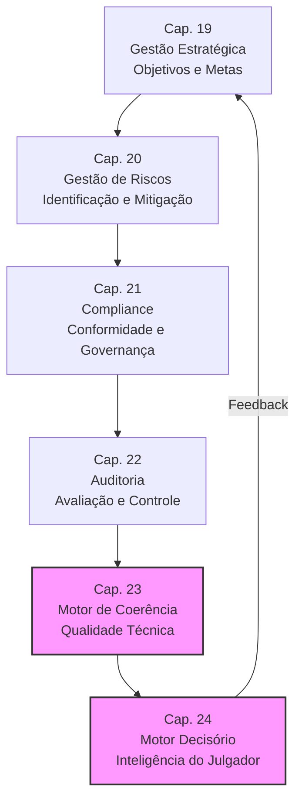

# 04_MOTORES / estrategia — Motores de Análise Estratégica

## Visão Geral

O diretório `estrategia/` contém os motores responsáveis pelo **planejamento, gestão de riscos, compliance, auditoria e otimização** da atuação jurídica, compondo o **BLOCO IV — Análise Estratégica** do SJIF (Capítulos 19–24). Estes motores transformam dados jurídicos em **decisões estratégicas fundamentadas**, elevando a função jurídica de centro de custos a **ativo estratégico**.

> **Princípio:** A análise estratégica jurídica integra a função jurídica aos objetivos globais da organização, garantindo que cada decisão jurídica seja informada por dados, riscos e oportunidades.

---

## Conteúdo do Diretório

| Arquivo | Capítulo | Título | Resumo |
|:--------|:---------|:-------|:-------|
| `cap19_gestao_estrategica.md` | Cap. 19 | **Gestão Estratégica Jurídica** | Objetivos SMART, estratégias processuais/negociais, KPIs/KRIs, análise SWOT jurídica |
| `cap20_gestao_riscos.md` | Cap. 20 | **Gestão de Riscos Jurídicos** | Ciclo de 4 fases (Identificação → Avaliação → Mitigação → Monitoramento), matrizes Probabilidade×Impacto |
| `cap21_compliance.md` | Cap. 21 | **Compliance e Governança** | 10 pilares de compliance, princípios IBGC, ESG, legislação anticorrupção |
| `cap22_auditoria.md` | Cap. 22 | **Auditoria Jurídica** | 6 tipos de auditoria, metodologia de 5 etapas, classificação de passivos e contingências |
| `cap23_motor_coerencia.md` | Cap. 23 | **Motor de Coerência Jurídica** | Matriz de Consistência (6 critérios), pontuação, detecção de omissões/contradições/fragilidades |
| `cap24_motor_decisorio.md` | Cap. 24 | **Motor Decisório Jurídico** | Análise de padrões decisórios (6 métricas), engenharia cognitiva do julgador, limites éticos |

---

## Fluxo Estratégico

---

## Destaques dos Motores

### 🏆 Motor de Coerência Jurídica (Cap. 23) — O Diferencial do SJIF

O componente **mais inovador** do framework:
- **Matriz de Consistência** com 6 critérios objetivos
- **Pontuação** de 0–100 para qualidade técnica
- **Detecção automática** de omissões, contradições e fragilidades
- Transforma revisão de peças em **processo objetivo e mensurável**

### 🧠 Motor Decisório Jurídico (Cap. 24) — Inteligência Estratégica

- **6 métricas** de análise de padrões decisórios
- **Engenharia Cognitiva** do julgador (baseada em dados públicos)
- **Simulação** do provável posicionamento do julgador
- **Limites éticos** rigorosos — jamais distorcer fatos ou manipular

### Complementaridade MCJ + MDJ

| Motor de Coerência (23) | Motor Decisório (24) |
|:------------------------|:---------------------|
| Solidez **interna** | Eficácia **externa** |
| "O argumento é sólido?" | "O argumento é eficaz para este julgador?" |

---

## Integração com Demais Blocos

| Fonte | O que fornece |
|:------|:-------------|
| **Pesquisa** (Caps. 14–18) | Dados normativos, jurisprudenciais e doutrinários |
| **Engenharia** (Caps. 7–13) | Peças construídas para avaliação e otimização |
| **Especializados** (Caps. 25–30) | Modelos matemáticos, IA, ontologia |
| **Bibliotecas** (Caps. 31–36) | KPIs/KRIs, templates, checklists, estratégias |

---

## Capítulos Relacionados

| Capítulo | Relação |
|:---------|:--------|
| [Cap. 2 — Diretiva Mestra](../../02_DIRETIVA_MESTRA/cap02_diretiva_mestra.md) | Diretivas Estratégica, de Auditoria e de IA |
| [Cap. 5 — Lógica Jurídica](../../03_FRAMEWORK/cap05_logica_argumentativa.md) | Base lógica para avaliação de coerência |
| [Cap. 14–18 — Pesquisa](../pesquisa/README.md) | Dados para análise estratégica |
| [Cap. 7–13 — Engenharia](../engenharia/README.md) | Peças para validação e otimização |
| [Cap. 25 — MJF](../especializados/cap25_modulo_forense.md) | Integração no módulo forense |
| [Cap. 29 — Modelos Matemáticos](../../10_MODELOS_MATEMATICOS/cap29_modelos_matematicos.md) | Modelos de risco, ponderação e simulação |
| [Cap. 35 — Indicadores](../../09_INDICADORES/cap35_biblioteca_indicadores.md) | KPIs e KRIs para monitoramento |

---

> Sigma—Juris Intelligence Framework (SJIF) v1.0 | Propriedade de Charles de Paula Eugênio — Sigma Sihf Soluções Analíticas Ltda
