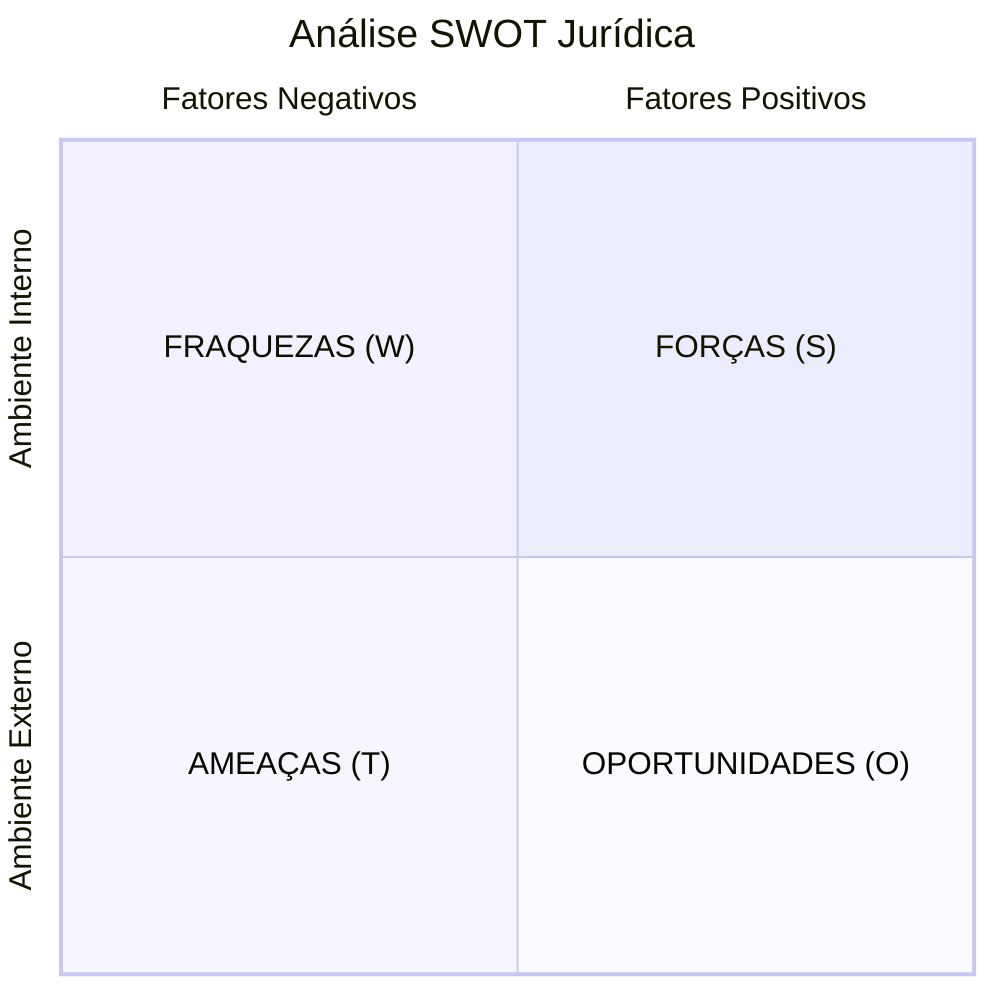

# Capítulo 19 — Gestão Estratégica Jurídica

## Visão Geral

A Gestão Estratégica Jurídica é a disciplina do Sigma—Juris Intelligence Framework (SJIF) que integra a **função jurídica aos objetivos globais da organização**, transformando o Direito de um centro de custos reativo em um **ativo estratégico** capaz de gerar valor e vantagem competitiva. Envolve a definição de objetivos e metas alinhados à estratégia empresarial, o planejamento e execução de ações jurídicas proativas, e o monitoramento contínuo de resultados.

> **Princípio-chave:** O Direito como vantagem competitiva — de centro de custos a parceiro estratégico na tomada de decisões.

---

## 19.1 Definição de Objetivos e Metas — Metodologia SMART

A gestão estratégica jurídica começa com a clara definição de onde a função jurídica precisa chegar. Todos os objetivos e metas devem seguir a metodologia **SMART**:

| Critério | Descrição | Exemplo Jurídico |
|:---------|:----------|:----------------|
| **S** — Specific (Específico) | Objetivos claros e bem definidos | "Reduzir ações trabalhistas no setor operacional" |
| **M** — Measurable (Mensurável) | Quantificáveis com métricas | "Reduzir em 30% o número de ações" |
| **A** — Achievable (Alcançável) | Realistas e factíveis | Baseado em análise de dados históricos |
| **R** — Relevant (Relevante) | Alinhados à estratégia empresarial | Impacta diretamente a rentabilidade |
| **T** — Time-bound (Temporal) | Com prazo definido | "Nos próximos 12 meses" |

### 19.1.1 Alinhamento com a Estratégia Empresarial

Os objetivos jurídicos devem estar **intrinsecamente ligados** aos objetivos de negócio:

- **Compreensão do Negócio** — Profundo conhecimento do setor, produtos, serviços, mercados e desafios
- **Participação Estratégica** — Área jurídica ativa nas discussões estratégicas da organização
- **Mapeamento de Riscos e Oportunidades** — Como o ambiente regulatório impacta o negócio

### 19.1.2 Exemplos de Objetivos e Metas Jurídicas

| Objetivo | Meta SMART |
|:---------|:-----------|
| Redução de litígios | Diminuir ações judiciais passivas em X% no próximo ano |
| Otimização de custos | Reduzir gastos com honorários e custas em Y% |
| Segurança jurídica | 100% dos contratos em conformidade com legislação vigente |
| Suporte à expansão | Suporte jurídico ágil para entrada em novos mercados |
| Melhora reputacional | Fortalecer imagem ética através de governança e compliance |

---

## 19.2 Planejamento e Execução de Estratégias

Com objetivos definidos, o SJIF estrutura o planejamento e execução em dois eixos:

### 19.2.1 Estratégias Processuais (Contenciosas)

| Estratégia | Ferramenta SJIF |
|:-----------|:---------------|
| **Análise de Cenários** | Modelos Matemáticos (Cap. 29) e Simulações |
| **Definição de Teses** | Engenharia da Fundamentação (Cap. 9) e Lógica Jurídica (Cap. 5) |
| **Gestão de Provas** | Engenharia da Prova (Cap. 8) |
| **Estratégia Recursal** | Engenharia Recursal (Cap. 12) |
| **Gestão da Execução** | Engenharia da Execução (Cap. 13) |

### 19.2.2 Estratégias Negociais (Consultivas)

| Estratégia | Descrição |
|:-----------|:----------|
| **Análise de Interesses** | Identificação de interesses de todas as partes, buscando soluções de ganho mútuo |
| **Mapeamento de Alternativas** | Diferentes opções e cenários, incluindo BATNA |
| **Mediação e Arbitragem** | Avaliação de métodos alternativos de resolução de conflitos |
| **Elaboração de Contratos** | Contratos claros e equilibrados, com base na Biblioteca de Templates (Cap. 33) |
| **Gestão de Contratos** | Monitoramento de cumprimento e riscos de descumprimento |

---

## 19.3 Monitoramento com KPIs e KRIs

A gestão estratégica exige **monitoramento contínuo** e avaliação rigorosa dos resultados.

### 19.3.1 Indicadores de Desempenho (KPIs)

Medem o **sucesso na consecução** dos objetivos:

| KPI | O que mede |
|:----|:-----------|
| Taxa de sucesso em litígios | % de decisões favoráveis |
| Tempo médio de resolução | Eficiência processual |
| Economia por consultorias preventivas | Valor gerado pela atuação consultiva |
| Satisfação do cliente interno | Qualidade percebida do serviço jurídico |

### 19.3.2 Indicadores de Risco (KRIs)

Monitoram **riscos jurídicos** e alertam para problemas:

| KRI | O que monitora |
|:----|:---------------|
| Novas ações judiciais | Volume de litígios emergentes |
| Valor de contingências | Exposição financeira |
| % de não conformidade | Desvios em auditorias |
| Alertas regulatórios | Novas obrigações legais |

### 19.3.3 Ferramentas de Monitoramento

- **Dashboards Jurídicos** — Painéis visuais com KPIs e KRIs em tempo real
- **Relatórios Gerenciais** — Análise periódica de resultados e recomendações
- **Auditoria Jurídica** (Cap. 22) — Avaliação independente da eficácia
- **Benchmark Jurídico** (Cap. 17) — Comparação com o mercado

---

## 19.4 Análise SWOT Jurídica

O **Motor Estratégico** do SJIF incorpora a análise SWOT adaptada ao contexto jurídico:

| Dimensão | Exemplos |
|:---------|:---------|
| **Forças (S)** | Equipe qualificada, processos bem estruturados, base de conhecimento |
| **Fraquezas (W)** | Gargalos processuais, falta de tecnologia, alta dependência de terceiros |
| **Oportunidades (O)** | Novas regulamentações favoráveis, expansão de mercado, ADRs |
| **Ameaças (T)** | Mudanças legislativas adversas, aumento de litigiosidade, concorrência |

---

## 19.5 Motor Estratégico — Funcionalidades

O **Motor Estratégico** (Cap. 26) automatiza e aprimora a Gestão Estratégica:

| Funcionalidade | Descrição |
|:---------------|:----------|
| **Análise SWOT Jurídica** | Identificação de Forças, Fraquezas, Oportunidades e Ameaças |
| **Modelagem de Cenários** | Modelos preditivos para avaliar impacto de estratégias |
| **Sugestão de Estratégias** | Abordagens processuais ou negociais mais adequadas |
| **Monitoramento de Tendências** | Mudanças legislativas, jurisprudenciais e de mercado |
| **Geração de Planos de Ação** | Planos detalhados com responsáveis, prazos e recursos |

---

## 19.6 O Direito como Diferencial Competitivo

Ao integrar a Gestão Estratégica Jurídica, o SJIF transforma a função jurídica em um **centro de inteligência e valor**, capaz de antecipar desafios, mitigar riscos e contribuir ativamente para o alcance dos objetivos estratégicos. O Direito deixa de ser um custo para se tornar um **diferencial competitivo**.

---

## Referências Cruzadas

| Capítulo | Relação |
|:---------|:--------|
| [Cap. 5 — Lógica Jurídica](../../03_FRAMEWORK/cap05_logica_argumentativa.md) | Construção de teses estratégicas |
| [Cap. 8 — Engenharia da Prova](../engenharia/cap08_eng_prova.md) | Gestão de provas na estratégia |
| [Cap. 12 — Engenharia Recursal](../engenharia/cap12_eng_recursal.md) | Estratégia recursal |
| [Cap. 17 — Benchmark Jurídico](../pesquisa/cap17_benchmark.md) | Comparação de desempenho |
| [Cap. 20 — Gestão de Riscos](cap20_gestao_riscos.md) | Riscos na estratégia |
| [Cap. 22 — Auditoria Jurídica](cap22_auditoria.md) | Avaliação da eficácia |
| [Cap. 29 — Modelos Matemáticos](../../10_MODELOS_MATEMATICOS/cap29_modelos_matematicos.md) | Simulações e cenários |
| [Cap. 35 — Indicadores](../../09_INDICADORES/cap35_biblioteca_indicadores.md) | KPIs e KRIs |

---

> Sigma—Juris Intelligence Framework (SJIF) v1.0 | Propriedade de Charles de Paula Eugênio — Sigma Sihf Soluções Analíticas Ltda
