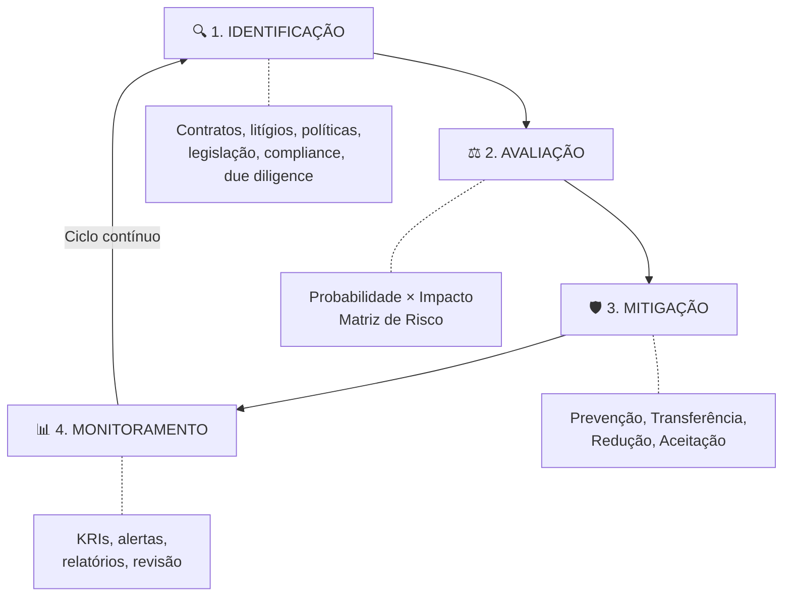

# Capítulo 20 — Gestão de Riscos Jurídicos

## Visão Geral

A Gestão de Riscos Jurídicos é a disciplina do Sigma—Juris Intelligence Framework (SJIF) dedicada à **identificação, avaliação, mitigação e monitoramento proativo** de eventos que podem gerar passivos, perdas financeiras, danos reputacionais ou interrupções operacionais decorrentes de questões legais. O ambiente jurídico é inerentemente permeado por **incertezas** que, quando não gerenciadas, podem representar riscos significativos para indivíduos e organizações.

> **Princípio-chave:** A incerteza jurídica não é eliminável, mas é gerenciável. Gestão de riscos eficaz transforma incerteza em vantagem estratégica.

---

## 20.1 O Ciclo de Gestão de Riscos — 4 Fases

A gestão de riscos jurídicos no SJIF é um **processo contínuo e sistemático** composto por 4 fases integradas:

---

## 20.2 Fase 1 — Identificação de Riscos

A identificação é a etapa de reconhecimento dos eventos que podem gerar **consequências jurídicas negativas**:

| Método de Identificação | Descrição |
|:----------------------|:----------|
| **Análise de Contratos** | Revisão para cláusulas ambíguas, desequilibradas ou com obrigações excessivas |
| **Análise de Processos Judiciais** | Levantamento de litígios em curso ou potenciais, com probabilidade de condenação |
| **Revisão de Políticas Internas** | Conformidade das práticas com legislação e regulamentação |
| **Monitoramento Legislativo** | Acompanhamento de novas leis e regulamentos que impactem operações |
| **Análise de Compliance** | Aderência a normas de setores regulados (Cap. 21) |
| **Due Diligence** | Investigação aprofundada em M&A, parcerias e investimentos |
| **Entrevistas com Stakeholders** | Conversas com gestores e colaboradores para identificar preocupações |

---

## 20.3 Fase 2 — Avaliação de Riscos (Probabilidade × Impacto)

Após identificação, os riscos são avaliados quanto à **probabilidade de ocorrência** e ao **impacto potencial**, utilizando Modelos Matemáticos (Cap. 29):

### Dimensões de Avaliação

| Dimensão | Escala | Descrição |
|:---------|:-------|:----------|
| **Probabilidade** | Baixa / Média / Alta | Chance do evento de risco ocorrer |
| **Impacto** | Baixo / Médio / Alto | Consequências: financeiro, reputacional, operacional, regulatório |
| **Priorização** | Combinação P × I | Classificação para foco nos riscos mais críticos |

### 20.3.1 Matriz de Risco Jurídico

| Probabilidade \ Impacto | 🟢 Baixo | 🟡 Médio | 🔴 Alto |
|:------------------------|:---------|:---------|:--------|
| **🟢 Baixa** | Risco Aceitável | Risco Moderado | Risco Elevado |
| **🟡 Média** | Risco Moderado | Risco Elevado | ⚠️ Risco Crítico |
| **🔴 Alta** | Risco Elevado | ⚠️ Risco Crítico | 🚨 Risco Crítico |

> [!IMPORTANT]
> Riscos classificados como **Críticos** exigem plano de ação imediato e monitoramento intensivo. Riscos **Elevados** requerem plano de mitigação dentro de prazo definido.

---

## 20.4 Fase 3 — Mitigação de Riscos

A mitigação envolve implementação de ações para **reduzir probabilidade** ou **minimizar impacto**:

### 4 Estratégias de Mitigação

| Estratégia | Descrição | Exemplo |
|:-----------|:----------|:--------|
| **Prevenção** | Evitar que o risco se materialize | Revisão de contratos, treinamento de compliance |
| **Transferência** | Repassar o risco para terceiros | Seguros, cláusulas de indenização |
| **Redução** | Diminuir probabilidade ou impacto | Controles internos, novas tecnologias |
| **Aceitação** | Aceitar o risco conscientemente | Quando custo de mitigação supera o risco |

---

## 20.5 Fase 4 — Monitoramento (Planos de Contingência)

### 20.5.1 Planos de Contingência

Conjuntos de ações pré-definidas para execução **caso o risco se materialize**:

| Componente | Descrição |
|:-----------|:----------|
| **Protocolos de Resposta** | Passos para violação de dados, acidente ambiental, processo inesperado |
| **Equipes de Crise** | Responsáveis e funções em emergências jurídicas |
| **Comunicação de Crise** | Estratégias para mídia, reguladores e stakeholders |
| **Recursos Financeiros** | Alocação para cobrir potenciais perdas |

### 20.5.2 Indicadores de Risco (KRIs)

| KRI | O que monitora |
|:----|:---------------|
| Volume de novas ações | Tendência de litigiosidade |
| Valor de contingências | Exposição financeira total |
| Taxa de não conformidade | Desvios em auditorias |
| Tempo de resposta a incidentes | Agilidade da organização |
| Alertas regulatórios | Novas obrigações legais |

---

## 20.6 Impacto Financeiro e Reputacional

Os riscos jurídicos produzem consequências que vão **muito além** de multas e condenações:

### Impacto Financeiro

| Tipo | Exemplos |
|:-----|:---------|
| **Custos Diretos** | Multas, indenizações, honorários, custas, perícias |
| **Custos Indiretos** | Perda de receita, queda de vendas, perda de contratos, aumento de prêmios |
| **Desvalorização** | Impacto no valor de mercado e de ativos |

### Impacto Reputacional

| Tipo | Consequências |
|:-----|:-------------|
| **Dano à Imagem** | Perda de confiança de clientes, investidores e público |
| **Atração de Talentos** | Dificuldade em recrutar e reter profissionais |
| **Restrições de Mercado** | Perda de licenças, certificações e acesso a mercados |
| **Escrutínio Regulatório** | Aumento de fiscalização e burocracia |

---

## 20.7 Motor de Gestão de Riscos — Funcionalidades

O **Motor de Gestão de Riscos** (Cap. 26) automatiza e aprimora toda a gestão:

| Funcionalidade | Descrição |
|:---------------|:----------|
| **Base de Dados de Riscos** | Repositório com probabilidades, impactos e sugestões de mitigação |
| **Análise Preditiva** | IA para identificar padrões e prever riscos com dados históricos |
| **Geração de Matrizes** | Matrizes personalizadas baseadas nos riscos identificados |
| **Monitoramento Contínuo** | KRIs com alertas sobre materialização de eventos |
| **Planos de Mitigação** | Sugestão de ações preventivas e planos de contingência |
| **Relatórios de Risco** | Exposição, medidas implementadas e status dos planos |

---

## 20.8 Integração Estratégica

A Gestão de Riscos Jurídicos capacita organizações a transformar a **incerteza em elemento gerenciável**, permitindo atuação jurídica proativa que protege o patrimônio, a reputação e a continuidade dos negócios, contribuindo para uma cultura de **segurança jurídica e resiliência organizacional**.

---

## Referências Cruzadas

| Capítulo | Relação |
|:---------|:--------|
| [Cap. 19 — Gestão Estratégica](cap19_gestao_estrategica.md) | Riscos como componente estratégico |
| [Cap. 21 — Compliance](cap21_compliance.md) | Riscos de não conformidade |
| [Cap. 22 — Auditoria Jurídica](cap22_auditoria.md) | Identificação de passivos e contingências |
| [Cap. 23 — Motor de Coerência](cap23_motor_coerencia.md) | Avaliação de fragilidades |
| [Cap. 29 — Modelos Matemáticos](../../10_MODELOS_MATEMATICOS/cap29_modelos_matematicos.md) | Modelos probabilísticos e de risco |
| [Cap. 35 — Indicadores](../../09_INDICADORES/cap35_biblioteca_indicadores.md) | KPIs e KRIs para monitoramento |

---

> Sigma—Juris Intelligence Framework (SJIF) v1.0 | Propriedade de Charles de Paula Eugênio — Sigma Sihf Soluções Analíticas Ltda
