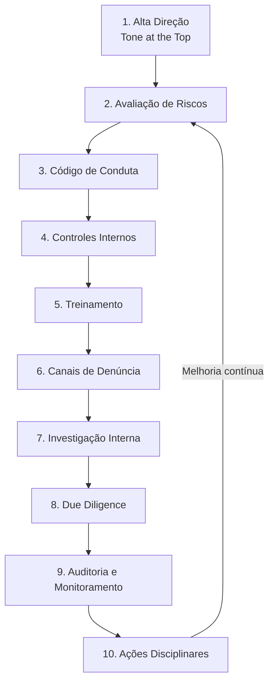

# Capítulo 21 — Compliance e Governança

## Visão Geral

O Compliance e a Governança Corporativa são **pilares indispensáveis** para a sustentabilidade e a reputação de qualquer organização. No Sigma—Juris Intelligence Framework (SJIF), o Compliance refere-se ao conjunto de práticas e procedimentos que visam garantir a **conformidade** com leis, regulamentos, políticas internas e códigos de conduta — prevenindo, detectando e remediando desvios. A Governança Corporativa, por sua vez, estabelece estruturas e processos pelos quais as empresas são **dirigidas e controladas**, assegurando transparência, equidade, prestação de contas e responsabilidade corporativa.

> **Princípio-chave:** Compliance não é apenas um programa — é uma **cultura organizacional** que permeia todas as camadas da empresa.

---

## 21.1 Os 10 Pilares de um Programa de Compliance

O SJIF estrutura programas de compliance em **10 pilares fundamentais** que, em conjunto, criam uma cultura de integridade:

| # | Pilar | Descrição |
|:-:|:------|:----------|
| 1 | **Comprometimento da Alta Direção** | Liderança demonstra apoio inequívoco, estabelecendo o **tom ético** da organização |
| 2 | **Avaliação de Riscos** | Identificação e análise dos riscos de não conformidade específicos, com base na Gestão de Riscos (Cap. 20) |
| 3 | **Código de Conduta e Políticas** | Código claro e acessível, complementado por políticas sobre anticorrupção, privacidade, concorrência leal etc. |
| 4 | **Controles Internos** | Mecanismos para garantir execução: segregação de funções, aprovações, auditorias |
| 5 | **Treinamento e Comunicação** | Capacitação contínua sobre políticas e código de conduta; comunicação eficaz dos valores éticos |
| 6 | **Canais de Denúncia** | Canais seguros e confidenciais para reportar violações, com **garantia de não retaliação** |
| 7 | **Investigação Interna** | Procedimentos claros para investigar denúncias com imparcialidade e rigor |
| 8 | **Due Diligence de Terceiros** | Avaliação de riscos em parceiros, fornecedores e clientes |
| 9 | **Auditoria e Monitoramento** | Verificação periódica da eficácia e monitoramento de KRIs |
| 10 | **Ações Disciplinares e Remediação** | Sanções proporcionais e medidas corretivas para evitar reincidências |

### Ferramentas do SJIF para Compliance

| Ferramenta | Função |
|:-----------|:-------|
| **Motor de Compliance** (Cap. 26) | Automatiza verificação de conformidade e gera alertas |
| **Biblioteca de Checklists** (Cap. 34) | Checklists para auditorias, due diligence e avaliação de riscos |
| **Biblioteca de Templates** (Cap. 33) | Modelos de códigos de conduta, políticas e relatórios |
| **Motor de Gestão de Riscos** (Cap. 20) | Identificação e avaliação de riscos de não conformidade |

---

## 21.2 Governança Corporativa — Princípios IBGC

A Governança Corporativa é o sistema pelo qual empresas são **dirigidas, monitoradas e incentivadas**. O Instituto Brasileiro de Governança Corporativa (IBGC) estabelece **4 princípios básicos**:

### Os 4 Princípios da Governança

| Princípio | Descrição |
|:----------|:----------|
| **Transparência (*Disclosure*)** | Disponibilização de informações relevantes de forma clara, precisa e tempestiva para todos os stakeholders |
| **Equidade (*Fairness*)** | Tratamento justo e isonômico de todos os sócios e demais partes interessadas |
| **Prestação de Contas (*Accountability*)** | Agentes de governança prestam contas, assumindo consequências de atos e omissões |
| **Responsabilidade Corporativa** | Zelo pela viabilidade econômico-financeira, considerando impactos sociais e ambientais |

> [!IMPORTANT]
> Esses quatro princípios não são independentes — são **interdependentes** e se reforçam mutuamente. A falha em um compromete todos os demais.

---

## 21.3 Responsabilidade Social e Ambiental — ESG

O framework ESG (**Environmental, Social, and Governance**) tem se tornado componente essencial da governança corporativa moderna:

### Dimensões ESG

| Dimensão | Escopo | Exemplos |
|:---------|:-------|:---------|
| **Environmental (E)** | Impacto ambiental das operações | Emissões, resíduos, uso de recursos naturais |
| **Social (S)** | Impacto nas pessoas e comunidades | Direitos humanos, diversidade, condições de trabalho |
| **Governance (G)** | Qualidade da gestão corporativa | Estrutura do conselho, ética, anticorrupção |

### Contribuição do SJIF ao ESG

- **Mapeamento de Riscos ESG** — Identificação de riscos ambientais, sociais e de governança
- **Monitoramento de Conformidade ESG** — Aderência a normas e padrões de sustentabilidade
- **Relatórios de Sustentabilidade** — Suporte na preparação de relatórios ESG

---

## 21.4 Prevenção e Combate à Corrupção e Fraudes

### Legislação Anticorrupção de Referência

| Lei | Jurisdição | Escopo |
|:----|:-----------|:-------|
| **Lei nº 12.846/2013** | Brasil | Responsabilização objetiva de PJs por atos de corrupção contra administração pública |
| **Foreign Corrupt Practices Act (FCPA)** | EUA | Proíbe suborno de funcionários estrangeiros para obter/reter negócios |
| **UK Bribery Act** | Reino Unido | Criminaliza suborno ativo e passivo; falha em prevenir suborno |

### Medidas de Prevenção e Combate

| Medida | Descrição |
|:-------|:----------|
| **Políticas Anticorrupção** | Proibição de suborno, pagamentos de facilitação, brindes e hospitalidades indevidas |
| **Controles Financeiros** | Integridade das transações e prevenção de desvios |
| **Due Diligence Aprofundada** | Verificação de antecedentes de parceiros, agentes e intermediários |
| **Treinamento Específico** | Capacitação sobre riscos de corrupção e políticas da empresa |
| **Canais de Denúncia** | Incentivo à denúncia com proteção aos denunciantes |
| **Investigações Rigorosas** | Apuração imparcial e aplicação de sanções adequadas |

---

## 21.5 Motor de Compliance — Funcionalidades

O **Motor de Compliance** (Cap. 26) automatiza e aprimora a gestão:

| Funcionalidade | Descrição |
|:---------------|:----------|
| **Mapeamento de Obrigações** | Identificação automática de leis e normas aplicáveis por setor e localização |
| **Monitoramento de Conformidade** | Verificação contínua com alertas sobre não conformidades |
| **Análise de Riscos de Compliance** | Avaliação de probabilidade e impacto de violações |
| **Relatórios de Compliance** | Status do programa com KPIs e KRIs relevantes |
| **Suporte a Auditorias** | Informações e evidências para processos de auditoria |
| **Base de Melhores Práticas** | Repositório com exemplos e estudos de caso |

---

## 21.6 Integração Estratégica

Compliance e Governança capacitam organizações a construir uma **cultura de integridade, transparência e responsabilidade**, mitigando riscos legais e reputacionais e fortalecendo a posição no mercado. O Direito atua como **vetor de valor**, garantindo a perenidade e o sucesso em um ambiente cada vez mais exigente.

---

## Referências Cruzadas

| Capítulo | Relação |
|:---------|:--------|
| [Cap. 19 — Gestão Estratégica](cap19_gestao_estrategica.md) | Alinhamento estratégico do compliance |
| [Cap. 20 — Gestão de Riscos](cap20_gestao_riscos.md) | Riscos de não conformidade |
| [Cap. 22 — Auditoria Jurídica](cap22_auditoria.md) | Auditoria de conformidade |
| [Cap. 33 — Biblioteca de Templates](../../07_TEMPLATES/cap33_biblioteca_templates.md) | Modelos de códigos e políticas |
| [Cap. 34 — Biblioteca de Checklists](../../08_CHECKLISTS/cap34_biblioteca_checklists.md) | Checklists de compliance |
| [Cap. 35 — Indicadores](../../09_INDICADORES/cap35_biblioteca_indicadores.md) | KPIs e KRIs de compliance |

---

> Sigma—Juris Intelligence Framework (SJIF) v1.0 | Propriedade de Charles de Paula Eugênio — Sigma Sihf Soluções Analíticas Ltda
