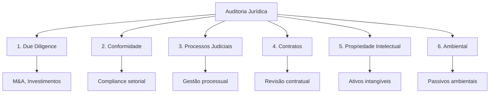
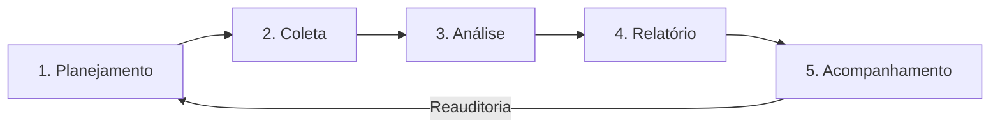

# Capítulo 22 — Auditoria Jurídica

## Visão Geral

A Auditoria Jurídica é um processo **sistemático e independente** de exame das atividades, processos e documentos de uma organização, com o objetivo de avaliar a **conformidade** com normas legais e regulatórias, **identificar riscos**, passivos e contingências, e **propor recomendações** para aprimorar a gestão jurídica. No Sigma—Juris Intelligence Framework (SJIF), a Auditoria Jurídica atua como ferramenta essencial de **governança e prevenção**, fornecendo uma visão clara da saúde jurídica da organização.

> **Princípio-chave:** Auditar não é apenas identificar problemas — é transformar a avaliação em oportunidade para aprimorar a gestão, prevenir riscos e fortalecer a conformidade.

---

## 22.1 Os 6 Tipos de Auditoria Jurídica

O SJIF classifica a auditoria jurídica em **6 modalidades** especializadas:

| # | Tipo | Descrição | Escopo |
|:-:|:-----|:----------|:-------|
| 1 | **Due Diligence Legal** | Investigação jurídica em M&A, investimentos e parcerias | Contratos, litígios, PI, ambiental, trabalhista, tributário, regulatório |
| 2 | **Auditoria de Conformidade** | Avaliação de aderência a leis, regulamentos e políticas internas | Anticorrupção, proteção de dados, ambiental, setorial |
| 3 | **Auditoria de Processos Judiciais** | Exame de processos em curso ou encerrados | Gestão, estratégia, custos, probabilidade de sucesso |
| 4 | **Auditoria de Contratos** | Revisão sistemática de contratos | Cláusulas de risco, inconsistências, prazos, otimização |
| 5 | **Auditoria de Propriedade Intelectual** | Proteção e gestão de ativos intangíveis | Marcas, patentes, direitos autorais, segredos comerciais |
| 6 | **Auditoria Ambiental** | Conformidade com legislação ambiental | Passivos e riscos ambientais |

---

## 22.2 Metodologia de Auditoria — 5 Etapas

O SJIF estrutura toda auditoria jurídica em um **processo de 5 etapas**:

### Etapa 1 — Planejamento
- Definição de **escopo, objetivos e metodologia**
- Composição da **equipe de auditoria**
- Estabelecimento do **cronograma**
- Definição dos **critérios de auditoria** (normas, políticas, melhores práticas)

### Etapa 2 — Coleta de Informações
- Reunião de **documentos, contratos, processos, relatórios financeiros, políticas, registros**
- **Entrevistas** com gestores e colaboradores
- Acesso a sistemas de gestão e bases de dados

### Etapa 3 — Análise e Avaliação
- Exame crítico confrontando informações com critérios de auditoria
- Identificação de **não conformidades, riscos, passivos e contingências**
- Utilização dos motores do SJIF:
  - **Motor de Coerência Jurídica** (Cap. 23)
  - **Motor de Gestão de Riscos** (Cap. 20)
  - **Análise Documental Integral** (Cap. 8)

### Etapa 4 — Elaboração do Relatório
- Apresentação dos **achados** da auditoria
- Documentação de **não conformidades** e **riscos identificados**
- Classificação de **contingências**
- **Recomendações** para correção e melhoria

### Etapa 5 — Acompanhamento
- Monitoramento da **implementação** das ações corretivas e preventivas
- Verificação de **eficácia** das mudanças
- **Reauditoria** quando necessário

---

## 22.3 Classificação de Passivos e Contingências

Um dos principais objetivos da auditoria é identificar **passivos** e **contingências** que impactam a organização.

### 22.3.1 Passivos Jurídicos

Obrigações **certas e exigíveis**, decorrentes de fatos geradores já ocorridos:

| Tipo | Exemplo |
|:-----|:--------|
| Condenações transitadas em julgado | Decisões definitivas com valores a pagar |
| Multas administrativas definitivas | Autuações com recursos esgotados |
| Acordos homologados | Acordos judiciais ou extrajudiciais em execução |
| Obrigações contratuais vencidas | Pagamentos e obrigações não cumpridos |

### 22.3.2 Contingências Jurídicas

Obrigações **potenciais**, cuja existência depende de eventos futuros incertos:

| Classificação | Probabilidade | Tratamento Contábil |
|:-------------|:-------------|:--------------------|
| **Provável** | Alta probabilidade de ocorrência | ⚠️ **Devem ser provisionadas** no balanço |
| **Possível** | Menor que provável, maior que remota | 📝 **Divulgadas** em notas explicativas |
| **Remota** | Probabilidade muito baixa | ✅ Não precisam ser provisionadas nem divulgadas |

> [!WARNING]
> A classificação incorreta de contingências pode gerar problemas contábeis graves e responsabilização dos administradores. O SJIF auxilia com análise jurisprudencial (Cap. 15) para prever desfechos com base em precedentes.

---

## 22.4 Recomendações — Tipos e Planos de Ação

### Tipos de Recomendações

| Tipo | Descrição | Exemplo |
|:-----|:----------|:--------|
| **Ações Corretivas** | Eliminar causa de não conformidade ou mitigar passivo | Renegociação de contrato, defesa em processo |
| **Ações Preventivas** | Evitar riscos ou não conformidades futuras | Revisão de políticas, treinamento de compliance |
| **Melhorias de Processos** | Otimizar fluxos e aumentar eficiência | Automação, padronização, eliminação de burocracia |
| **Revisão de Estratégias** | Ajustar estratégia jurídica com base nos achados | Mudança de posicionamento em temas críticos |
| **Implementação de Ferramentas** | Adotar tecnologias para aprimorar gestão | Sistemas de gestão, IA, automação documental |

### Estrutura do Plano de Ação

| Componente | Descrição |
|:-----------|:----------|
| **Responsáveis** | Definição clara de quem executa cada ação |
| **Prazos** | Datas-limite para conclusão |
| **Recursos** | Financeiros, humanos e tecnológicos necessários |
| **Indicadores** | Métricas para monitorar progresso e eficácia |

---

## 22.5 Motor de Auditoria Jurídica — Funcionalidades

O **Motor de Auditoria Jurídica** (Cap. 26) automatiza e aprimora os processos:

| Funcionalidade | Descrição |
|:---------------|:----------|
| **Checklists Automatizados** | Geração personalizada por tipo de auditoria, baseada em normas aplicáveis |
| **Análise Documental por IA** | Revisão de grandes volumes identificando cláusulas de risco e não conformidades |
| **Mapeamento de Passivos** | Identificação automática de potenciais passivos e contingências |
| **Geração de Relatórios** | Relatórios estruturados com achados, riscos e recomendações |
| **Monitoramento de Recomendações** | Acompanhamento de implementação com alertas de prazo e status |
| **Base de Melhores Práticas** | Repositório com exemplos e estudos de caso |

---

## 22.6 Integração Estratégica

A Auditoria Jurídica capacita organizações a manter **controle rigoroso** sobre sua saúde jurídica, transformando a avaliação de riscos em oportunidade para **aprimorar a gestão**, prevenir problemas e fortalecer a conformidade e a governança, contribuindo para a **segurança jurídica e perenidade** dos negócios.

---

## Referências Cruzadas

| Capítulo | Relação |
|:---------|:--------|
| [Cap. 7 — Engenharia Processual](../engenharia/cap07_eng_processual.md) | Análise de processos judiciais |
| [Cap. 8 — Engenharia da Prova](../engenharia/cap08_eng_prova.md) | Análise documental integral |
| [Cap. 12 — Engenharia Recursal](../engenharia/cap12_eng_recursal.md) | Avaliação de estratégias recursais |
| [Cap. 15 — Pesquisa Jurisprudencial](../pesquisa/cap15_pesq_jurisprudencial.md) | Previsão de desfechos |
| [Cap. 20 — Gestão de Riscos](cap20_gestao_riscos.md) | Avaliação de probabilidade e impacto |
| [Cap. 21 — Compliance](cap21_compliance.md) | Auditoria de conformidade |
| [Cap. 23 — Motor de Coerência](cap23_motor_coerencia.md) | Avaliação de consistência |

---

> Sigma—Juris Intelligence Framework (SJIF) v1.0 | Propriedade de Charles de Paula Eugênio — Sigma Sihf Soluções Analíticas Ltda
