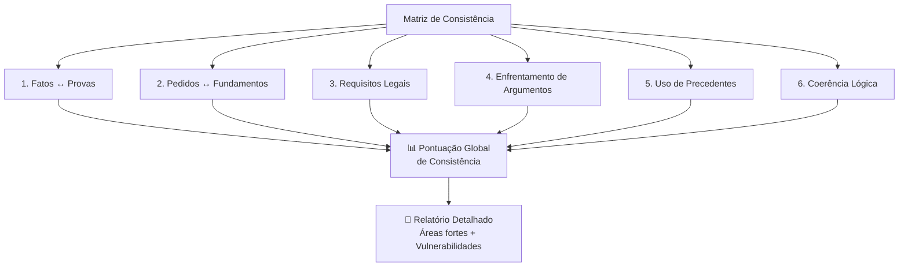

# Capítulo 23 — Motor de Coerência Jurídica

## Visão Geral

O Motor de Coerência Jurídica (MCJ) é o componente **mais inovador e revolucionário** do Sigma—Juris Intelligence Framework (SJIF). Diferentemente de sistemas que tentam prever resultados ou "dizer quem vai ganhar a causa", o MCJ foca na **avaliação objetiva da qualidade técnica** da construção jurídica. Ele atua como um **auditor implacável da lógica e da consistência**, garantindo que petições, pareceres, recursos e decisões sejam estruturalmente sólidos e imunes a falhas argumentativas.

> **Princípio-chave:** A força de um argumento jurídico reside fundamentalmente na sua **coerência interna e externa**, não apenas na eloquência ou na citação de normas.

---

## 23.1 O Papel do MCJ no SJIF

O MCJ não se baseia em intuição, mas em **análise estruturada e algorítmica** dos elementos que compõem o raciocínio jurídico. Seu objetivo central é **medir objetivamente a robustez** de uma peça jurídica antes de sua utilização ou avaliar a solidez de uma decisão já proferida.

### O que o MCJ faz:
- ✅ Verifica se premissas sustentam conclusões
- ✅ Confirma se provas corroboram fatos
- ✅ Avalia se a lei foi aplicada adequadamente
- ✅ Identifica falhas antes da submissão ao Judiciário
- ✅ Gera pontuação objetiva de qualidade técnica

### O que o MCJ **NÃO** faz:
- ❌ Prever o resultado de um processo
- ❌ Substituir o discernimento do advogado
- ❌ Gerar argumentos — apenas avalia os existentes

---

## 23.2 A Matriz de Consistência — 6 Critérios

O coração do MCJ é a **Matriz de Consistência**, modelo analítico que atribui pontuações para diversos aspectos da construção jurídica:

### Os 6 Critérios de Avaliação

| # | Critério | O que avalia | Impacto na pontuação |
|:-:|:---------|:------------|:--------------------|
| 1 | **Aderência dos Fatos às Provas** | Cada fato alegado possui suporte probatório correspondente? | Fatos sem prova **reduzem** a pontuação |
| 2 | **Correspondência Pedidos ↔ Fundamentos** | Cada pedido decorre logicamente dos fundamentos? | Pedido sem base legal/fática = **inconsistência** |
| 3 | **Cobertura dos Requisitos Legais** | A argumentação aborda todos os requisitos da norma? | Requisitos não cobertos = **vulnerabilidade** |
| 4 | **Enfrentamento de Argumentos Relevantes** | Todos os argumentos centrais são enfrentados? | Omissão = **falha grave** |
| 5 | **Uso Adequado de Precedentes** | Precedentes são realmente aplicáveis e atualizados? | Precedentes superados = **fragilidade** |
| 6 | **Coerência Lógica da Fundamentação** | A estrutura do raciocínio é logicamente sólida? | Saltos lógicos = **vulnerabilidade crítica** |

---

## 23.3 Sistema de Pontuação e Relatório

### Pontuação Global

Com base na análise dos 6 critérios, o MCJ gera:

| Faixa | Classificação | Ação Recomendada |
|:------|:-------------|:-----------------|
| **90-100** | 🟢 Excelente | Peça sólida — Pronta para submissão |
| **75-89** | 🟡 Boa | Ajustes menores recomendados |
| **50-74** | 🟠 Moderada | Revisão necessária em pontos específicos |
| **25-49** | 🔴 Fraca | Reestruturação significativa necessária |
| **0-24** | ⚫ Crítica | Reconstrução completa recomendada |

### Relatório de Consistência

O relatório detalhado inclui:
- **Pontuação por critério** — Performance em cada um dos 6 eixos
- **Áreas fortes** — Elementos bem estruturados
- **Vulnerabilidades** — Pontos que necessitam correção
- **Recomendações** — Ações específicas para elevar a pontuação

---

## 23.4 Detecção de Omissões

O MCJ é programado para identificar o que **NÃO está** na peça, mas que **deveria estar**:

| Tipo de Omissão | Descrição |
|:----------------|:----------|
| **Fatos não mencionados** | Fatos relevantes do caso que não foram narrados |
| **Provas não utilizadas** | Provas disponíveis nos autos que não foram valoradas |
| **Normas ignoradas** | Legislação aplicável que não foi citada ou analisada |
| **Argumentos não rebatidos** | Teses da parte contrária que ficaram sem resposta |
| **Pedidos não analisados** | Em decisões: pedidos que o julgador não apreciou |

> [!WARNING]
> No CPC brasileiro, a omissão em decisão judicial é fundamento para **embargos de declaração** (art. 1.022). O MCJ identifica exatamente essas falhas.

---

## 23.5 Detecção de Contradições

O motor busca ativamente por **inconsistências internas e externas**:

### Contradições Internas
Afirmações conflitantes **dentro do mesmo documento**:
- *Exemplo: Alegar que um contrato é nulo em um parágrafo e pedir seu cumprimento em outro*

### Contradições Externas
Afirmações que conflitam com **elementos externos**:
- Conflito com as **provas dos autos**
- Conflito com a **legislação vigente**
- Conflito com a **jurisprudência pacificada**

---

## 23.6 Detecção de Fragilidades Argumentativas

Além de omissões e contradições evidentes, o MCJ identifica **fraquezas estruturais**:

| Fragilidade | Descrição | Risco |
|:------------|:----------|:------|
| **Saltos Lógicos** | Conclusões não suportadas pelas premissas | Alto — Argumento pode ser facilmente desmontado |
| **Fundamentação Genérica** | Argumentos padronizados sem conexão com o caso | Médio — Falta de persuasão |
| **Precedentes Superados** | Jurisprudência modificada por decisões posteriores | Alto — Credibilidade comprometida |
| **Falta de Nexo Causal** | Falha em demonstrar causa e efeito | Alto — Elemento essencial em responsabilidade civil |
| **Premissas Falsas** | Premissas factuais ou normativas incorretas | Crítico — Invalida toda a cadeia argumentativa |

---

## 23.7 O MCJ como Diferencial Competitivo

O Motor de Coerência Jurídica transforma a revisão de peças de um **processo subjetivo** em um **procedimento objetivo, rigoroso e mensurável**:

- **Eleva a qualidade** do trabalho jurídico
- **Aumenta as chances** de sucesso em litígios e negociações
- **Previne falhas** antes da submissão ao Judiciário
- **Não substitui** o advogado — atua como **parceiro analítico incansável**
- Garante que a estratégia concebida pelo profissional seja executada com **máxima precisão técnica**

---

## Referências Cruzadas

| Capítulo | Relação |
|:---------|:--------|
| [Cap. 5 — Lógica Jurídica](../../03_FRAMEWORK/cap05_logica_argumentativa.md) | Base lógica para avaliação de coerência |
| [Cap. 9 — Engenharia da Fundamentação](../engenharia/cap09_eng_fundamentacao.md) | Qualidade da fundamentação |
| [Cap. 11 — Engenharia Reversa](../engenharia/cap11_eng_reversa.md) | Análise de decisões judiciais |
| [Cap. 15 — Pesquisa Jurisprudencial](../pesquisa/cap15_pesq_jurisprudencial.md) | Verificação de precedentes |
| [Cap. 22 — Auditoria Jurídica](cap22_auditoria.md) | MCJ como ferramenta de auditoria |
| [Cap. 24 — Motor Decisório](cap24_motor_decisorio.md) | Complementaridade: solidez interna + eficácia externa |
| [Cap. 25 — MJF](../especializados/cap25_modulo_forense.md) | Integração no módulo forense |

---

> Sigma—Juris Intelligence Framework (SJIF) v1.0 | Propriedade de Charles de Paula Eugênio — Sigma Sihf Soluções Analíticas Ltda
