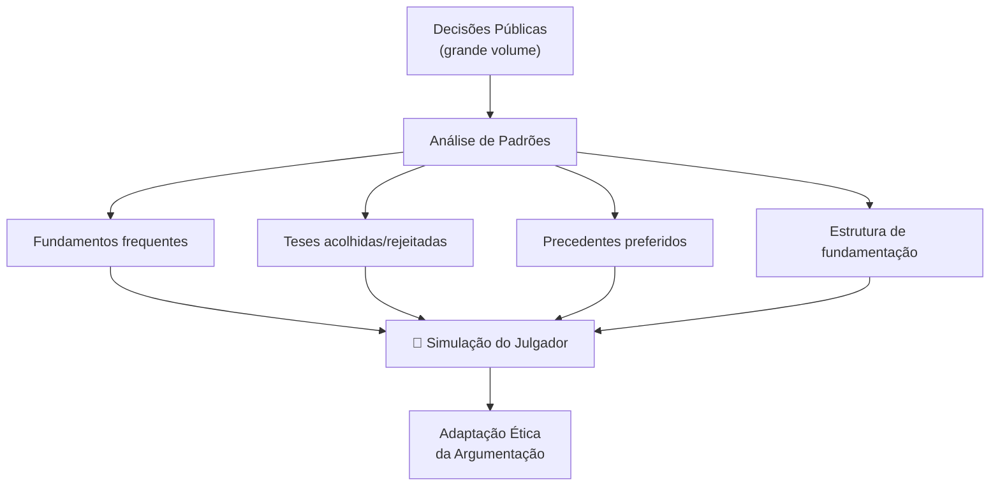
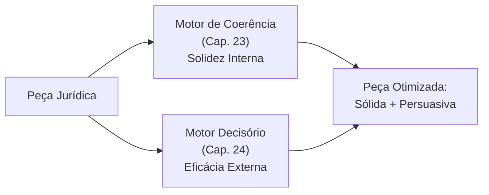

# Capítulo 24 — Motor Decisório Jurídico

## Visão Geral

O Motor Decisório Jurídico (MDJ) é a disciplina do Sigma—Juris Intelligence Framework (SJIF) dedicada à **análise de padrões decisórios de julgadores**, utilizando técnicas de **engenharia cognitiva** para compreender a lógica subjacente às decisões judiciais. Seu objetivo não é adivinhar resultados, mas fornecer **insights baseados em dados objetivos e públicos**, permitindo adaptar a **forma de apresentação** da argumentação sem distorcer fatos ou inventar fundamentos.

> **Diretiva IA (Cap. 2):** O foco deve ser em **padrões observáveis nas decisões públicas** e nunca em especulações sobre preferências pessoais ou tentativas de manipulação.

---

## 24.1 A Previsibilidade no Direito

Embora o Direito não seja uma ciência exata, a **compreensão dos padrões decisórios** é crucial para a formulação de estratégias eficazes. O MDJ utiliza o Motor Jurisprudencial (Cap. 15) e o Grafo de Conhecimento (Cap. 28) para analisar grandes volumes de decisões.

### O que o MDJ proporciona:
- ✅ Compreensão de **como** o julgador estrutura suas decisões
- ✅ Identificação de **teses** frequentemente acolhidas ou rejeitadas
- ✅ Mapeamento de **precedentes** preferidos pelo julgador
- ✅ Adaptação **ética** da forma de comunicação

### O que o MDJ **NÃO** faz:
- ❌ Adivinhar o resultado de um processo
- ❌ Especular sobre preferências pessoais do julgador
- ❌ Manipular o julgador por meios indevidos
- ❌ Distorcer fatos ou inventar fundamentos

---

## 24.2 Análise de Padrões Decisórios — 6 Métricas

O MDJ coleta e processa um vasto volume de decisões para identificar tendências através de **6 métricas-chave**:

| # | Métrica | O que analisa | Finalidade |
|:-:|:--------|:-------------|:-----------|
| 1 | **Frequência de Acolhimento/Rejeição de Teses** | Quantas vezes uma tese foi aceita/recusada pelo julgador | Identificar quais argumentos têm maior probabilidade de sucesso |
| 2 | **Valoração de Provas** | Como o julgador pondera diferentes tipos de prova (documental, testemunhal, pericial) | Planejar a produção probatória mais eficaz |
| 3 | **Citação de Precedentes** | Quais precedentes são mais frequentemente citados e como são interpretados | Priorizar a citação dos precedentes mais influentes |
| 4 | **Aplicação de Normas** | Quais dispositivos legais são mais aplicados e em que contexto | Direcionar a fundamentação normativa |
| 5 | **Tempo de Julgamento** | Tempo médio para proferir decisões em diferentes tipos de casos | Planejar expectativas e estratégias temporais |
| 6 | **Votos Vencidos** | Frequência e fundamentos dos votos divergentes em colegiados | Identificar pontos de controvérsia e possíveis mudanças |

### Fontes de Dados

| Fonte | Descrição |
|:------|:----------|
| **Bases de Jurisprudência** | Acervos públicos e comerciais com inteiro teor de sentenças e acórdãos |
| **Dados Processuais** | Andamento, partes, advogados e resultados |
| **Dados Doutrinários** | Artigos que analisam posicionamentos de julgadores |

---

## 24.3 Engenharia Cognitiva do Julgador

A Engenharia Cognitiva do Julgador aplica técnicas para **reconstruir o processo de raciocínio** de um julgador com base em suas decisões públicas. O objetivo é entender "**como** o julgador estrutura sua fundamentação".

### 24.3.1 Análise de Padrões Documentados

O sistema avalia, com base **exclusivamente em decisões públicas e relevantes**:

| Padrão Analisado | O que revela |
|:----------------|:-------------|
| **Fundamentos mais frequentes** | Argumentos e princípios consistentemente utilizados para justificar decisões |
| **Teses acolhidas/rejeitadas** | Posições jurídicas favoráveis ou desfavoráveis ao julgador |
| **Precedentes recorrentes** | Súmulas, acórdãos e temas que o julgador invoca repetidamente |
| **Estrutura da fundamentação** | Metodologia: prioriza literalidade da lei, finalidade social, análise econômica? |
| **Argumentos mais desenvolvidos** | Pontos que recebem maior atenção e aprofundamento |
| **Rigor vs. flexibilidade** | Postura formalista ou flexível conforme o assunto jurídico |

### 24.3.2 Simulação do Julgador

O MDJ pode realizar uma **Simulação do Julgador**, respondendo a perguntas como:

> *"Se eu fosse o juiz, como decidiria? Se eu fosse o desembargador? Mudaria? Se eu fosse o ministro? Mudaria? Por quê?"*

Esta simulação é baseada nos **padrões decisórios identificados**, fornecendo perspectiva informada — **não suposições** — sobre o provável posicionamento.

---

## 24.4 Adaptação da Argumentação — Estratégias e Limites

### 24.4.1 Estratégias de Adaptação Ética

| Estratégia | Descrição |
|:-----------|:----------|
| **Priorização de Argumentos** | Apresentar argumentos alinhados aos fundamentos frequentes do julgador |
| **Linguagem e Estilo** | Adaptar a linguagem para se assemelhar ao estilo do julgador |
| **Citação de Precedentes** | Priorizar precedentes do próprio julgador ou de seu tribunal |
| **Estrutura da Fundamentação** | Organizar conforme a metodologia preferida (fatos → normas → princípios?) |
| **Antecipação de Objeções** | Apresentar contra-argumentos baseados em padrões de rejeição |

### 24.4.2 Limites Éticos — Fronteiras Inegociáveis

> [!CAUTION]
> O MDJ **jamais** deve ser utilizado para:

| Proibição | Descrição |
|:----------|:----------|
| **Distorcer Fatos** | ❌ Alterar narrativa fática para se adequar a padrão decisório |
| **Inventar Fundamentos** | ❌ Criar argumentos sem base legal ou doutrinária |
| **Manipular o Julgador** | ❌ Influenciar por meios indevidos ou antiéticos |

> O objetivo é **otimizar a comunicação da verdade jurídica**, e não alterá-la.

---

## 24.5 Complementaridade com o Motor de Coerência

O MDJ complementa o **Motor de Coerência Jurídica** (Cap. 23) de forma sinérgica:

| Motor de Coerência (Cap. 23) | Motor Decisório (Cap. 24) |
|:-----------------------------|:--------------------------|
| Avalia a **solidez interna** da peça | Avalia a **eficácia externa** perante o julgador |
| Foco: consistência lógica | Foco: persuasão estratégica |
| Pergunta: "O argumento é sólido?" | Pergunta: "O argumento é eficaz para este julgador?" |
| Auditoria da qualidade técnica | Inteligência estratégica sobre o destinatário |

---

## 24.6 O MDJ como Ferramenta de Inteligência Estratégica

O Motor Decisório Jurídico proporciona uma **compreensão aprofundada** do comportamento decisório dos julgadores. Ao analisar padrões objetivos e públicos, permite adaptação inteligente da argumentação, aumentando **persuasão e eficácia** das peças jurídicas, sempre dentro dos **limites da ética e da integridade jurídica**.

O MDJ consolida o SJIF como uma plataforma que não apenas **organiza** o conhecimento jurídico, mas o **utiliza de forma estratégica** para alcançar os melhores resultados.

---

## Referências Cruzadas

| Capítulo | Relação |
|:---------|:--------|
| [Cap. 2 — Diretiva Mestra](../../02_DIRETIVA_MESTRA/cap02_diretiva_mestra.md) | Diretiva IA — limites éticos |
| [Cap. 5 — Lógica Jurídica](../../03_FRAMEWORK/cap05_logica_argumentativa.md) | Estrutura lógica da argumentação |
| [Cap. 11 — Engenharia Reversa](../engenharia/cap11_eng_reversa.md) | Reconstrução do raciocínio do julgador |
| [Cap. 15 — Pesquisa Jurisprudencial](../pesquisa/cap15_pesq_jurisprudencial.md) | Dados de jurisprudência para análise |
| [Cap. 23 — Motor de Coerência](cap23_motor_coerencia.md) | Solidez interna + Eficácia externa |
| [Cap. 25 — MJF](../especializados/cap25_modulo_forense.md) | Simulação do julgador no módulo forense |
| [Cap. 28 — Grafo de Conhecimento](../../05_BIBLIOTECAS/cap28_grafo_conhecimento.md) | Rede de relações entre decisões |
| [Cap. 29 — Modelos Matemáticos](../../10_MODELOS_MATEMATICOS/cap29_modelos_matematicos.md) | Modelos probabilísticos de previsão |

---

> Sigma—Juris Intelligence Framework (SJIF) v1.0 | Propriedade de Charles de Paula Eugênio — Sigma Sihf Soluções Analíticas Ltda
