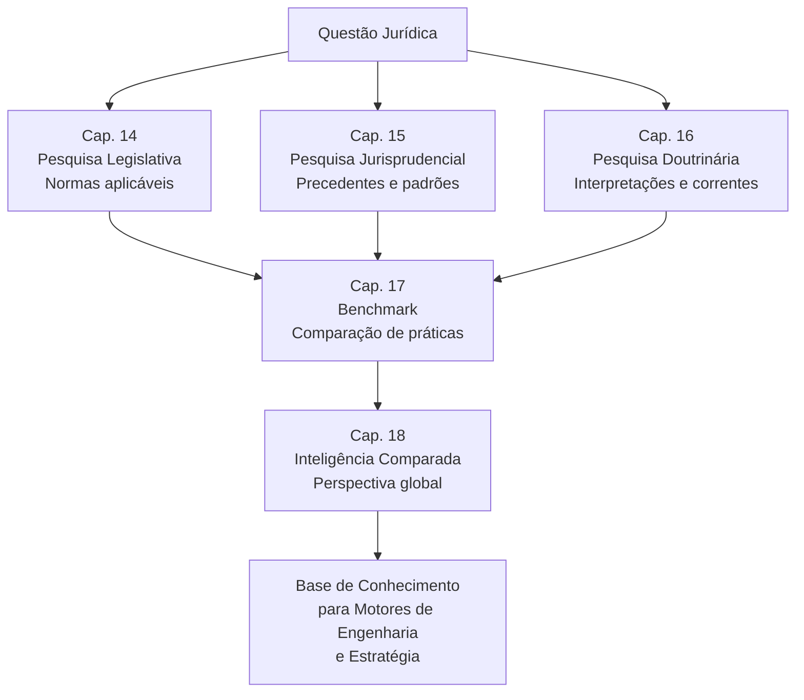

# 04_MOTORES / pesquisa — Motores de Pesquisa Jurídica

## Visão Geral

O diretório `pesquisa/` contém os motores dedicados à **localização, análise e interpretação** das fontes do Direito — legislação, jurisprudência, doutrina — e ferramentas de análise comparativa que compõem o **BLOCO III — Pesquisa Jurídica** do SJIF (Capítulos 14–18). Estes motores alimentam todos os demais componentes do framework com dados e conhecimento jurídico verificado.

> **Diretiva Mestra (Cap. 2):** Nenhuma jurisprudência relevante poderá deixar de ser pesquisada. A pesquisa legislativa, jurisprudencial e doutrinária deve ser **exaustiva e atualizada**.

---

## Conteúdo do Diretório

| Arquivo | Capítulo | Título | Resumo |
|:--------|:---------|:-------|:-------|
| `cap14_pesq_legislativa.md` | Cap. 14 | **Pesquisa Legislativa** | Metodologia de 7 etapas, vigência/hierarquia/aplicabilidade, Pirâmide de Kelsen, bases de dados, Motor Normativo |
| `cap15_pesq_jurisprudencial.md` | Cap. 15 | **Pesquisa Jurisprudencial** | Metodologia de 7 etapas, jurisprudência dominante, precedentes vinculantes, súmulas, análise de padrões, Motor Jurisprudencial |
| `cap16_pesq_doutrinaria.md` | Cap. 16 | **Pesquisa Doutrinária** | 6 fontes, 5 métodos, doutrina majoritária vs. minoritária, Motor Doutrinário |
| `cap17_benchmark.md` | Cap. 17 | **Benchmark Jurídico** | 5 tipos de benchmarking, processo de 5 etapas, análise baseada em KPIs |
| `cap18_inteligencia_comparada.md` | Cap. 18 | **Inteligência Jurídica Comparada** | Classificação de sistemas jurídicos, 3 abordagens metodológicas, aplicação de insights comparados |

---

## Fluxo de Pesquisa

---

## Integração com Motores

Os motores de pesquisa alimentam diretamente:

| Destino | Como utiliza a pesquisa |
|:--------|:----------------------|
| **Engenharia da Fundamentação** (Cap. 9) | Normas, precedentes e doutrina como base argumentativa |
| **Motor de Coerência** (Cap. 23) | Verificação de cobertura normativa e uso adequado de precedentes |
| **Motor Decisório** (Cap. 24) | Dados jurisprudenciais para análise de padrões de julgadores |
| **Gestão Estratégica** (Cap. 19) | Insights para formulação de estratégias |
| **Gestão de Riscos** (Cap. 20) | Monitoramento legislativo e regulatório |
| **MJF** (Cap. 25) | Pesquisa automatizada no módulo forense |

---

## Motores Automatizados Associados

| Motor | Função |
|:------|:-------|
| **Motor Normativo** | Busca semântica, consolidação automática, monitoramento legislativo |
| **Motor Jurisprudencial** | Busca semântica avançada, identificação de precedentes, análise de padrões |
| **Motor Doutrinário** | Busca em acervos, identificação de correntes, mapeamento de citações |
| **Motor de Benchmark** | Coleta de dados de mercado, relatórios comparativos, gaps de performance |
| **Motor de Inteligência Comparada** | Bases multijurisdicionais, tendências globais, relatórios comparativos |

---

## Capítulos Relacionados

| Capítulo | Relação |
|:---------|:--------|
| [Cap. 2 — Diretiva Mestra](../../02_DIRETIVA_MESTRA/cap02_diretiva_mestra.md) | Diretrizes de completude |
| [Cap. 6 — Hermenêutica](../../03_FRAMEWORK/cap06_hermeneutica.md) | Interpretação das normas |
| [Cap. 7–13 — Engenharia](../engenharia/README.md) | Consumidores dos dados de pesquisa |
| [Cap. 19–24 — Estratégia](../estrategia/README.md) | Aplicação estratégica dos resultados |
| [Cap. 26 — Motores Especializados](../especializados/cap26_motores_especializados.md) | Motores automatizados associados |

---

> Sigma—Juris Intelligence Framework (SJIF) v1.0 | Propriedade de Charles de Paula Eugênio — Sigma Sihf Soluções Analíticas Ltda
