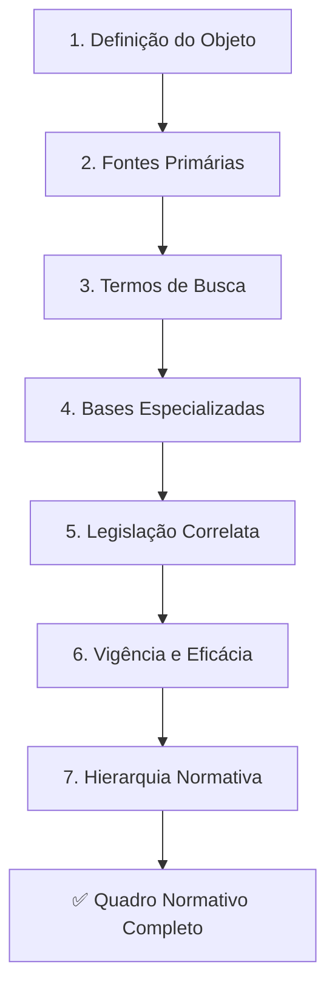

# Capítulo 14 — Pesquisa Legislativa

## Visão Geral

A Pesquisa Legislativa é a disciplina fundamental do Sigma—Juris Intelligence Framework (SJIF) dedicada à **localização, análise e interpretação das normas jurídicas** aplicáveis a uma determinada questão. A legislação, enquanto fonte primária do Direito, estabelece as regras e princípios que governam as relações sociais. Em um cenário de constante produção legislativa e complexidade normativa, a pesquisa eficaz é condição indispensável para garantir que a análise jurídica seja **precisa, atualizada e completa**.

> **Diretiva Mestra (Cap. 2):** Nenhuma norma aplicável poderá ser ignorada. A pesquisa legislativa deve ser exaustiva, abrangendo fontes oficiais e correlatas.

---

## 14.1 A Norma Jurídica como Ponto de Partida

A norma jurídica é o alicerce de qualquer construção argumentativa. Antes de avançar para pesquisa jurisprudencial ou doutrinária, é imprescindível mapear o **quadro normativo completo** aplicável ao caso. O Capítulo 14 integra-se diretamente aos seguintes componentes do SJIF:

- **Motor Normativo** (Cap. 26) — Automação da pesquisa e análise legislativa
- **Engenharia da Fundamentação** (Cap. 9) — Base normativa para a argumentação
- **Motor de Coerência Jurídica** (Cap. 23) — Verificação da cobertura dos requisitos legais
- **Pesquisa Jurisprudencial** (Cap. 15) — Complemento interpretativo das normas

---

## 14.2 Metodologia de Pesquisa de Normas — 7 Etapas

A pesquisa legislativa no SJIF segue uma metodologia estruturada de **7 etapas** que garante abrangência e precisão:

### Etapa 1 — Definição do Objeto da Pesquisa
Clarificar a questão jurídica a ser respondida e os termos-chave relacionados. Envolve a identificação do **ramo do direito**, do **tipo de relação jurídica** e do **fato gerador**.

### Etapa 2 — Identificação das Fontes Primárias
Priorizar a busca em **fontes oficiais e confiáveis**: diários oficiais, códigos, leis compiladas e repositórios governamentais.

### Etapa 3 — Utilização de Termos de Busca Abrangentes
Empregar **sinônimos**, termos relacionados e **operadores booleanos** (AND, OR, NOT) para refinar a busca e evitar perda de informações relevantes.

### Etapa 4 — Pesquisa em Bases de Dados Especializadas
Utilizar plataformas jurídicas com funcionalidades avançadas de busca, filtros por data, tipo de norma, e que realizem a consolidação e atualização legislativa.

### Etapa 5 — Análise da Legislação Correlata
Não se limitar à norma diretamente aplicável. Buscar **leis complementares**, regulamentos, decretos e portarias que impactem a interpretação e aplicação da norma principal.

### Etapa 6 — Verificação da Vigência e Eficácia
Confirmar se a norma está em vigor, se foi **revogada, alterada ou suspensa**, e se produz efeitos jurídicos no momento da análise.

### Etapa 7 — Análise da Hierarquia Normativa
Posicionar a norma dentro da **Pirâmide de Kelsen**, verificando compatibilidade com normas superiores e relação com normas inferiores.



---

## 14.3 Análise de Vigência, Hierarquia e Aplicabilidade

A mera localização de uma norma é insuficiente; é necessário compreender seu **status jurídico** e sua real capacidade de produzir efeitos.

### 14.3.1 Vigência da Norma

A **vigência** refere-se ao período em que a norma está apta a produzir efeitos jurídicos:

| Aspecto | Descrição |
|:--------|:----------|
| **Início da Vigência** | Após publicação e período de *vacatio legis* |
| **Término da Vigência** | Por revogação (expressa ou tácita), caducidade ou declaração de inconstitucionalidade |
| **Repristinação** | Norma revogada que volta a vigir pela revogação da norma revogadora (exige previsão legal expressa) |

### 14.3.2 Hierarquia Normativa — Pirâmide de Kelsen

A hierarquia normativa estabelece a ordem de superioridade entre normas, sendo fundamental para resolver conflitos:

```
          ┌────────────────────────┐
          │   CONSTITUIÇÃO FEDERAL │  ← Norma Suprema
          └───────────┬────────────┘
                      │
          ┌───────────▼────────────┐
          │  LEIS COMPLEMENTARES   │
          │  E LEIS ORDINÁRIAS     │  ← Normas Infraconstitucionais
          └───────────┬────────────┘
                      │
          ┌───────────▼────────────┐
          │  DECRETOS, REGULAMENTOS│
          │  E PORTARIAS           │  ← Normas Infralegais
          └───────────┬────────────┘
                      │
          ┌───────────▼────────────┐
          │  ATOS NORMATIVOS       │
          │  LOCAIS                │  ← Legislação Municipal/Estadual
          └────────────────────────┘
```

> [!IMPORTANT]
> A análise hierárquica permite identificar se uma norma inferior está em conformidade com uma superior, **evitando a aplicação de normas inconstitucionais ou ilegais**.

### 14.3.3 Aplicabilidade da Norma

A **aplicabilidade** refere-se à capacidade da norma de incidir sobre um caso concreto, avaliando quatro âmbitos:

| Âmbito | Pergunta-Chave |
|:-------|:---------------|
| **Temporal** | A norma estava em vigor no momento do fato gerador? |
| **Espacial** | A norma tem validade no local onde o fato ocorreu? |
| **Pessoal** | A norma se aplica às pessoas envolvidas no caso? |
| **Material** | O caso concreto se enquadra na hipótese normativa prevista? |

---

## 14.4 Ferramentas e Bases de Dados Legislativas

O SJIF integra e recomenda o uso de diversas fontes para otimizar a pesquisa legislativa.

### 14.4.1 Bases de Dados Oficiais

- **Diário Oficial da União (DOU)** — Publicação oficial de leis, decretos e atos normativos federais
- **Diários Oficiais Estaduais e Municipais** — Atos normativos dos respectivos entes
- **Portal da Legislação (Planalto)** — Repositório oficial da legislação federal brasileira, com versões consolidadas
- **Sites dos Poderes Legislativos** — Câmara dos Deputados, Senado Federal, Assembleias e Câmaras Municipais

### 14.4.2 Bases de Dados Jurídicas Comerciais

- **VLex, LexisNexis, Thomson Reuters** — Plataformas com acervos legislativos extensos, busca avançada, consolidação de normas e links para jurisprudência e doutrina
- **Softwares de Gestão Jurídica** — Módulos de pesquisa legislativa integrados

---

## 14.5 Motor Normativo — Funcionalidades Avançadas

O **Motor Normativo** (Cap. 26) é o componente do SJIF que automatiza e aprimora a pesquisa e análise legislativa:

| Funcionalidade | Descrição |
|:---------------|:----------|
| **Busca Semântica** | Pesquisa por conceitos e relações, não apenas palavras-chave |
| **Consolidação Automática** | Texto atualizado incorporando todas as alterações e revogações |
| **Análise de Impacto Legislativo** | Avalia efeitos de nova lei sobre caso ou setor específico |
| **Monitoramento Legislativo** | Alertas sobre novas leis, decretos e projetos relevantes |
| **Mapeamento de Relações Normativas** | Grafo de conhecimento interligando normas, princípios e precedentes |

---

## 14.6 A Pesquisa Legislativa como Fundamento da Inteligência Jurídica

A Pesquisa Legislativa é o **alicerce** sobre o qual toda a inteligência jurídica do SJIF é construída. Ao garantir o acesso a normas precisas, atualizadas e corretamente interpretadas, ela assegura que análises e estratégias sejam sempre **fundamentadas na lei**. A metodologia e as ferramentas transformam a pesquisa legislativa de uma tarefa árdua em um **processo eficiente e estratégico**, permitindo que profissionais do direito atuem com maior segurança e assertividade.

---

## Referências Cruzadas

| Capítulo | Relação |
|:---------|:--------|
| [Cap. 2 — Diretiva Mestra](../../02_DIRETIVA_MESTRA/cap02_diretiva_mestra.md) | Diretriz de completude da pesquisa |
| [Cap. 6 — Hermenêutica Jurídica](../../03_FRAMEWORK/cap06_hermeneutica.md) | Interpretação das normas encontradas |
| [Cap. 9 — Engenharia da Fundamentação](../engenharia/cap09_eng_fundamentacao.md) | Uso das normas na argumentação |
| [Cap. 15 — Pesquisa Jurisprudencial](cap15_pesq_jurisprudencial.md) | Complemento interpretativo |
| [Cap. 23 — Motor de Coerência](../estrategia/cap23_motor_coerencia.md) | Verificação de cobertura normativa |
| [Cap. 26 — Motores Especializados](../especializados/cap26_motores_especializados.md) | Motor Normativo |

---

> Sigma—Juris Intelligence Framework (SJIF) v1.0 | Propriedade de Charles de Paula Eugênio — Sigma Sihf Soluções Analíticas Ltda
