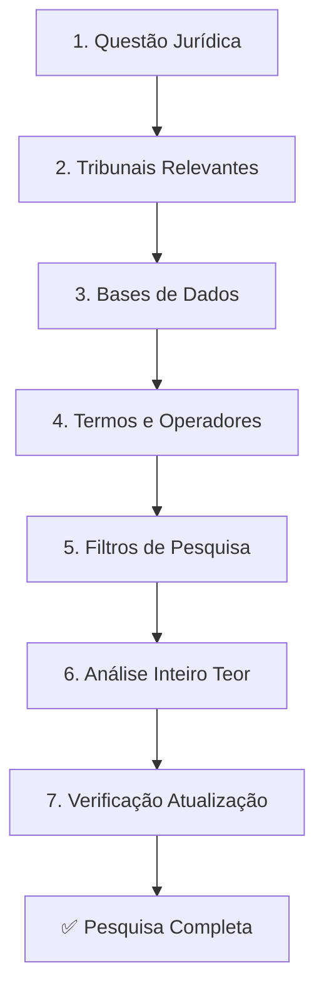

# Capítulo 15 — Pesquisa Jurisprudencial

## Visão Geral

A Pesquisa Jurisprudencial é a disciplina do Sigma—Juris Intelligence Framework (SJIF) dedicada à **localização, análise e compreensão dos padrões decisórios dos tribunais**, identificando precedentes, súmulas e temas repetitivos que influenciam a aplicação da lei. A jurisprudência, entendida como o conjunto de decisões e interpretações dos tribunais, é uma fonte essencial do Direito, conferindo-lhe **dinamismo e adaptabilidade** às realidades sociais.

> **Diretiva Mestra (Cap. 2):** Nenhuma jurisprudência relevante poderá deixar de ser pesquisada. A pesquisa deve abranger tribunais competentes, superiores, jurisprudência dominante, precedentes vinculantes, súmulas, orientações e temas repetitivos.

---

## 15.1 A Jurisprudência como Fonte Dinâmica do Direito

Em um sistema jurídico que valoriza a **segurança jurídica** e a **previsibilidade** das decisões, a pesquisa jurisprudencial eficaz é fundamental para:

- Construção de **argumentos sólidos**
- Formulação de **estratégias processuais**
- **Previsão de resultados** judiciais
- Identificação de **tendências decisórias**

### Integração no SJIF

| Componente | Relação |
|:-----------|:--------|
| **Motor Jurisprudencial** (Cap. 26) | Automação da pesquisa e análise |
| **Motor Decisório** (Cap. 24) | Análise de padrões de julgadores |
| **Motor de Coerência** (Cap. 23) | Uso adequado de precedentes |
| **Engenharia Reversa** (Cap. 11) | Reconstrução do raciocínio do julgador |
| **Grafo de Conhecimento** (Cap. 28) | Rede de relações entre julgados |

---

## 15.2 Metodologia de Pesquisa — 7 Etapas

O SJIF orienta uma abordagem sistemática de **7 etapas** para garantir abrangência e relevância dos resultados:

### Etapa 1 — Definição da Questão Jurídica
Clarificar o problema jurídico e termos-chave, considerando o **ramo do direito**, partes envolvidas e fatos relevantes.

### Etapa 2 — Seleção dos Tribunais Relevantes
Priorizar tribunais com **competência para julgar a matéria**:
- Tribunais de primeira instância
- Tribunais de Justiça estaduais/regionais
- Tribunais Regionais Federais
- **STJ** (Superior Tribunal de Justiça)
- **STF** (Supremo Tribunal Federal)

### Etapa 3 — Utilização de Bases de Dados
Empregar os **sistemas de busca dos próprios tribunais** e plataformas jurídicas comerciais com funcionalidades avançadas.

### Etapa 4 — Termos de Busca e Operadores Booleanos
Utilizar palavras-chave precisas, **sinônimos** e operadores lógicos (AND, OR, NOT). Considerar variação terminológica entre épocas e tribunais.

### Etapa 5 — Filtros de Pesquisa
Aplicar filtros por:
- **Data** de julgamento
- **Relator** ou turma/câmara
- **Tipo de recurso**
- **Palavras-chave** na ementa e no inteiro teor

### Etapa 6 — Análise do Inteiro Teor
> [!WARNING]
> Nunca se limitar à ementa ou ao resumo. A leitura do **inteiro teor** do acórdão é fundamental para compreender o contexto fático, os fundamentos, os votos vencidos e a real abrangência da decisão.

### Etapa 7 — Verificação de Atualização
Assegurar que a jurisprudência encontrada é a **mais recente** e não foi superada por decisões posteriores (*overruling*) ou por alterações legislativas.

---

## 15.3 Jurisprudência Dominante, Precedentes Vinculantes e Súmulas

O Brasil tem fortalecido mecanismos de **uniformização** das decisões e **segurança jurídica**. O SJIF auxilia na identificação desses elementos cruciais.

### 15.3.1 Jurisprudência Dominante

Entendimento **majoritário e reiterado** dos tribunais sobre determinada questão. Embora não vinculante, indica uma **forte tendência decisória** e deve ser considerada na formulação de estratégias.

### 15.3.2 Precedentes Vinculantes

Decisões que, por força de lei, **devem ser observadas** pelos demais órgãos do Judiciário:

| Tipo | Descrição | Alcance |
|:-----|:----------|:--------|
| **Súmulas Vinculantes (STF)** | Editadas pelo STF | Vinculam Judiciário e Administração Pública (federal, estadual, municipal) |
| **Controle Concentrado (ADI/ADC/ADPF)** | Julgamentos do STF | Eficácia *erga omnes* e efeito vinculante |
| **Recursos Repetitivos (STJ/STF)** | Temas paradigmas para demandas idênticas | Teses devem ser aplicadas aos casos análogos |
| **IRDR** | Incidentes nos TJs e TRFs | Uniformizam questões de direito em casos repetitivos |

### 15.3.3 Súmulas e Orientações

- **Súmulas (não vinculantes)** — Enunciados que consolidam jurisprudência pacífica. Forte indicativo do entendimento do tribunal.
- **Orientações Jurisprudenciais (OJs)** — Enunciados do TST que uniformizam temas na Justiça do Trabalho.

---

## 15.4 Análise de Padrões Decisórios e Evolução da Jurisprudência

A pesquisa jurisprudencial no SJIF vai além da localização de julgados, buscando **padrões decisórios** e a **evolução interpretativa** ao longo do tempo.

### 15.4.1 Análise de Padrões Decisórios

| Dimensão | O que avaliar |
|:---------|:-------------|
| **Teses Recorrentes** | Quais teses são frequentemente acolhidas/rejeitadas? |
| **Valoração de Provas** | Como os tribunais ponderam diferentes tipos de prova? |
| **Comportamento de Julgadores** | Tendências e preferências interpretativas (dados objetivos e públicos) |
| **Impacto de Argumentos** | Quais argumentos têm sido mais eficazes? |

### 15.4.2 Evolução da Jurisprudência

- **Linha do Tempo Jurisprudencial** — Mapeamento da evolução interpretativa, identificando *overruling* e consolidação de teses
- **Impacto de Novas Leis** — Como a jurisprudência se adapta a alterações legislativas
- **Divergência Jurisprudencial** — Conflitos entre tribunais ou turmas, indicativo para interposição de Recursos Especiais ou Extraordinários

---

## 15.5 Motor Jurisprudencial — Funcionalidades

O **Motor Jurisprudencial** (Cap. 26) automatiza e aprimora a pesquisa e análise:

| Funcionalidade | Descrição |
|:---------------|:----------|
| **Busca Semântica Avançada** | Pesquisa por conceitos, relações e contexto |
| **Identificação Automática de Precedentes** | Reconhece súmulas vinculantes, repetitivos e IRDRs |
| **Análise de Padrões Decisórios** | IA para identificar tendências e comportamentos |
| **Mapeamento de Divergências** | Conflitos entre órgãos judiciais |
| **Alerta de Novas Decisões** | Notificação sobre julgados relevantes |
| **Visualização de Redes de Precedentes** | Grafo de relações entre julgados e evolução de teses |

---

## 15.6 Integração Estratégica

A pesquisa jurisprudencial capacita os profissionais a navegar com segurança no universo das decisões judiciais, transformando a jurisprudência em **ferramenta estratégica** para:

1. **Construção de argumentos** robustos e embasados
2. **Previsão de resultados** com base em padrões identificados
3. **Defesa eficaz** dos interesses dos clientes
4. **Estratégia recursal** informada por divergências e tendências
5. **Adaptação argumentativa** ao perfil do julgador (Cap. 24)

---

## Referências Cruzadas

| Capítulo | Relação |
|:---------|:--------|
| [Cap. 2 — Diretiva Mestra](../../02_DIRETIVA_MESTRA/cap02_diretiva_mestra.md) | Diretriz de pesquisa exaustiva |
| [Cap. 11 — Engenharia Reversa](../engenharia/cap11_eng_reversa.md) | Reconstrução do raciocínio do julgador |
| [Cap. 14 — Pesquisa Legislativa](cap14_pesq_legislativa.md) | Base normativa complementar |
| [Cap. 16 — Pesquisa Doutrinária](cap16_pesq_doutrinaria.md) | Suporte interpretativo |
| [Cap. 23 — Motor de Coerência](../estrategia/cap23_motor_coerencia.md) | Uso adequado de precedentes |
| [Cap. 24 — Motor Decisório](../estrategia/cap24_motor_decisorio.md) | Padrões de julgadores |
| [Cap. 28 — Grafo de Conhecimento](../../05_BIBLIOTECAS/cap28_grafo_conhecimento.md) | Rede de precedentes |

---

> Sigma—Juris Intelligence Framework (SJIF) v1.0 | Propriedade de Charles de Paula Eugênio — Sigma Sihf Soluções Analíticas Ltda
