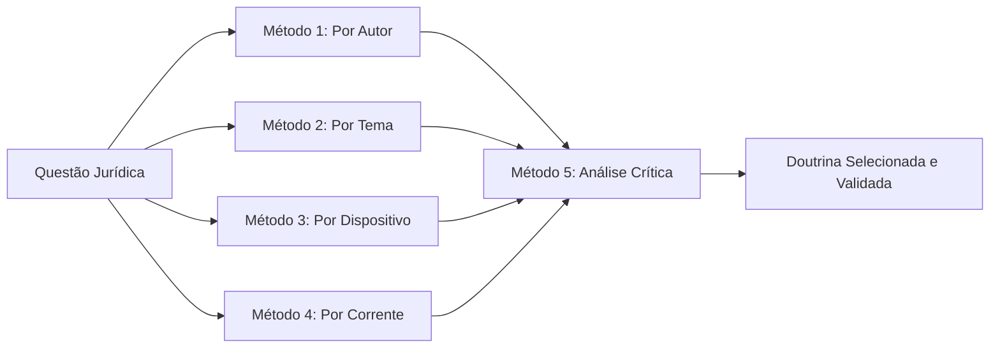

# Capítulo 16 — Pesquisa Doutrinária

## Visão Geral

A Pesquisa Doutrinária é a disciplina do Sigma—Juris Intelligence Framework (SJIF) dedicada à **localização, análise e utilização estratégica** dos conhecimentos produzidos por juristas e acadêmicos. A doutrina jurídica — composta por opiniões, estudos, análises e sistematizações — é uma fonte secundária, porém de **extrema relevância**, para a compreensão e aplicação do Direito. Ela oferece interpretações aprofundadas, críticas construtivas e embasamento teórico para a construção de argumentos jurídicos robustos.

> **Diretiva Doutrinária (Cap. 2):** A pesquisa e utilização da doutrina deve distinguir entre posições majoritárias e minoritárias, avaliando sua pertinência ao caso concreto.

---

## 16.1 A Doutrina como Fonte de Conhecimento e Argumentação

Em um cenário de complexidade normativa e diversidade de entendimentos, a pesquisa doutrinária eficaz é fundamental para:

- **Aprofundar a análise** jurídica além do texto legal
- **Embasar teses** com suporte teórico e conceitual
- **Fortalecer a argumentação** com autoridade acadêmica
- **Explorar perspectivas** inovadoras em casos complexos
- **Antecipar contra-argumentos** conhecendo as diferentes correntes

---

## 16.2 As 6 Fontes de Doutrina

O SJIF identifica **6 categorias principais** de fontes doutrinárias, cada uma com características e pesos argumentativos distintos:

| # | Fonte | Descrição | Peso Argumentativo |
|:-:|:------|:----------|:-------------------|
| 1 | **Livros e Tratados** | Obras completas com abordagem aprofundada e sistemática. Visão consolidada de grandes juristas | ★★★★★ Alto |
| 2 | **Artigos Científicos e Periódicos** | Publicações em revistas especializadas, anais de congressos e plataformas acadêmicas. Análises pontuais e atualizadas | ★★★★☆ Alto-Médio |
| 3 | **Pareceres e Opiniões Legais** | Documentos de juristas renomados expressando entendimento sobre questão específica | ★★★★☆ Alto-Médio |
| 4 | **Comentários a Códigos e Leis** | Análise artigo por artigo de diplomas legais com interpretações e exemplos | ★★★★★ Alto |
| 5 | **Teses e Dissertações** | Trabalhos acadêmicos com pesquisa aprofundada e novas perspectivas | ★★★☆☆ Médio |
| 6 | **Blogs e Sites Especializados** | Plataformas online com análises rápidas e atualizadas, especialmente em áreas de evolução rápida | ★★☆☆☆ Baixo-Médio |

---

## 16.3 Os 5 Métodos de Pesquisa Doutrinária

A pesquisa doutrinária no SJIF utiliza **5 métodos** que garantem abrangência e relevância:

### Método 1 — Pesquisa por Autor
Buscar obras e artigos de **juristas reconhecidos** na área. A reputação e a autoridade do autor conferem maior peso à opinião.

### Método 2 — Pesquisa por Tema/Assunto
Utilizar **termos-chave** para localizar obras que abordem a questão jurídica. Bases de dados jurídicas e bibliotecas digitais são ferramentas essenciais.

### Método 3 — Pesquisa por Dispositivo Legal
Buscar comentários e análises doutrinárias sobre um **artigo ou parágrafo específico** de lei ou código.

### Método 4 — Pesquisa por Corrente de Pensamento
Identificar as **diferentes posições doutrinárias** sobre tema controvertido, buscando argumentos a favor e contra cada uma.

### Método 5 — Análise Crítica
> [!IMPORTANT]
> Não aceitar a doutrina de forma passiva. É fundamental **analisar criticamente** os argumentos, verificar a coerência lógica, a fundamentação em normas e precedentes, e a pertinência ao caso concreto.

---

## 16.4 Doutrina Majoritária vs. Minoritária

No Direito, a existência de diferentes correntes de pensamento é natural e frequente. O SJIF visa identificar **ambas** para uma compreensão completa do debate jurídico.

### 16.4.1 Doutrina Majoritária

Entendimento **predominante** entre juristas e acadêmicos. Possui peso argumentativo significativo por refletir consenso ou posição amplamente aceita.

**Utilidade estratégica:**
- ✅ **Fortalecer argumentos** — Conferir credibilidade pela adesão ao consenso
- ✅ **Prever tendências** — Frequentemente influencia a jurisprudência

### 16.4.2 Doutrina Minoritária

Posições **não predominantes**, mas com fundamentos sólidos e relevância em contextos específicos.

**Utilidade estratégica:**
- ✅ **Explorar novas perspectivas** — Abordagens inovadoras ou críticas a entendimentos consolidados
- ✅ **Casos difíceis** — Embasamento quando a majoritária não favorece a tese
- ✅ **Antecipar contra-argumentos** — Preparar refutações conhecendo posições diversas
- ✅ **Superação de precedentes** — Base para mudança de entendimento jurisprudencial

### Quadro Comparativo

| Aspecto | Majoritária | Minoritária |
|:--------|:-----------|:-----------|
| **Aceitação** | Ampla | Restrita |
| **Influência na jurisprudência** | Alta | Baixa (mas crescente em temas emergentes) |
| **Uso principal** | Fortalecimento de teses | Inovação e casos difíceis |
| **Risco** | Baixo | Moderado (pode não ser acolhida) |
| **Potencial transformador** | Estabilidade | Evolução do Direito |

---

## 16.5 Utilização Estratégica da Doutrina na Argumentação

A doutrina é uma **ferramenta ativa** na construção de argumentos jurídicos:

1. **Embasamento Teórico** — Suporte conceitual para a tese jurídica, explicando fundamentos e princípios
2. **Interpretação de Normas** — Justificativa para determinada interpretação, especialmente em casos de ambiguidade ou lacuna
3. **Crítica a Entendimentos Contrários** — Refutação de argumentos adversos ou de decisões que se afastam do entendimento consolidado
4. **Construção de Novas Teses** — Base para formulação de teses inovadoras ainda não consolidadas na jurisprudência
5. **Diferenciação de Casos** — Demonstração de que um precedente invocado não se aplica ao caso concreto, por particularidades fáticas ou jurídicas

---

## 16.6 Motor Doutrinário — Funcionalidades

O **Motor Doutrinário** (Cap. 26) automatiza e aprimora a pesquisa e análise:

| Funcionalidade | Descrição |
|:---------------|:----------|
| **Busca Semântica em Acervos** | Pesquisa por conceitos e relações em obras, artigos e pareceres |
| **Identificação de Correntes** | IA para mapear posições majoritárias e minoritárias |
| **Análise de Impacto Doutrinário** | Avalia influência de autor ou obra na jurisprudência/legislação |
| **Geração de Resumos** | Resumos concisos com principais argumentos e conclusões |
| **Mapeamento de Citações** | Identifica como um autor é citado por outros juristas e em decisões |
| **Alerta de Novas Publicações** | Notificação sobre obras e artigos relevantes |

---

## 16.7 Integração com os Demais Componentes

A Pesquisa Doutrinária integra-se ao SJIF capacitando profissionais a acessar e utilizar o vasto conhecimento produzido pela academia e pelos juristas, transformando a doutrina em **ferramenta estratégica** para aprofundar a análise, construir argumentos sólidos e inovar na prática jurídica.

---

## Referências Cruzadas

| Capítulo | Relação |
|:---------|:--------|
| [Cap. 2 — Diretiva Mestra](../../02_DIRETIVA_MESTRA/cap02_diretiva_mestra.md) | Diretiva Doutrinária |
| [Cap. 5 — Lógica Jurídica](../../03_FRAMEWORK/cap05_logica_argumentativa.md) | Engenharia argumentativa com suporte doutrinário |
| [Cap. 9 — Engenharia da Fundamentação](../engenharia/cap09_eng_fundamentacao.md) | Uso da doutrina na fundamentação |
| [Cap. 14 — Pesquisa Legislativa](cap14_pesq_legislativa.md) | Interpretação complementar das normas |
| [Cap. 15 — Pesquisa Jurisprudencial](cap15_pesq_jurisprudencial.md) | Suporte interpretativo mútuo |
| [Cap. 23 — Motor de Coerência](../estrategia/cap23_motor_coerencia.md) | Verificação do uso adequado da doutrina |
| [Cap. 26 — Motores Especializados](../especializados/cap26_motores_especializados.md) | Motor Doutrinário |

---

> Sigma—Juris Intelligence Framework (SJIF) v1.0 | Propriedade de Charles de Paula Eugênio — Sigma Sihf Soluções Analíticas Ltda
