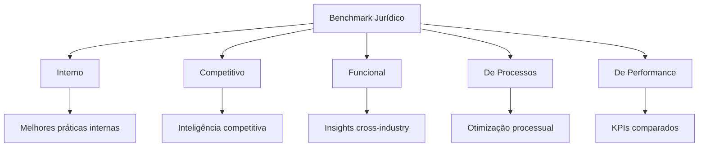

# Capítulo 17 — Benchmark Jurídico

## Visão Geral

O Benchmark Jurídico é a disciplina do Sigma—Juris Intelligence Framework (SJIF) dedicada à **análise comparativa de práticas, metodologias e resultados jurídicos**, tanto internos quanto externos, com o objetivo de aprimorar a eficiência, a qualidade e a estratégia da atuação jurídica. O benchmarking — prática consolidada no mundo corporativo — consiste na comparação de processos, produtos e serviços com os **melhores do mercado**, visando identificar oportunidades de melhoria e alcançar a excelência.

> **Princípio-chave:** A busca pela excelência exige comparação sistemática. O que não se mede, não se melhora.

---

## 17.1 O Benchmark no Contexto Jurídico

Em um ambiente cada vez mais competitivo e exigente, o benchmarking oferece uma abordagem sistemática para:

- **Aprender com os líderes** do setor jurídico
- **Adaptar melhores práticas** à realidade de escritórios e departamentos
- **Identificar gaps** de desempenho
- **Otimizar processos** e resultados
- **Orientar investimentos** em tecnologia e capacitação

---

## 17.2 Os 5 Tipos de Benchmarking Jurídico

O SJIF identifica **5 modalidades** de benchmarking aplicáveis ao contexto jurídico:

| # | Tipo | Descrição | Aplicação |
|:-:|:-----|:----------|:----------|
| 1 | **Benchmarking Interno** | Comparação entre equipes, departamentos ou unidades da mesma organização | Identificar e disseminar melhores práticas internas |
| 2 | **Benchmarking Competitivo** | Comparação com concorrentes diretos | Entender estratégias, pontos fortes e fracos dos concorrentes |
| 3 | **Benchmarking Funcional (Genérico)** | Comparação com organizações de outros setores com processos semelhantes | Ex.: gestão de projetos jurídicos vs. engenharia |
| 4 | **Benchmarking de Processos** | Foco em processos específicos | Gestão de litígios, elaboração de contratos, pesquisa jurídica |
| 5 | **Benchmarking de Performance** | Comparação de indicadores de desempenho | Tempo de resolução, taxa de sucesso, custos por processo |

---

## 17.3 O Processo de Benchmarking — 5 Etapas

O SJIF estrutura o benchmarking em um **ciclo de 5 etapas**:

### Etapa 1 — Planejamento
- Definir **o que será comparado**
- Identificar **parceiros de benchmarking** (internos ou externos)
- Determinar **quais dados serão coletados**
- Delimitar claramente a questão jurídica a ser aprimorada

### Etapa 2 — Coleta de Dados
- Reunir informações sobre práticas e resultados próprios e dos parceiros
- Métodos: **pesquisas, entrevistas, análise de documentos e relatórios**
- Fontes: sistemas de gestão jurídica (CMS), relatórios de mercado, dados públicos

### Etapa 3 — Análise
- Comparação dos dados coletados
- Identificação de **lacunas de desempenho (gaps)**
- Identificação de **melhores práticas** que explicam a superioridade dos parceiros
- O SJIF utiliza seus motores de análise para identificar **padrões e correlações**

### Etapa 4 — Adaptação e Implementação
- Desenvolvimento de **plano de ação** para adaptar melhores práticas à realidade da organização
- Revisão de processos, capacitação de equipes, adoção de tecnologias
- Definição de **responsáveis, prazos e recursos**

### Etapa 5 — Monitoramento e Avaliação
- Acompanhamento dos resultados da implementação
- Avaliação de impacto com **KPIs e KRIs**
- **Ciclo contínuo** de melhoria

---

## 17.4 Análise de Desempenho Baseada em KPIs

O Benchmark Jurídico utiliza a **Biblioteca de Indicadores** (Cap. 35) para mensuração objetiva:

### Indicadores de Desempenho (KPIs) no Contexto Jurídico

| Categoria | KPIs Exemplares |
|:----------|:---------------|
| **Eficiência Processual** | Tempo médio de tramitação, taxa de resolução, audiências por processo |
| **Qualidade da Atuação** | Taxa de sucesso em litígios, % de decisões favoráveis, recursos providos, satisfação do cliente |
| **Gestão Financeira** | Custo médio por processo, rentabilidade por cliente, taxa de recuperação de créditos |
| **Produtividade da Equipe** | Horas faturáveis por advogado, peças produzidas, volume de atendimentos |
| **Gestão de Riscos** | Contingências identificadas/mitigadas, % de conformidade com compliance |
| **Inovação** | Adoção de tecnologia, novas metodologias, projetos de pesquisa |

### Ferramentas de Análise de Desempenho

- **Sistemas de Gestão Jurídica (CMS)** — Coleta e organização de dados sobre processos, clientes e finanças
- **Business Intelligence (BI)** — Transformação de dados em informações estratégicas, visualização de tendências
- **Auditoria Jurídica** (Cap. 22) — Avaliação sistemática da eficácia dos processos e resultados

---

## 17.5 Melhores Práticas e Oportunidades de Melhoria

### Melhores Práticas Identificadas

| Prática | Descrição |
|:--------|:----------|
| **Gestão de Projetos Jurídicos** | Metodologias ágeis (Scrum, Kanban) para gerenciar casos e projetos |
| **Uso Estratégico de Tecnologia** | IA, automação de documentos, e-discovery |
| **Gestão do Conhecimento** | Bases de conhecimento, bibliotecas de precedentes e templates |
| **Desenvolvimento de Talentos** | Capacitação, mentoria e avaliação de desempenho |
| **Foco no Cliente** | Compreensão de necessidades, comunicação eficaz, entrega de valor |
| **Cultura de Inovação** | Experimentação, busca por novas soluções e adaptação |

### Oportunidades de Melhoria

- **Otimização de Processos** — Redução de etapas desnecessárias, eliminação de retrabalho
- **Redução de Custos** — Identificação de áreas de otimização sem comprometer qualidade
- **Aumento da Produtividade** — Ferramentas e metodologias para produzir mais com mesmos recursos
- **Melhora da Qualidade** — Práticas que garantam precisão e eficácia
- **Expansão de Serviços** — Novas áreas de atuação baseadas em demanda e competências

---

## 17.6 Motor de Benchmark Jurídico — Funcionalidades

O **Motor de Benchmark Jurídico** (Cap. 26) automatiza e aprimora a análise comparativa:

| Funcionalidade | Descrição |
|:---------------|:----------|
| **Coleta de Dados de Mercado** | Integração com bases (anonimizadas e agregadas) |
| **Relatórios Comparativos** | Comparação de desempenho com pares e líderes |
| **Identificação de Gaps** | Áreas abaixo da média ou dos líderes |
| **Sugestão de Melhores Práticas** | Práticas e metodologias adaptáveis |
| **Monitoramento Contínuo** | Acompanhamento temporal e alertas de mudanças |

---

## 17.7 Integração Estratégica

O Benchmark Jurídico capacita profissionais a adotar uma postura **proativa** na busca pela excelência, transformando a comparação em **ferramenta estratégica** para o aprimoramento contínuo da atuação jurídica e a conquista de resultados superiores.

---

## Referências Cruzadas

| Capítulo | Relação |
|:---------|:--------|
| [Cap. 19 — Gestão Estratégica](../estrategia/cap19_gestao_estrategica.md) | Objetivos e metas para o benchmark |
| [Cap. 20 — Gestão de Riscos](../estrategia/cap20_gestao_riscos.md) | KRIs como indicadores de benchmark |
| [Cap. 22 — Auditoria Jurídica](../estrategia/cap22_auditoria.md) | Avaliação sistemática complementar |
| [Cap. 35 — Biblioteca de Indicadores](../../09_INDICADORES/cap35_biblioteca_indicadores.md) | KPIs e KRIs para mensuração |
| [Cap. 26 — Motores Especializados](../especializados/cap26_motores_especializados.md) | Motor de Benchmark |

---

> Sigma—Juris Intelligence Framework (SJIF) v1.0 | Propriedade de Charles de Paula Eugênio — Sigma Sihf Soluções Analíticas Ltda
