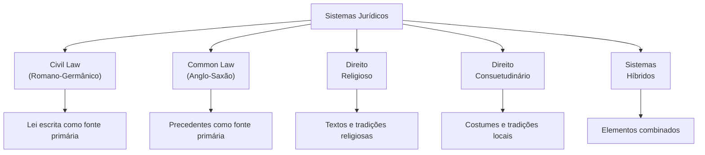

# Capítulo 18 — Inteligência Jurídica Comparada

## Visão Geral

A Inteligência Jurídica Comparada é a disciplina do Sigma—Juris Intelligence Framework (SJIF) dedicada à **análise sistemática de sistemas jurídicos estrangeiros e internacionais**, buscando identificar soluções, tendências e melhores práticas que possam informar e aprimorar a prática jurídica nacional. Em um mundo globalizado e interconectado, as questões jurídicas frequentemente transcendem fronteiras nacionais, exigindo uma compreensão de diferentes sistemas legais e abordagens regulatórias.

> **Princípio-chave:** A expansão do horizonte jurídico além das fronteiras nacionais não é luxo acadêmico — é necessidade estratégica em um mundo globalizado.

---

## 18.1 Além das Fronteiras: A Expansão do Horizonte Jurídico

A Inteligência Jurídica Comparada **não se limita** a uma mera comparação de leis, mas busca compreender:

- **Princípios subjacentes** aos diferentes sistemas
- **Metodologias de aplicação** do Direito em outras jurisdições
- **Resultados práticos** obtidos por diferentes abordagens
- **Tendências regulatórias** globais e emergentes

### Integração no SJIF

A disciplina conecta-se com os seguintes componentes:

| Componente | Relação |
|:-----------|:--------|
| **Pesquisa Legislativa** (Cap. 14) | Normas de referência internacional |
| **Pesquisa Jurisprudencial** (Cap. 15) | Precedentes comparados |
| **Pesquisa Doutrinária** (Cap. 16) | Doutrina internacional |
| **Gestão Estratégica** (Cap. 19) | Insights para estratégias inovadoras |
| **Benchmark Jurídico** (Cap. 17) | Comparação de práticas internacionais |

---

## 18.2 Classificação dos Sistemas Jurídicos

O SJIF analisa os sistemas jurídicos a partir de suas **grandes famílias**, reconhecendo variações e hibridismos:

### Famílias Jurídicas

| Sistema | Prevalência | Características |
|:--------|:-----------|:---------------|
| **Civil Law (Romano-Germânico)** | Europa Continental, América Latina | Primazia da lei escrita (códigos, estatutos); jurisprudência secundária, embora crescente |
| **Common Law (Anglo-Saxão)** | Reino Unido, EUA, Canadá, Austrália | Primazia dos precedentes judiciais (*stare decisis*); lei escrita complementar |
| **Direito Religioso** | Países islâmicos, sistemas canônicos | Baseado em textos e tradições religiosas |
| **Direito Consuetudinário** | Sociedades tribais, comunidades específicas | Baseado em costumes e tradições locais |
| **Sistemas Híbridos** | Diversos países | Combinam elementos de diferentes famílias |

### Elementos de Análise de um Sistema Jurídico

Ao analisar um sistema estrangeiro, o SJIF orienta a investigação de:

| Elemento | Pergunta-Chave |
|:---------|:---------------|
| **Fontes do Direito** | Quais as principais fontes e sua hierarquia? |
| **Estrutura Judiciária** | Como se organiza a hierarquia dos tribunais e mecanismos de revisão? |
| **Processo Legal** | Quais as regras processuais? (adversarial vs. inquisitorial) |
| **Princípios Fundamentais** | Quais valores informam o sistema? (devido processo, presunção de inocência, boa-fé) |
| **Instituições Jurídicas** | Quais as principais instituições e seus papéis? |
| **Cultura Jurídica** | Quais as práticas e expectativas dos profissionais e da sociedade? |

---

## 18.3 Metodologias de Estudo Comparado

O SJIF emprega **3 abordagens metodológicas** para o estudo comparado:

### Abordagem Funcional
Comparar como diferentes sistemas resolvem o **mesmo problema** social ou econômico, independentemente das categorias legais internas.

> *Exemplo: Como diferentes países regulam a proteção de dados pessoais.*

### Abordagem Institucional
Comparar **estruturas e funções** de instituições jurídicas em diferentes sistemas.

> *Exemplo: O papel do Ministério Público no Brasil vs. o papel do District Attorney nos EUA.*

### Abordagem Problema-Orientada
Focar em um **problema jurídico específico** e analisar soluções em diversas jurisdições.

> *Exemplo: Como diferentes países lidam com a responsabilidade civil por danos ambientais.*

### Áreas de Interesse para Comparação

| Área | Temas |
|:-----|:------|
| **Novas Tecnologias** | IA, blockchain, criptomoedas, regulação digital |
| **Direito Ambiental** | Proteção ambiental, licenciamento, responsabilidade ecológica |
| **Direito Empresarial** | Modelos de contratos, governança corporativa, disputas comerciais |
| **Direitos Humanos** | Proteção e implementação de direitos fundamentais |
| **Processo Civil e Penal** | Eficiência processual, acesso à justiça, mediação e conciliação |

---

## 18.4 Aplicação de Insights em Contextos Nacionais

O objetivo final da Inteligência Jurídica Comparada é **aplicar os insights** para aprimorar o Direito nacional.

### Benefícios da Aplicação

| Benefício | Descrição |
|:----------|:----------|
| **Reforma Legislativa** | Modelos bem-sucedidos que inspirem reformas no direito interno |
| **Interpretação de Normas** | Experiência de outros sistemas para normas ambíguas ou lacunosas |
| **Novas Teses** | Conceitos estrangeiros adaptados para resolver problemas internos |
| **Estratégias Processuais** | Estratégias eficazes em outras jurisdições |
| **Conflitos Internacionais** | Compreensão essencial em litígios transnacionais |
| **Harmonização do Direito** | Contribuição para blocos econômicos e tratados internacionais |

### Cuidados na Aplicação

> [!WARNING]
> A aplicação de insights de direito comparado deve ser feita com **cautela**, considerando as particularidades do sistema jurídico e da cultura nacional. Uma **transposição acrítica** pode levar a resultados indesejados. O SJIF enfatiza a necessidade de análise **contextualizada e adaptada**.

---

## 18.5 Motor de Inteligência Jurídica Comparada — Funcionalidades

O **Motor de Inteligência Jurídica Comparada** (Cap. 26) automatiza e aprimora a análise:

| Funcionalidade | Descrição |
|:---------------|:----------|
| **Bases Multijurisdicionais** | Acesso a acervos legislativos, jurisprudenciais e doutrinários de múltiplas jurisdições |
| **Mapeamento de Similaridades/Diferenças** | IA para identificar convergências e divergências entre sistemas |
| **Análise de Tendências Globais** | Monitoramento de novas regulamentações internacionais |
| **Relatórios Comparativos** | Comparação detalhada de legislação, jurisprudência e doutrina entre países |
| **Sugestão de Melhores Práticas** | Abordagens eficazes em outras jurisdições para adaptação local |

---

## 18.6 Integração Estratégica

A Inteligência Jurídica Comparada expande o **horizonte analítico** dos profissionais, permitindo atuar de forma mais informada e estratégica em um cenário globalizado. O conhecimento e as experiências de diferentes sistemas legais são aproveitados para **aprimorar a prática nacional**, constituindo um diferencial competitivo em um mundo cada vez mais interconectado.

---

## Referências Cruzadas

| Capítulo | Relação |
|:---------|:--------|
| [Cap. 14 — Pesquisa Legislativa](cap14_pesq_legislativa.md) | Normas de referência internacional |
| [Cap. 15 — Pesquisa Jurisprudencial](cap15_pesq_jurisprudencial.md) | Precedentes comparados |
| [Cap. 16 — Pesquisa Doutrinária](cap16_pesq_doutrinaria.md) | Doutrina internacional |
| [Cap. 17 — Benchmark Jurídico](cap17_benchmark.md) | Comparação de práticas |
| [Cap. 19 — Gestão Estratégica](../estrategia/cap19_gestao_estrategica.md) | Estratégias baseadas em insights globais |
| [Cap. 26 — Motores Especializados](../especializados/cap26_motores_especializados.md) | Motor de Inteligência Comparada |

---

> Sigma—Juris Intelligence Framework (SJIF) v1.0 | Propriedade de Charles de Paula Eugênio — Sigma Sihf Soluções Analíticas Ltda
