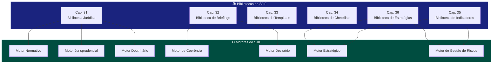

# 📚 05_BIBLIOTECAS — Bibliotecas do SJIF

## Visão Geral

O módulo de **Bibliotecas** constitui a camada de gestão do conhecimento do Sigma—Juris Intelligence Framework (SJIF). As bibliotecas são repositórios inteligentes que centralizam, categorizam e tornam acessível todo o acervo necessário para a operação jurídica de excelência.

> As bibliotecas do SJIF não são meros repositórios passivos — são sistemas vivos que se integram aos motores de inteligência para gerar, organizar e potencializar o conhecimento jurídico.

## Estrutura do Módulo

```
05_BIBLIOTECAS/
├── README.md                              ← Este arquivo
├── cap31_biblioteca_juridica.md           ← Cap. 31: Biblioteca Jurídica
├── areas/                                 ← 16 áreas do Direito
│   ├── direito_civil.md
│   ├── direito_empresarial.md
│   ├── direito_tributario.md
│   ├── direito_trabalhista.md
│   ├── direito_ambiental.md
│   ├── direito_minerario.md
│   ├── direito_agrario.md
│   ├── direito_administrativo.md
│   ├── direito_constitucional.md
│   ├── direito_processual_civil.md
│   ├── direito_consumidor.md
│   ├── direito_digital.md
│   ├── arbitragem.md
│   ├── mediacao.md
│   ├── recuperacao_judicial.md
│   └── licitacoes.md
└── estrategias/
    └── cap36_biblioteca_estrategias.md    ← Cap. 36: Biblioteca de Estratégias
```

## Diagrama de Relações entre Bibliotecas



## Descrição das Bibliotecas

| Capítulo | Biblioteca | Descrição | Arquivo |
|----------|-----------|-----------|---------|
| **31** | Biblioteca Jurídica | Repositório digital inteligente — legislação, jurisprudência, doutrina, documentos internos | [cap31_biblioteca_juridica.md](cap31_biblioteca_juridica.md) |
| **32** | Biblioteca de Briefings | Sínteses estratégicas — 6 tipos de briefings com geração automática via PLN | [../06_BRIEFINGS/cap32_biblioteca_briefings.md](../06_BRIEFINGS/cap32_biblioteca_briefings.md) |
| **33** | Biblioteca de Templates | Modelos pré-formatados — petições, contratos, pareceres com preenchimento inteligente | *Capítulo 33* |
| **34** | Biblioteca de Checklists | Listas de verificação — due diligence, compliance, processual, contratos | *Capítulo 34* |
| **35** | Biblioteca de Indicadores | KPIs e KRIs — mensuração de performance e monitoramento de riscos | *Capítulo 35* |
| **36** | Biblioteca de Estratégias | Planos de ação — estratégias processuais, negociais, preventivas, de crise e PI | [estrategias/cap36_biblioteca_estrategias.md](estrategias/cap36_biblioteca_estrategias.md) |

## Áreas do Direito Cobertas

O SJIF organiza seu acervo jurídico em **16 áreas especializadas**, cada uma com definição, escopo, fontes e integração com os motores:

| # | Área | Arquivo |
|---|------|---------|
| 1 | Direito Civil | [areas/direito_civil.md](areas/direito_civil.md) |
| 2 | Direito Empresarial | [areas/direito_empresarial.md](areas/direito_empresarial.md) |
| 3 | Direito Tributário | [areas/direito_tributario.md](areas/direito_tributario.md) |
| 4 | Direito Trabalhista | [areas/direito_trabalhista.md](areas/direito_trabalhista.md) |
| 5 | Direito Ambiental | [areas/direito_ambiental.md](areas/direito_ambiental.md) |
| 6 | Direito Minerário | [areas/direito_minerario.md](areas/direito_minerario.md) |
| 7 | Direito Agrário | [areas/direito_agrario.md](areas/direito_agrario.md) |
| 8 | Direito Administrativo | [areas/direito_administrativo.md](areas/direito_administrativo.md) |
| 9 | Direito Constitucional | [areas/direito_constitucional.md](areas/direito_constitucional.md) |
| 10 | Direito Processual Civil | [areas/direito_processual_civil.md](areas/direito_processual_civil.md) |
| 11 | Direito do Consumidor | [areas/direito_consumidor.md](areas/direito_consumidor.md) |
| 12 | Direito Digital | [areas/direito_digital.md](areas/direito_digital.md) |
| 13 | Arbitragem | [areas/arbitragem.md](areas/arbitragem.md) |
| 14 | Mediação | [areas/mediacao.md](areas/mediacao.md) |
| 15 | Recuperação Judicial | [areas/recuperacao_judicial.md](areas/recuperacao_judicial.md) |
| 16 | Licitações | [areas/licitacoes.md](areas/licitacoes.md) |

## Capítulos Relacionados

- [Cap. 23 — Motor de Coerência Jurídica](../01_KERNEL/cap23_motor_coerencia.md)
- [Cap. 24 — Motor Decisório Jurídico](../01_KERNEL/cap24_motor_decisorio.md)
- [Cap. 25 — Módulo Jurídico Forense](../01_KERNEL/cap25_modulo_forense.md)
- [Cap. 26 — Motores Especializados](../01_KERNEL/cap26_motores_especializados.md)
- [Cap. 27 — Ontologia Jurídica](../01_KERNEL/cap27_ontologia_juridica.md)
- [Cap. 28 — Grafo de Conhecimento Jurídico](../01_KERNEL/cap28_grafo_conhecimento.md)
- [Cap. 29 — Modelos Matemáticos](../01_KERNEL/cap29_modelos_matematicos.md)
- [Cap. 30 — Motores de PLN](../01_KERNEL/cap30_motores_pln.md)

---
> Sigma—Juris Intelligence Framework (SJIF) v1.0 | Propriedade de Charles de Paula Eugênio — Sigma Sihf Soluções Analíticas Ltda
