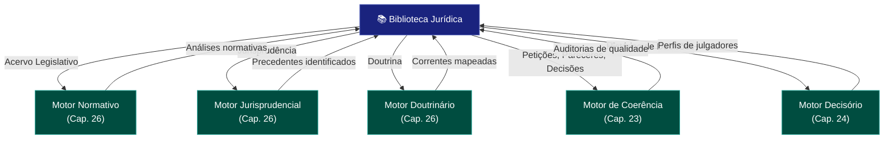

# Capítulo 31 — Biblioteca Jurídica

## 31.1 O Conhecimento Organizado: A Biblioteca Jurídica no SJIF

Em um cenário jurídico caracterizado pela vasta e crescente produção de normas, decisões e doutrinas, a organização eficiente do conhecimento é um desafio constante. A **Biblioteca Jurídica**, no contexto do Sigma—Juris Intelligence Framework (SJIF), é mais do que um mero repositório de documentos — é um **sistema inteligente de gestão do conhecimento** que centraliza, categoriza e torna acessível todo o acervo jurídico da organização.

Ela atua como a **memória institucional**, garantindo que informações valiosas não se percam e que o conhecimento acumulado seja facilmente recuperável e aplicável.

> **A Biblioteca Jurídica é o coração do conhecimento no SJIF**, fornecendo a base de dados essencial para todas as operações de inteligência.

---

## 31.2 Estruturação e Gestão de Acervos Digitais

A transição do acervo físico para o digital trouxe consigo a necessidade de novas abordagens para a estruturação e gestão do conhecimento jurídico. A Biblioteca Jurídica do SJIF é projetada para otimizar esse processo.

### 31.2.1 Componentes de um Acervo Digital Jurídico

| Componente | Descrição |
|-----------|-----------|
| **Legislação** | Códigos, leis, decretos, portarias — versão original e consolidada, com histórico de alterações |
| **Jurisprudência** | Sentenças, acórdãos, súmulas, precedentes vinculantes — organizados por tribunal, tema, relator e data |
| **Doutrina** | Livros, artigos, pareceres, teses, dissertações — organizados por autor, tema e área do Direito |
| **Documentos Internos** | Petições, pareceres, contratos, memorandos, relatórios de auditoria, políticas internas, modelos e templates |
| **Notícias e Artigos de Mercado** | Publicações relevantes sobre o setor de atuação, tendências jurídicas e econômicas |

### 31.2.2 Princípios de Estruturação e Gestão

1. **Centralização** — Reunir todo o conhecimento jurídico em uma única plataforma, evitando a dispersão de informações
2. **Padronização** — Utilizar padrões de nomenclatura, metadados e formatos de arquivo para garantir a consistência e a interoperabilidade
3. **Segurança** — Implementar controles de acesso e políticas de segurança para proteger a confidencialidade e a integridade dos documentos
4. **Versionamento** — Manter um histórico de todas as alterações nos documentos, permitindo a recuperação de versões anteriores
5. **Acessibilidade** — Garantir que o acervo seja facilmente acessível aos usuários autorizados, de qualquer lugar e a qualquer momento
6. **Escalabilidade** — Projetar o sistema para suportar o crescimento contínuo do volume de documentos e informações

---

## 31.3 Categorização e Indexação de Documentos

A mera digitalização de documentos não é suficiente; é preciso categorizá-los e indexá-los de forma inteligente para que possam ser efetivamente recuperados e utilizados.

### 31.3.1 Categorização

- **Por Ramo do Direito** — Classificação dos documentos de acordo com as áreas do Direito (Civil, Penal, Trabalhista, Tributário, Ambiental, etc.)
- **Por Tema/Assunto** — Atribuição de tags ou palavras-chave descrevendo o conteúdo (ex.: "responsabilidade civil", "contrato de compra e venda", "LGPD")
- **Por Tipo de Documento** — Classificação como "lei", "sentença", "petição inicial", "parecer", "contrato", etc.
- **Por Jurisdição** — Indicação do tribunal ou órgão de origem (STF, STJ, TJSP, TRF, etc.)
- **Por Data** — Organização cronológica dos documentos

### 31.3.2 Indexação

| Tipo de Indexação | Descrição |
|-------------------|-----------|
| **Indexação por Metadados** | Atribuição de informações estruturadas (autor, data, partes envolvidas, número do processo, ementa) |
| **Indexação de Texto Completo** | Busca por qualquer palavra ou frase contida no documento, mesmo que não esteja nos metadados (*Full-Text Indexing*) |
| **Indexação Semântica** | Utilização da Ontologia Jurídica (Cap. 27) e do Grafo de Conhecimento (Cap. 28) para indexar com base em conceitos e relações — buscas mais inteligentes e contextuais |

### 31.3.3 Ferramentas do SJIF para Categorização e Indexação

- **Processamento de Linguagem Natural (PLN)** — Motores de PLN (Cap. 30) para extração automática de metadados, entidades e relações de documentos não estruturados
- **Machine Learning** — Algoritmos treinados para classificar documentos em categorias pré-definidas com alta precisão
- **Ontologia Jurídica** — Fornece o vocabulário controlado e a estrutura conceitual para a categorização e indexação semântica

---

## 31.4 Integração com os Motores de Pesquisa do SJIF

A Biblioteca Jurídica não é um sistema isolado; ela é intrinsecamente integrada aos motores de pesquisa e análise do SJIF, potencializando suas capacidades e fornecendo a base de dados para suas operações.

### 31.4.1 Sinergia com os Motores Especializados

| Motor | Função junto à Biblioteca |
|-------|--------------------------|
| **Motor Normativo** (Cap. 26) | A Biblioteca armazena e organiza o acervo legislativo — base para análises de vigência, hierarquia e conflitos normativos |
| **Motor Jurisprudencial** (Cap. 26) | O acervo de jurisprudência é a fonte para identificação de precedentes, súmulas e padrões decisórios |
| **Motor Doutrinário** (Cap. 26) | O conhecimento doutrinário é processado para identificar correntes de pensamento e influências |
| **Motor de Coerência Jurídica** (Cap. 23) | Documentos (petições, pareceres, decisões) são insumo para avaliação da qualidade técnica da construção jurídica |
| **Motor Decisório Jurídico** (Cap. 24) | O histórico de decisões de julgadores é base para engenharia cognitiva e simulação do julgador |

### 31.4.2 Benefícios da Integração

- **Busca Unificada** — Buscas abrangentes retornando legislação, jurisprudência, doutrina e documentos internos em interface única
- **Contextualização de Resultados** — Ao encontrar um documento, o SJIF apresenta automaticamente documentos relacionados (leis citadas, decisões interpretativas, doutrinas analíticas)
- **Atualização Contínua** — A Biblioteca é alimentada continuamente pelos motores de monitoramento legislativo e jurisprudencial
- **Geração de Conhecimento** — A integração permite gerar novos conhecimentos a partir da análise das relações entre os documentos

---

## 31.5 A Biblioteca Jurídica como Coração do Conhecimento no SJIF

A Biblioteca Jurídica é o coração do conhecimento no Sigma—Juris Intelligence Framework, fornecendo a base de dados essencial para todas as operações de inteligência. Ao estruturar, categorizar e indexar o vasto acervo jurídico de forma inteligente, e ao integrá-la de forma sinérgica com os motores de pesquisa e análise, o SJIF transforma a gestão do conhecimento de uma tarefa passiva em um **processo ativo e estratégico**.

Ela garante que os profissionais do direito tenham acesso rápido e preciso às informações de que precisam, capacitando-os a:

- Tomar decisões mais informadas
- Construir argumentos mais sólidos
- Atuar com maior eficiência e eficácia

> A Biblioteca Jurídica é um pilar fundamental para a construção de uma inteligência jurídica que valoriza e potencializa o **capital intelectual** da organização.

## Referências Cruzadas

- [Cap. 23 — Motor de Coerência Jurídica](../../01_KERNEL/cap23_motor_coerencia.md)
- [Cap. 24 — Motor Decisório Jurídico](../../01_KERNEL/cap24_motor_decisorio.md)
- [Cap. 26 — Motores Especializados](../../01_KERNEL/cap26_motores_especializados.md)
- [Cap. 27 — Ontologia Jurídica](../../01_KERNEL/cap27_ontologia_juridica.md)
- [Cap. 28 — Grafo de Conhecimento Jurídico](../../01_KERNEL/cap28_grafo_conhecimento.md)
- [Cap. 30 — Motores de PLN](../../01_KERNEL/cap30_motores_pln.md)
- [Cap. 32 — Biblioteca de Briefings](../../06_BRIEFINGS/cap32_biblioteca_briefings.md)
- [Cap. 36 — Biblioteca de Estratégias](../estrategias/cap36_biblioteca_estrategias.md)
- [Áreas do Direito — Diretório](../areas/)

---
> Sigma—Juris Intelligence Framework (SJIF) v1.0 | Propriedade de Charles de Paula Eugênio — Sigma Sihf Soluções Analíticas Ltda
