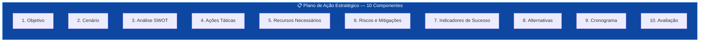
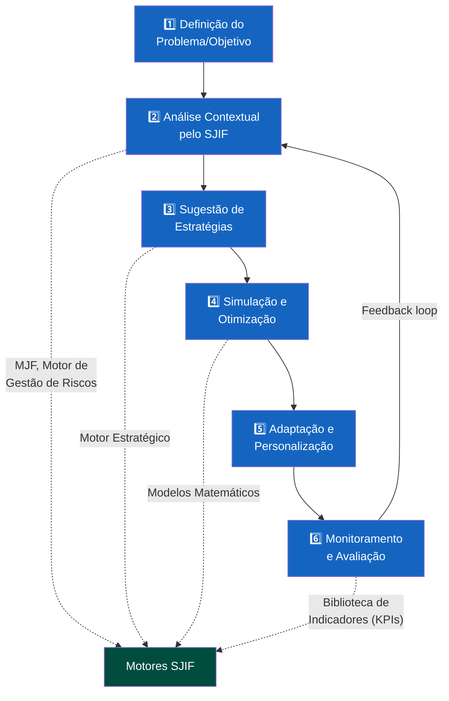

# Capítulo 36 — Biblioteca de Estratégias

## 36.1 A Arte da Estratégia Jurídica: Otimizando a Tomada de Decisão no SJIF

No complexo tabuleiro do Direito, a formulação de estratégias eficazes é a chave para o sucesso em litígios, negociações e na gestão preventiva de riscos. A **Biblioteca de Estratégias**, no contexto do Sigma—Juris Intelligence Framework (SJIF), é um **repositório dinâmico e inteligente** de abordagens táticas e planos de ação comprovados, desenvolvidos a partir da análise de dados históricos, melhores práticas e insights gerados pelos motores do SJIF.

> A Biblioteca de Estratégias transforma a formulação de planos de ação de uma arte intuitiva em uma **ciência baseada em dados**.

---

## 36.2 Estruturação e Gestão de Estratégias Jurídicas

Uma estratégia jurídica eficaz é um plano de ação cuidadosamente elaborado para alcançar um objetivo específico, considerando o ambiente legal, as partes envolvidas e os recursos disponíveis.

### 36.2.1 Os 5 Tipos de Estratégias Jurídicas

```mermaid
graph TD
    BE["📋 Biblioteca de Estratégias"]
    
    BE --> EP["⚖️ Estratégias<br>Processuais"]
    BE --> EN["🤝 Estratégias<br>Negociais"]
    BE --> EPr["🛡️ Estratégias<br>Preventivas"]
    BE --> EC["🚨 Estratégias de<br>Gestão de Crise"]
    BE --> EPI["💡 Estratégias de<br>Propriedade Intelectual"]

    EP --> EP1["Escolha da via processual"]
    EP --> EP2["Formulação de teses"]
    EP --> EP3["Gestão de provas"]
    EP --> EP4["Interposição de recursos"]
    EP --> EP5["Condução da execução"]

    EN --> EN1["Mediação e conciliação"]
    EN --> EN2["Arbitragem"]
    EN --> EN3["Negociação de contratos"]

    EPr --> EPr1["Programas de compliance"]
    EPr --> EPr2["Revisão contratual"]
    EPr --> EPr3["Políticas internas"]

    EC --> EC1["Investigações regulatórias"]
    EC --> EC2["Acidentes ambientais"]
    EC --> EC3["Escândalos de reputação"]

    EPI --> EPI1["Patentes e marcas"]
    EPI --> EPI2["Direitos autorais"]
    EPI --> EPI3["Combate à pirataria"]

    style BE fill:#1a237e,stroke:#5c6bc0,color:#fff
    style EP fill:#0d47a1,stroke:#42a5f5,color:#fff
    style EN fill:#1b5e20,stroke:#66bb6a,color:#fff
    style EPr fill:#e65100,stroke:#ff9800,color:#fff
    style EC fill:#b71c1c,stroke:#ef5350,color:#fff
    style EPI fill:#4a148c,stroke:#ab47bc,color:#fff
```

#### 1. Estratégias Processuais

Planos de ação para litígios, incluindo a escolha da via processual, a formulação de teses, a gestão de provas, a interposição de recursos e a condução da execução.

**Exemplos:**
- Estratégia de Defesa em Ação de Indenização
- Estratégia Recursal em Processo Trabalhista

#### 2. Estratégias Negociais

Abordagens para resolução de conflitos fora do âmbito judicial — mediação, conciliação e arbitragem — ou para a negociação de contratos.

**Exemplos:**
- Estratégia de Negociação em Acordo Extrajudicial
- Estratégia para Resolução de Conflito Societário

#### 3. Estratégias Preventivas

Planos para mitigar riscos e garantir a conformidade — programas de compliance, revisão de contratos, elaboração de políticas internas.

**Exemplos:**
- Estratégia de Prevenção de Litígios Trabalhistas
- Estratégia de Adequação à LGPD

#### 4. Estratégias de Gestão de Crise

Planos de resposta a eventos jurídicos adversos inesperados — investigações regulatórias, acidentes ambientais, escândalos de reputação.

**Exemplos:**
- Plano de Resposta a Crise de Imagem
- Estratégia de Defesa em Inquérito Policial

#### 5. Estratégias de Propriedade Intelectual

Planos para proteção, gestão e monetização de ativos intangíveis — patentes, marcas e direitos autorais.

**Exemplos:**
- Estratégia de Registro de Marca
- Estratégia de Combate à Pirataria

### 36.2.2 Princípios de Estruturação e Gestão

1. **Orientação por Objetivos** — Cada estratégia deve estar claramente vinculada a um objetivo jurídico e de negócio
2. **Flexibilidade e Adaptabilidade** — As estratégias devem se adaptar a mudanças no cenário jurídico ou fático
3. **Baseada em Evidências** — Formuladas com base em dados, análises e insights gerados pelo SJIF
4. **Avaliação de Riscos** — Cada estratégia deve considerar riscos associados e incluir planos de mitigação
5. **Monitoramento e Revisão** — As estratégias devem ser continuamente monitoradas e revisadas para garantir sua eficácia

---

## 36.3 Categorização e Aplicação de Planos de Ação

### 36.3.1 Categorização de Estratégias

As estratégias podem ser categorizadas por:

| Dimensão | Categorias |
|----------|-----------|
| **Área do Direito** | Civil, Penal, Trabalhista, Tributário, etc. |
| **Tipo de Caso/Problema** | Litígio, Negociação, Compliance, Consultoria |
| **Fase do Processo** | Pré-litígio, Conhecimento, Execução, Recurso |
| **Partes Envolvidas** | Cliente (autor/réu), Parte Contrária, Julgador |
| **Nível de Risco** | Baixo, Médio, Alto |

### 36.3.2 Os 10 Componentes de um Plano de Ação Estratégico

Cada plano de ação na Biblioteca de Estratégias é composto por **10 componentes essenciais**:

| # | Componente | Descrição |
|---|-----------|-----------|
| **1** | **Objetivo** | O que se pretende alcançar com a estratégia |
| **2** | **Cenário** | Descrição do contexto em que a estratégia será aplicada |
| **3** | **Análise SWOT** | Forças, Fraquezas, Oportunidades e Ameaças relevantes |
| **4** | **Ações Táticas** | Passos específicos a serem tomados, com responsáveis e prazos |
| **5** | **Recursos Necessários** | Humanos, financeiros, tecnológicos |
| **6** | **Riscos e Mitigações** | Identificação de riscos e planos de contingência |
| **7** | **Indicadores de Sucesso (KPIs)** | Métricas para avaliar a eficácia da estratégia |
| **8** | **Alternativas** | Planos B e C, caso a estratégia principal não seja viável ou falhe |
| **9** | **Cronograma** | Linha do tempo com marcos e deadlines para cada ação tática |
| **10** | **Avaliação** | Critérios para revisão periódica e ajuste da estratégia |

---

## 36.4 Integração com os Motores de Análise do SJIF para Seleção e Otimização

A Biblioteca de Estratégias atinge seu potencial máximo quando integrada aos motores de inteligência do SJIF, permitindo a seleção e otimização de estratégias de forma inteligente e preditiva.

### 36.4.1 Sinergia com os Motores Especializados

| Motor | Papel na Seleção/Otimização de Estratégias |
|-------|-------------------------------------------|
| **Motor Estratégico** (Cap. 19) | Principal motor — sugere planos de ação com base nos objetivos e análise de riscos |
| **Módulo Jurídico Forense** (Cap. 25) | Após análise multicamadas, identifica as estratégias processuais mais adequadas |
| **Motor Decisório Jurídico** (Cap. 24) | Fornece insights sobre padrões decisórios de julgadores para adaptar argumentação |
| **Motor de Gestão de Riscos** (Cap. 26) | Propõe estratégias de mitigação de riscos e planos de contingência |
| **Modelos Matemáticos** (Cap. 29) | Simula impacto de diferentes estratégias e otimiza escolha com base em probabilidades |
| **Biblioteca de Indicadores** (Cap. 35) | Fornece os KPIs para monitorar a execução e eficácia das estratégias |

### 36.4.2 Processo de Seleção e Otimização Inteligente

1. **Definição do Problema/Objetivo** — O usuário informa o cenário jurídico e o objetivo a ser alcançado
2. **Análise Contextual pelo SJIF** — Os motores (MJF, Motor de Gestão de Riscos, etc.) analisam o caso, identificando fatos, normas, precedentes, riscos e padrões decisórios
3. **Sugestão de Estratégias** — O Motor Estratégico consulta a Biblioteca e sugere os planos com maior probabilidade de sucesso
4. **Simulação e Otimização** — Utilizando Modelos Matemáticos, o SJIF simula o impacto das estratégias, permitindo comparação de cenários
5. **Adaptação e Personalização** — O profissional adapta a estratégia às particularidades do caso, utilizando templates e checklists
6. **Monitoramento e Avaliação** — A execução é monitorada por KPIs, permitindo ajustes em tempo real

---

## 36.5 A Biblioteca de Estratégias como Vantagem Competitiva

A Biblioteca de Estratégias é um componente fundamental do Sigma—Juris Intelligence Framework, transformando a formulação de planos de ação de uma arte intuitiva em uma ciência baseada em dados. Ao fornecer um repositório organizado de estratégias comprovadas, e ao integrá-la de forma sinérgica com os motores de análise e otimização do SJIF, ela capacita os profissionais do Direito a:

- Tomar decisões mais informadas, eficazes e com maior probabilidade de sucesso
- Otimizar tempo e recursos
- Conquistar vantagem competitiva significativa
- Atuar de forma proativa, adaptável e orientada para resultados

> A Biblioteca de Estratégias é um pilar essencial para a construção de uma inteligência jurídica que eleva a prática do Direito a um novo patamar de **excelência estratégica**.

## Referências Cruzadas

- [Cap. 19 — Motor Estratégico](../../01_KERNEL/cap19_motor_estrategico.md)
- [Cap. 24 — Motor Decisório Jurídico](../../01_KERNEL/cap24_motor_decisorio.md)
- [Cap. 25 — Módulo Jurídico Forense](../../01_KERNEL/cap25_modulo_forense.md)
- [Cap. 26 — Motores Especializados](../../01_KERNEL/cap26_motores_especializados.md)
- [Cap. 29 — Modelos Matemáticos](../../01_KERNEL/cap29_modelos_matematicos.md)
- [Cap. 31 — Biblioteca Jurídica](../cap31_biblioteca_juridica.md)
- [Cap. 35 — Biblioteca de Indicadores](../../05_BIBLIOTECAS/cap35_biblioteca_indicadores.md)

---
> Sigma—Juris Intelligence Framework (SJIF) v1.0 | Propriedade de Charles de Paula Eugênio — Sigma Sihf Soluções Analíticas Ltda
