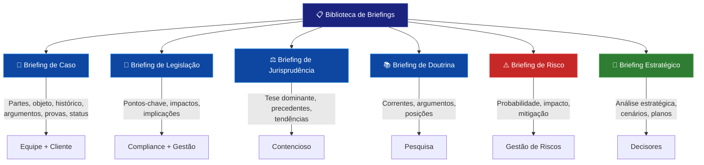

# 📋 06_BRIEFINGS — Biblioteca de Briefings do SJIF

## Visão Geral

O módulo de **Briefings** constitui a camada de comunicação estratégica do Sigma—Juris Intelligence Framework (SJIF). A Biblioteca de Briefings é um repositório estruturado de documentos que condensam análises jurídicas complexas, resultados de pesquisas e recomendações estratégicas em formatos de fácil compreensão.

> Os briefings do SJIF são o elo vital entre a **análise profunda** e a **ação estratégica** — transformando dados complexos em inteligência acionável.

## Estrutura do Módulo

```
06_BRIEFINGS/
├── README.md                              ← Este arquivo
├── cap32_biblioteca_briefings.md          ← Cap. 32: Biblioteca de Briefings
├── briefing_mestre.md                     ← Template mestre de briefing
└── especializados/                        ← 20 briefings especializados
    ├── briefing_civil.md
    ├── briefing_empresarial.md
    ├── briefing_tributario.md
    ├── briefing_trabalhista.md
    ├── briefing_ambiental.md
    ├── briefing_minerario.md
    ├── briefing_agrario.md
    ├── briefing_administrativo.md
    ├── briefing_constitucional.md
    ├── briefing_contratual.md
    ├── briefing_societario.md
    ├── briefing_compliance.md
    ├── briefing_arbitragem.md
    ├── briefing_mediacao.md
    ├── briefing_recuperacao_judicial.md
    ├── briefing_licitacoes.md
    ├── briefing_consumidor.md
    ├── briefing_digital.md
    ├── briefing_recursal.md
    └── briefing_execucao.md
```

## Os 6 Tipos de Briefings do SJIF



## Conteúdo do Módulo

| Arquivo | Descrição |
|---------|-----------|
| [cap32_biblioteca_briefings.md](cap32_biblioteca_briefings.md) | Capítulo 32 completo — tipos, princípios, padronização e geração automática |
| [briefing_mestre.md](briefing_mestre.md) | Template mestre com estrutura completa para qualquer briefing |

### Briefings Especializados (20 áreas)

| # | Briefing | Arquivo |
|---|---------|---------|
| 1 | Civil | [especializados/briefing_civil.md](especializados/briefing_civil.md) |
| 2 | Empresarial | [especializados/briefing_empresarial.md](especializados/briefing_empresarial.md) |
| 3 | Tributário | [especializados/briefing_tributario.md](especializados/briefing_tributario.md) |
| 4 | Trabalhista | [especializados/briefing_trabalhista.md](especializados/briefing_trabalhista.md) |
| 5 | Ambiental | [especializados/briefing_ambiental.md](especializados/briefing_ambiental.md) |
| 6 | Minerário | [especializados/briefing_minerario.md](especializados/briefing_minerario.md) |
| 7 | Agrário | [especializados/briefing_agrario.md](especializados/briefing_agrario.md) |
| 8 | Administrativo | [especializados/briefing_administrativo.md](especializados/briefing_administrativo.md) |
| 9 | Constitucional | [especializados/briefing_constitucional.md](especializados/briefing_constitucional.md) |
| 10 | Contratual | [especializados/briefing_contratual.md](especializados/briefing_contratual.md) |
| 11 | Societário | [especializados/briefing_societario.md](especializados/briefing_societario.md) |
| 12 | Compliance | [especializados/briefing_compliance.md](especializados/briefing_compliance.md) |
| 13 | Arbitragem | [especializados/briefing_arbitragem.md](especializados/briefing_arbitragem.md) |
| 14 | Mediação | [especializados/briefing_mediacao.md](especializados/briefing_mediacao.md) |
| 15 | Recuperação Judicial | [especializados/briefing_recuperacao_judicial.md](especializados/briefing_recuperacao_judicial.md) |
| 16 | Licitações | [especializados/briefing_licitacoes.md](especializados/briefing_licitacoes.md) |
| 17 | Consumidor | [especializados/briefing_consumidor.md](especializados/briefing_consumidor.md) |
| 18 | Digital | [especializados/briefing_digital.md](especializados/briefing_digital.md) |
| 19 | Recursal | [especializados/briefing_recursal.md](especializados/briefing_recursal.md) |
| 20 | Execução | [especializados/briefing_execucao.md](especializados/briefing_execucao.md) |

## Capítulos Relacionados

- [Cap. 23 — Motor de Coerência Jurídica](../01_KERNEL/cap23_motor_coerencia.md)
- [Cap. 25 — Módulo Jurídico Forense](../01_KERNEL/cap25_modulo_forense.md)
- [Cap. 26 — Motores Especializados](../01_KERNEL/cap26_motores_especializados.md)
- [Cap. 30 — Motores de PLN](../01_KERNEL/cap30_motores_pln.md)
- [Cap. 31 — Biblioteca Jurídica](../05_BIBLIOTECAS/cap31_biblioteca_juridica.md)
- [Cap. 33 — Biblioteca de Templates](../05_BIBLIOTECAS/cap33_biblioteca_templates.md)

---
> Sigma—Juris Intelligence Framework (SJIF) v1.0 | Propriedade de Charles de Paula Eugênio — Sigma Sihf Soluções Analíticas Ltda
