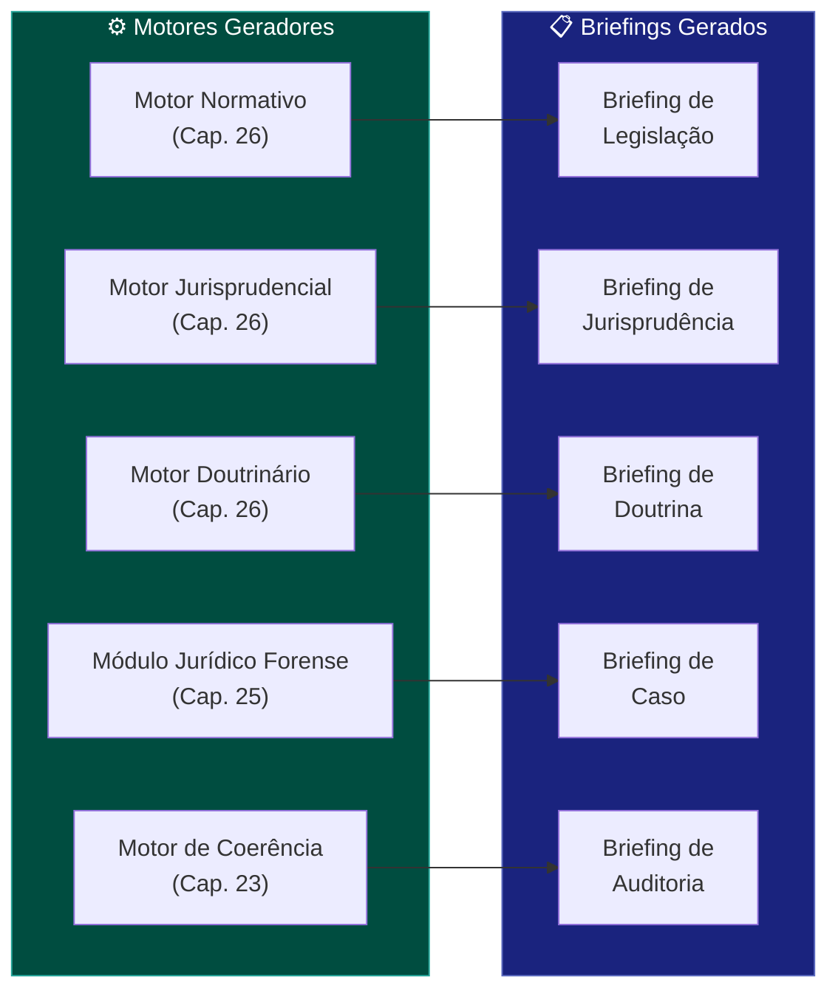
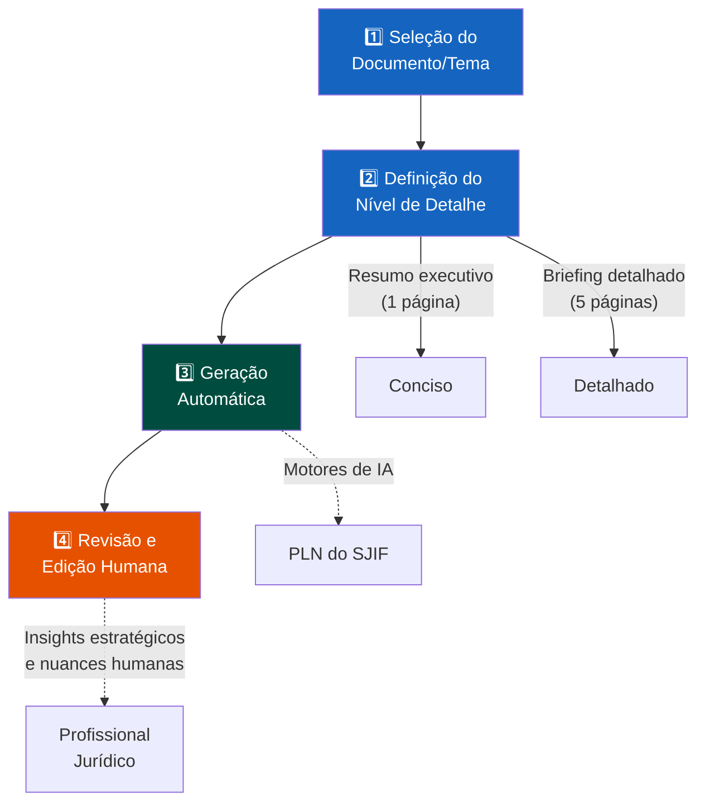

# Capítulo 32 — Biblioteca de Briefings

## 32.1 A Síntese Estratégica: O Poder dos Briefings no SJIF

Em um ambiente jurídico de alta complexidade e volume de informações, a capacidade de sintetizar dados complexos em resumos concisos e acionáveis é uma habilidade inestimável. A **Biblioteca de Briefings**, no contexto do Sigma—Juris Intelligence Framework (SJIF), é um repositório estruturado de documentos que condensam análises jurídicas complexas, resultados de pesquisas e recomendações estratégicas em formatos de fácil compreensão.

Ela serve como ferramenta essencial para a **comunicação eficaz** entre advogados, clientes, gestores e outras partes interessadas, garantindo que as informações mais relevantes sejam transmitidas de forma clara e objetiva.

> A Biblioteca de Briefings é um elo vital entre a análise profunda e a ação estratégica, consolidando o SJIF como uma plataforma que não apenas gera conhecimento, mas o torna **acessível e impactante**.

---

## 32.2 Os 6 Tipos de Briefings Jurídicos

### Tipo 1: Briefing de Caso

Resumo de um processo judicial, incluindo as partes, o objeto, o histórico, os principais argumentos, as provas e o status atual. **Essencial** para a equipe jurídica e para comunicação com o cliente.

### Tipo 2: Briefing de Legislação

Análise concisa de uma nova lei ou regulamento, destacando seus principais pontos, impactos e implicações para a organização ou para um caso específico.

### Tipo 3: Briefing de Jurisprudência

Síntese de decisões judiciais relevantes sobre um tema, identificando a tese dominante, os precedentes importantes e as tendências decisórias.

### Tipo 4: Briefing de Doutrina

Resumo de posições doutrinárias sobre uma questão jurídica complexa, apresentando os principais argumentos e as diferentes correntes de pensamento.

### Tipo 5: Briefing de Risco

Avaliação concisa de um risco jurídico, incluindo sua probabilidade, impacto potencial e as medidas de mitigação recomendadas.

### Tipo 6: Briefing Estratégico

Documento que apresenta uma análise estratégica de uma situação jurídica, com recomendações de planos de ação e cenários possíveis.

| Tipo | Foco | Público-Alvo |
|------|------|-------------|
| **Briefing de Caso** | Processo judicial — partes, argumentos, provas, status | Equipe jurídica, cliente |
| **Briefing de Legislação** | Nova lei/regulamento — pontos-chave, impactos | Compliance, gestão |
| **Briefing de Jurisprudência** | Decisões relevantes — tese dominante, tendências | Contencioso |
| **Briefing de Doutrina** | Posições doutrinárias — correntes, argumentos | Pesquisa, consultivo |
| **Briefing de Risco** | Risco jurídico — probabilidade, impacto, mitigação | Gestão de riscos |
| **Briefing Estratégico** | Análise estratégica — cenários, planos de ação | Decisores, diretoria |

---

## 32.3 Princípios de Estruturação

Um briefing jurídico eficaz deve ser conciso, preciso e focado nas informações essenciais para a tomada de decisão.

### 5 Princípios Fundamentais

1. **Concisão** — Ir direto ao ponto, eliminando informações redundantes ou irrelevantes
2. **Clareza** — Utilizar linguagem simples e objetiva, evitando jargões jurídicos excessivos quando o público-alvo não for especializado
3. **Relevância** — Focar nas informações cruciais para a compreensão da questão e para a tomada de decisão
4. **Estrutura Lógica** — Organizar o conteúdo de forma hierárquica, com títulos e subtítulos que facilitem a leitura
5. **Foco na Ação** — Incluir recomendações claras e acionáveis, quando aplicável

---

## 32.4 Padronização de Formatos e Conteúdos

### 32.4.1 Elementos Comuns de um Briefing Padronizado

Todo briefing no SJIF deve conter os seguintes elementos:

| Elemento | Descrição |
|----------|-----------|
| **Título** | Claro e descritivo |
| **Data e Autor** | Para rastreabilidade e atualização |
| **Assunto/Tema** | Categoria principal do briefing |
| **Contexto/Introdução** | Breve descrição da questão jurídica |
| **Análise/Discussão** | Os pontos principais da análise jurídica |
| **Conclusão/Recomendação** | Síntese dos achados e sugestões de ação |
| **Anexos/Referências** | Links para documentos completos ou fontes originais |

### 32.4.2 Benefícios da Padronização

- **Eficiência** — Reduz o tempo gasto na elaboração, pois os profissionais já têm um modelo a seguir
- **Qualidade** — Garante que todos os briefings contenham as informações essenciais
- **Facilidade de Compreensão** — Permite que os leitores se familiarizem rapidamente com o formato
- **Busca e Recuperação** — Facilita a busca e recuperação na biblioteca, pois todos seguem estrutura lógica

---

## 32.5 Geração Automática via PLN

Uma das funcionalidades mais avançadas da Biblioteca de Briefings é sua integração com os motores de análise do SJIF para a geração automática ou semi-automática de resumos e briefings.

### 32.5.1 Técnicas de Sumarização

| Técnica | Descrição | Uso |
|---------|-----------|-----|
| **Sumarização Extrativa** | A IA identifica e extrai as frases mais importantes do documento original | Documentos longos (sentenças, pareceres) |
| **Sumarização Abstrativa** | A IA gera novas frases que capturam o significado essencial, sem copiar trechos | Técnica mais avançada e complexa |

### 32.5.2 Motores do SJIF Envolvidos

| Motor | Briefing Gerado |
|-------|----------------|
| **Motor Normativo** (Cap. 26) | Briefings sobre novas leis ou alterações regulatórias, destacando pontos relevantes |
| **Motor Jurisprudencial** (Cap. 26) | Briefings sobre jurisprudência dominante ou precedentes vinculantes |
| **Motor Doutrinário** (Cap. 26) | Resumo de artigos ou livros, apresentando ideias e argumentos principais |
| **Módulo Jurídico Forense** (Cap. 25) | Briefing de caso após análise multicamadas, consolidando informações para a estratégia |
| **Motor de Coerência Jurídica** (Cap. 23) | Briefing de auditoria, destacando omissões, contradições e fragilidades |

### 32.5.3 Processo de Geração em 4 Etapas

1. **Seleção do Documento/Tema** — O usuário seleciona o documento ou tema sobre o qual deseja um briefing
2. **Definição do Nível de Detalhe** — O usuário especifica o nível de concisão desejado (resumo executivo de 1 página, briefing detalhado de 5 páginas, etc.)
3. **Geração Automática** — Os motores de IA processam as informações e geram um rascunho do briefing
4. **Revisão e Edição Humana** — O profissional jurídico revisa, edita e complementa, adicionando insights estratégicos e nuances que apenas a inteligência humana pode fornecer

---

## 32.6 A Biblioteca de Briefings como Ferramenta de Comunicação Estratégica

A Biblioteca de Briefings é uma ferramenta de comunicação estratégica que eleva a capacidade do Sigma—Juris Intelligence Framework de transformar dados complexos em inteligência acionável. Ao fornecer um repositório organizado de resumos concisos e de alta qualidade, e ao integrar a geração automática com os motores de análise, o SJIF capacita os profissionais do direito a:

- Comunicar informações críticas de forma mais eficaz
- Economizar tempo na elaboração de documentos
- Garantir que as decisões sejam tomadas com base em compreensão clara e objetiva

## Referências Cruzadas

- [Cap. 23 — Motor de Coerência Jurídica](../01_KERNEL/cap23_motor_coerencia.md)
- [Cap. 25 — Módulo Jurídico Forense](../01_KERNEL/cap25_modulo_forense.md)
- [Cap. 26 — Motores Especializados](../01_KERNEL/cap26_motores_especializados.md)
- [Cap. 30 — Motores de PLN](../01_KERNEL/cap30_motores_pln.md)
- [Cap. 31 — Biblioteca Jurídica](../05_BIBLIOTECAS/cap31_biblioteca_juridica.md)
- [Cap. 36 — Biblioteca de Estratégias](../05_BIBLIOTECAS/estrategias/cap36_biblioteca_estrategias.md)
- [Briefing Mestre — Template](briefing_mestre.md)
- [Briefings Especializados](especializados/)

---
> Sigma—Juris Intelligence Framework (SJIF) v1.0 | Propriedade de Charles de Paula Eugênio — Sigma Sihf Soluções Analíticas Ltda
