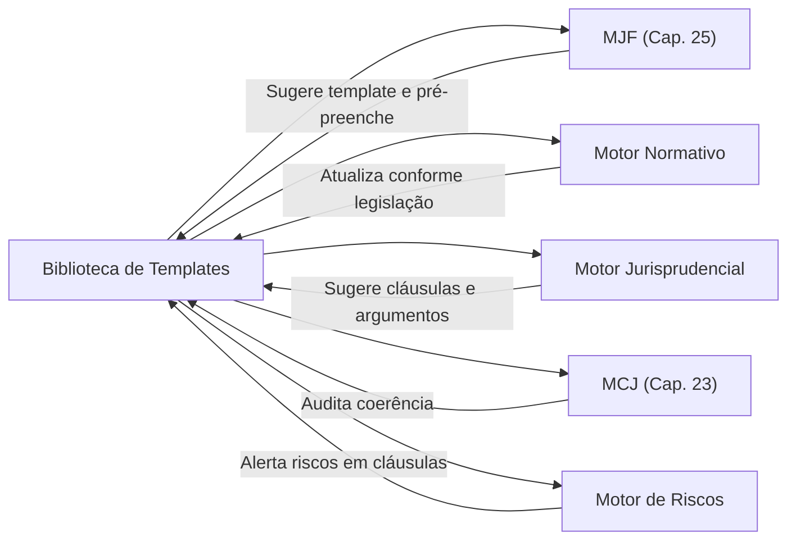

# 📄 07_TEMPLATES — Biblioteca de Templates Jurídicos

> **Diretório**: `07_TEMPLATES/`
> **Capítulo de Referência**: [Capítulo 33 — Biblioteca de Templates](cap33_biblioteca_templates.md)

## Visão Geral

A Biblioteca de Templates é o repositório inteligente de modelos pré-formatados e pré-redigidos para toda a gama de documentos jurídicos produzidos no âmbito do Juris Intelligence Framework (JIF). Este diretório organiza **14 subcategorias** de templates, cada uma especializada em um tipo de produção jurídica, desde petições processuais até documentos de governança corporativa.

O objetivo é **otimizar a produção jurídica**, garantindo padronização, qualidade e conformidade dos documentos, ao mesmo tempo em que libera os profissionais para se concentrarem nos aspectos estratégicos e intelectuais de cada caso.

## Arquitetura do Diretório

```
07_TEMPLATES/
├── README.md                          ← Este arquivo
├── cap33_biblioteca_templates.md      ← Capítulo 33: Fundamentação completa
├── peticoes/                          ← Petições processuais
│   └── README.md
├── recursos/                          ← Recursos e peças recursais
│   └── README.md
├── pareceres/                         ← Pareceres e opiniões legais
│   └── README.md
├── memoriais/                         ← Memoriais e sustentações
│   └── README.md
├── relatorios/                        ← Relatórios jurídicos
│   └── README.md
├── auditorias/                        ← Documentos de auditoria
│   └── README.md
├── notificacoes/                      ← Notificações extrajudiciais
│   └── README.md
├── contratos/                         ← Contratos e instrumentos
│   └── README.md
├── acordos/                           ← Acordos e transações
│   └── README.md
├── laudos/                            ← Laudos técnicos e periciais
│   └── README.md
├── planos_estrategicos/               ← Planos estratégicos jurídicos
│   └── README.md
├── due_diligence/                     ← Due Diligence jurídica
│   └── README.md
├── compliance/                        ← Documentos de Compliance
│   └── README.md
└── governanca/                        ← Governança Corporativa
    └── README.md
```

## Subcategorias de Templates

| # | Subcategoria | Descrição | Qtd. Estimada |
|---|---|---|---|
| 1 | **Petições** | Iniciais, contestações, réplicas, manifestações | 20+ |
| 2 | **Recursos** | Apelação, agravo, embargos, RE, REsp | 15+ |
| 3 | **Pareceres** | Opiniões legais, pareceres técnicos | 10+ |
| 4 | **Memoriais** | Memoriais de sustentação oral, memoriais descritivos | 8+ |
| 5 | **Relatórios** | Relatórios analíticos, gerenciais, de risco | 12+ |
| 6 | **Auditorias** | Relatórios de auditoria, achados, recomendações | 10+ |
| 7 | **Notificações** | Extrajudiciais, ofícios, comunicados | 10+ |
| 8 | **Contratos** | Compra/venda, locação, prestação de serviços, NDA | 25+ |
| 9 | **Acordos** | Termos de acordo, transações, mediação | 10+ |
| 10 | **Laudos** | Laudos periciais, técnicos, avaliatórios | 8+ |
| 11 | **Planos Estratégicos** | Planejamento jurídico, planos de ação A/B/C | 8+ |
| 12 | **Due Diligence** | Checklists e relatórios de DD | 10+ |
| 13 | **Compliance** | Códigos de conduta, políticas, termos | 15+ |
| 14 | **Governança** | Atas, estatutos, procurações, relatórios | 12+ |

## Funcionalidades-Chave dos Templates

### Campos Dinâmicos
Templates com campos que podem ser preenchidos automaticamente com informações do caso (nome das partes, número do processo, datas, valores).

### Cláusulas Condicionais
Inclusão ou exclusão automática de cláusulas com base em respostas a perguntas específicas do briefing.

### Preenchimento Automático (Auto-fill)
Utilização de dados estruturados (do processo, do cliente) para gerar automaticamente rascunhos de documentos.

### Auditoria Integrada (MCJ)
O documento gerado pode ser submetido ao Motor de Coerência Jurídica para verificação automática de consistência e conformidade.

## Integração com Motores do JIF



## Capítulos Relacionados

- [Capítulo 25 — Módulo Jurídico Forense (MJF)](../04_MOTORES/cap25_modulo_juridico_forense.md)
- [Capítulo 26 — Motores Especializados](../04_MOTORES/cap26_motores_especializados.md)
- [Capítulo 23 — Motor de Coerência Jurídica](../04_MOTORES/cap23_motor_coerencia_juridica.md)
- [Capítulo 27 — Ontologia Jurídica](../04_MOTORES/cap27_ontologia_juridica.md)
- [Capítulo 32 — Biblioteca de Briefings](../06_BRIEFINGS/cap32_biblioteca_briefings.md)
- [Capítulo 34 — Biblioteca de Checklists](../08_CHECKLISTS/cap34_biblioteca_checklists.md)

---
> Sigma—Juris Intelligence Framework (SJIF) v1.0 | Propriedade de Charles de Paula Eugênio — Sigma Sihf Soluções Analíticas Ltda
