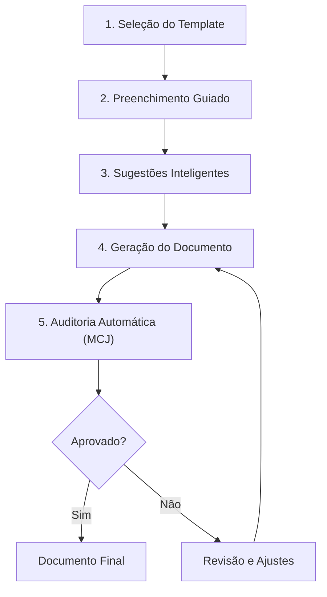

# Capítulo 33: Biblioteca de Templates

> **Bloco VI — Bibliotecas e Ferramentas**
> **Diretório**: `07_TEMPLATES/`

## 33.1 A Padronização Inteligente: Otimizando a Produção Jurídica com Templates

A produção de documentos jurídicos é uma parte central da prática do Direito, mas frequentemente consome um tempo considerável em tarefas repetitivas de formatação e redação de cláusulas padrão. A Biblioteca de Templates, no contexto do Juris Intelligence Framework (JIF), é um **repositório inteligente** de modelos pré-formatados e pré-redigidos para uma vasta gama de documentos jurídicos, desde petições e contratos até pareceres e notificações.

Ela visa otimizar a produção jurídica, garantindo a **padronização**, a **qualidade** e a **conformidade** dos documentos, ao mesmo tempo em que libera os profissionais para se concentrarem em aspectos mais estratégicos e intelectuais.

### Objetivos da Biblioteca de Templates

1. **Estruturar e gerenciar** modelos de documentos jurídicos
2. **Padronizar e automatizar** a redação jurídica
3. **Integrar com os motores do JIF** para personalização e preenchimento automático

---

## 33.2 Estruturação e Gestão de Modelos de Documentos

Uma biblioteca de templates eficaz não é apenas uma coleção de arquivos; é um **sistema organizado** que facilita a localização, a utilização e a atualização dos modelos.

### 33.2.1 Tipos de Templates Jurídicos

| Categoria | Exemplos de Documentos |
|---|---|
| **Petições Processuais** | Petições iniciais, contestações, réplicas, recursos (agravo, apelação, especial, extraordinário), embargos, manifestações |
| **Contratos** | Compra e venda, locação, prestação de serviços, parceria, trabalho, NDA, termos de uso, políticas de privacidade |
| **Pareceres e Opiniões Legais** | Pareceres sobre temas específicos com seções padronizadas (introdução, análise, conclusão, recomendações) |
| **Notificações e Correspondências** | Notificações extrajudiciais, ofícios, cartas de cobrança, comunicados internos e externos |
| **Documentos Societários** | Atas de reunião, contratos sociais, estatutos, procurações, termos de posse |
| **Documentos de Compliance** | Códigos de conduta, políticas internas (anticorrupção, proteção de dados), termos de consentimento |
| **Memoriais** | Memoriais descritivos, memoriais de sustentação oral |
| **Relatórios** | Relatórios analíticos, relatórios gerenciais, relatórios de risco |
| **Auditorias** | Relatórios de auditoria, achados, recomendações |
| **Laudos** | Laudos periciais, laudos técnicos, laudos avaliatórios |
| **Planos Estratégicos** | Planejamento jurídico, planos de ação A/B/C |
| **Due Diligence** | Relatórios de due diligence, checklists de DD |
| **Acordos** | Termos de acordo, transações judiciais e extrajudiciais |
| **Governança** | Atas de conselho, relatórios de governança, procurações |

### 33.2.2 Princípios de Estruturação e Gestão

1. **Categorização Lógica** — Organizar os templates por tipo de documento, área do Direito, jurisdição, ou qualquer outra taxonomia relevante
2. **Versionamento** — Manter um controle rigoroso das versões dos templates, garantindo que apenas as versões mais atualizadas e aprovadas sejam utilizadas
3. **Acessibilidade** — Facilitar a busca e o acesso aos templates por todos os usuários autorizados
4. **Segurança** — Implementar controles de acesso para proteger a integridade dos templates e evitar alterações não autorizadas
5. **Revisão Periódica** — Estabelecer um processo para a revisão e atualização regular dos templates, garantindo conformidade com a legislação e a jurisprudência mais recentes

---

## 33.3 Padronização e Automação da Redação Jurídica

A Biblioteca de Templates do JIF vai além da simples disponibilização de modelos, promovendo a **padronização da redação** e permitindo a **automação** de partes do processo de criação de documentos.

### 33.3.1 Elementos de Padronização

- **Cláusulas Padrão** — Repositório de cláusulas pré-aprovadas para contratos, que podem ser facilmente inseridas e adaptadas
- **Estrutura de Argumentação** — Modelos que guiam a construção de argumentos em petições e pareceres, garantindo a inclusão de todos os elementos essenciais (fatos, fundamentos, provas, pedidos)
- **Formatação** — Padronização de fontes, espaçamentos, cabeçalhos, rodapés e outras características visuais para garantir a uniformidade e o profissionalismo dos documentos
- **Linguagem e Terminologia** — Utilização de uma linguagem clara, concisa e consistente, alinhada à [Ontologia Jurídica (Capítulo 27)](../04_MOTORES/cap27_ontologia_juridica.md) do JIF

### 33.3.2 Automação da Redação

#### Campos Dinâmicos
Templates com campos que podem ser preenchidos automaticamente com informações do caso:

```
{{nome_autor}}          → Nome completo do autor
{{nome_reu}}            → Nome completo do réu
{{numero_processo}}     → Número do processo judicial
{{data_distribuicao}}   → Data de distribuição
{{valor_causa}}         → Valor da causa
{{vara_competente}}     → Vara/Juízo competente
{{comarca}}             → Comarca/Seção Judiciária
{{cpf_cnpj_autor}}      → CPF/CNPJ do autor
{{endereco_autor}}      → Endereço completo do autor
{{advogado_nome}}       → Nome do advogado
{{oab_numero}}          → Número da OAB
```

#### Cláusulas Condicionais
Inclusão ou exclusão automática de cláusulas com base em respostas a perguntas específicas:

```

  [Inserir cláusula de representação societária]

  [Inserir cláusula de representação pessoal]



  [Inserir cláusula de garantia — hipoteca/fiança/penhor]



  [Inserir seção de pedido de tutela de urgência]

```

#### Geração de Documentos a Partir de Dados
Utilização de dados estruturados (do processo, do cliente) para gerar automaticamente rascunhos de documentos, reduzindo o tempo de redação inicial.

---

## 33.4 Integração com os Motores do JIF para Personalização e Preenchimento Automático

A Biblioteca de Templates atinge seu potencial máximo quando integrada aos **motores de inteligência** do JIF, permitindo a personalização e o preenchimento automático de documentos de forma inteligente.

### 33.4.1 Sinergia com os Motores Especializados

| Motor | Função na Integração |
|---|---|
| **Módulo Jurídico Forense (Cap. 25)** | Sugere o template mais adequado para a peça a ser elaborada e pré-preenche o documento com dados do processo (partes, fatos, pedidos, provas) |
| **Motor Normativo (Cap. 26)** | Garante que os templates estejam atualizados com a legislação vigente, alertando sobre necessidade de revisão em caso de alterações normativas |
| **Motor Jurisprudencial (Cap. 26)** | Sugere a inclusão de cláusulas ou argumentos baseados na jurisprudência dominante ou em precedentes vinculantes relevantes |
| **Motor de Coerência Jurídica (Cap. 23)** | Audita o documento gerado a partir do template, verificando a consistência da argumentação e a conformidade com os padrões de qualidade |
| **Motor de Gestão de Riscos (Cap. 26)** | Alerta sobre cláusulas de risco em contratos gerados a partir de templates, ou sugere a inclusão de cláusulas de mitigação |

### 33.4.2 Processo de Utilização Inteligente



1. **Seleção do Template** — O usuário seleciona o template desejado na biblioteca
2. **Preenchimento Guiado** — O JIF guia o usuário através de um questionário interativo, cujas respostas são utilizadas para preencher os campos dinâmicos e ativar/desativar cláusulas condicionais
3. **Sugestões Inteligentes** — Durante o preenchimento, o sistema pode sugerir informações (dados de clientes, endereços, números de processo) a partir de outras bases de dados do JIF
4. **Geração do Documento** — O JIF gera um rascunho do documento, já formatado e pré-preenchido, pronto para revisão e finalização pelo profissional
5. **Auditoria Automática** — O documento gerado é submetido ao Motor de Coerência Jurídica para verificação automática de consistência e conformidade

---

## 33.5 A Biblioteca de Templates como Acelerador da Produção Jurídica no JIF

A Biblioteca de Templates é um **acelerador fundamental** da produção jurídica no Juris Intelligence Framework. Ao fornecer modelos padronizados, atualizados e integrados com os motores de inteligência do JIF, ela permite que os profissionais do Direito produzam documentos de alta qualidade com maior rapidez e eficiência.

### Benefícios Consolidados

- ✅ **Redução de tempo** na produção de documentos jurídicos
- ✅ **Padronização** na qualidade e formato das peças
- ✅ **Conformidade automática** com legislação e jurisprudência vigentes
- ✅ **Rastreabilidade** de todas as versões e modificações
- ✅ **Integração nativa** com todos os motores do JIF
- ✅ **Auditoria automática** pelo Motor de Coerência Jurídica

> A Biblioteca de Templates é, portanto, um pilar essencial para a construção de uma inteligência jurídica que combina a **automação** com a **expertise humana**, elevando a produtividade e a excelência na prática do Direito.

## Referências Cruzadas

- [Capítulo 23 — Motor de Coerência Jurídica](../04_MOTORES/cap23_motor_coerencia_juridica.md)
- [Capítulo 25 — Módulo Jurídico Forense](../04_MOTORES/cap25_modulo_juridico_forense.md)
- [Capítulo 26 — Motores Especializados](../04_MOTORES/cap26_motores_especializados.md)
- [Capítulo 27 — Ontologia Jurídica](../04_MOTORES/cap27_ontologia_juridica.md)
- [Capítulo 32 — Biblioteca de Briefings](../06_BRIEFINGS/cap32_biblioteca_briefings.md)
- [Capítulo 34 — Biblioteca de Checklists](../08_CHECKLISTS/cap34_biblioteca_checklists.md)
- [Capítulo 35 — Biblioteca de Indicadores](../09_INDICADORES/cap35_kpis_kris.md)

---
> Sigma—Juris Intelligence Framework (SJIF) v1.0 | Propriedade de Charles de Paula Eugênio — Sigma Sihf Soluções Analíticas Ltda
