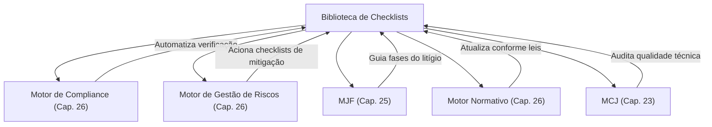

# ✅ 08_CHECKLISTS — Biblioteca de Checklists Jurídicos

> **Diretório**: `08_CHECKLISTS/`
> **Capítulo de Referência**: [Capítulo 34 — Biblioteca de Checklists](cap34_biblioteca_checklists.md)

## Visão Geral

A Biblioteca de Checklists é o repositório estruturado de listas de verificação que guiam os profissionais do Direito através de processos complexos, assegurando que todas as etapas necessárias sejam cumpridas, os requisitos legais atendidos e os riscos mitigados. Ela atua como uma ferramenta essencial para a **padronização de procedimentos**, a **redução de erros** e a **otimização da gestão de tarefas**, promovendo a eficiência e a segurança jurídica no âmbito do Juris Intelligence Framework (JIF).

## Arquitetura do Diretório

```
08_CHECKLISTS/
├── README.md                          ← Este arquivo
├── cap34_biblioteca_checklists.md     ← Capítulo 34: Fundamentação completa
├── checklist_inicial.md               ← Checklist de análise inicial do caso
├── checklist_probatorio.md            ← Checklist probatório
├── checklist_processual.md            ← Checklist processual
├── checklist_constitucional.md        ← Checklist constitucional
├── checklist_recursal.md              ← Checklist recursal
├── checklist_tributario.md            ← Checklist tributário
├── checklist_trabalhista.md           ← Checklist trabalhista
├── checklist_ambiental.md             ← Checklist ambiental
├── checklist_minerario.md             ← Checklist minerário
├── checklist_agrario.md               ← Checklist agrário
├── checklist_compliance.md            ← Checklist de compliance
├── checklist_auditoria.md             ← Checklist de auditoria jurídica
└── checklist_final.md                 ← Checklist de revisão final
```

## Catálogo de Checklists

| # | Checklist | Propósito | Itens Estimados |
|---|---|---|---|
| 1 | **Inicial** | Análise preliminar do caso, coleta de documentos, identificação de demanda | 15+ |
| 2 | **Probatório** | Verificação de provas, admissibilidade, cadeia de custódia | 12+ |
| 3 | **Processual** | Etapas processuais, prazos, competência, legitimidade | 15+ |
| 4 | **Constitucional** | Direitos fundamentais, controle de constitucionalidade | 12+ |
| 5 | **Recursal** | Cabimento, prazos, preparo, fundamentação recursal | 12+ |
| 6 | **Tributário** | Obrigações tributárias, créditos, compensações | 12+ |
| 7 | **Trabalhista** | Direitos trabalhistas, verbas, documentação | 12+ |
| 8 | **Ambiental** | Licenciamento, EIA/RIMA, TAC, conformidade | 12+ |
| 9 | **Minerário** | Concessões, autorizações, DNPM/ANM | 10+ |
| 10 | **Agrário** | Posse, propriedade rural, ITR, CAR | 10+ |
| 11 | **Compliance** | Conformidade normativa, políticas internas | 15+ |
| 12 | **Auditoria** | Auditoria jurídica interna/externa, passivos | 12+ |
| 13 | **Final** | Revisão final de qualidade, completude, coerência | 15+ |

## Tipos de Checklists no JIF (7 Categorias)

1. **Checklist de Due Diligence** — Fusões, aquisições, investimentos
2. **Checklist de Compliance** — Conformidade com leis e regulamentos
3. **Checklist Processual** — Fases de processos judiciais/administrativos
4. **Checklist de Contratos** — Elaboração e revisão de contratos
5. **Checklist de Auditoria Jurídica** — Auditorias internas/externas
6. **Checklist de Governança Corporativa** — Práticas de governança
7. **Checklist de Pesquisa Jurídica** — Pesquisas legislativas, jurisprudenciais e doutrinárias

## Princípios de Estruturação

- **Clareza e Objetividade** — Cada item deve ser inequívoco
- **Abrangência** — Cobertura de todas as etapas essenciais
- **Atualização Constante** — Revisão periódica conforme legislação
- **Flexibilidade** — Adaptação a casos específicos
- **Rastreabilidade** — Registro de conclusão, data e responsável

## Integração com Motores do JIF



## Capítulos Relacionados

- [Capítulo 20 — Gestão de Riscos Jurídicos](../03_FRAMEWORK/cap20_gestao_riscos.md)
- [Capítulo 21 — Compliance e Governança](../03_FRAMEWORK/cap21_compliance_governanca.md)
- [Capítulo 22 — Auditoria Jurídica](../03_FRAMEWORK/cap22_auditoria_juridica.md)
- [Capítulo 23 — Motor de Coerência Jurídica](../04_MOTORES/cap23_motor_coerencia_juridica.md)
- [Capítulo 25 — Módulo Jurídico Forense](../04_MOTORES/cap25_modulo_juridico_forense.md)
- [Capítulo 33 — Biblioteca de Templates](../07_TEMPLATES/cap33_biblioteca_templates.md)

---
> Sigma—Juris Intelligence Framework (SJIF) v1.0 | Propriedade de Charles de Paula Eugênio — Sigma Sihf Soluções Analíticas Ltda
