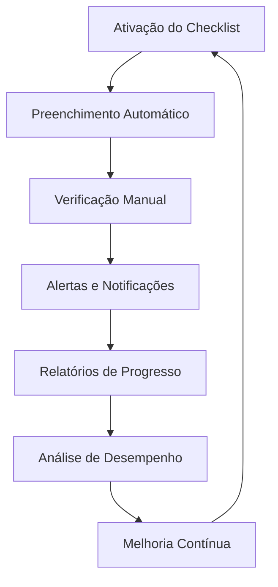

# Capítulo 34: Biblioteca de Checklists

> **Bloco VI — Bibliotecas e Ferramentas**
> **Diretório**: `08_CHECKLISTS/`

## 34.1 A Garantia da Qualidade e Conformidade: O Papel dos Checklists no JIF

Em um ambiente jurídico de crescente complexidade e volume de tarefas, a garantia da qualidade, da conformidade e da não omissão de etapas cruciais é um desafio constante. A Biblioteca de Checklists, no contexto do Juris Intelligence Framework (JIF), é um repositório estruturado de listas de verificação que guiam os profissionais do Direito através de processos complexos, assegurando que todas as etapas necessárias sejam cumpridas, os requisitos legais atendidos e os riscos mitigados.

Ela atua como uma ferramenta essencial para a **padronização de procedimentos**, a **redução de erros** e a **otimização da gestão de tarefas**, promovendo a eficiência e a segurança jurídica.

### Objetivos da Biblioteca de Checklists

1. **Estruturar e gerenciar** checklists jurídicos especializados
2. **Padronizar procedimentos** e garantir conformidade normativa
3. **Integrar com os motores do JIF** para automação e monitoramento contínuo

---

## 34.2 Estruturação e Gestão de Checklists Jurídicos

Um checklist jurídico eficaz é mais do que uma simples lista de itens; é uma **ferramenta de gestão** que reflete as melhores práticas e os requisitos legais de um determinado processo.

### 34.2.1 Os 7 Tipos de Checklists Jurídicos

#### Tipo 1 — Checklist de Due Diligence
Listas de verificação para a coleta e análise de documentos em operações de fusões e aquisições, investimentos ou outras transações, abrangendo áreas como:
- Contratos e litígios
- Propriedade intelectual
- Questões ambientais
- Questões trabalhistas
- Questões tributárias
- Aspectos regulatórios

#### Tipo 2 — Checklist de Compliance
Guias para a verificação da conformidade com leis, regulamentos, políticas internas e códigos de conduta:
- Anticorrupção (Lei nº 12.846/2013)
- Proteção de dados (LGPD)
- Prevenção à lavagem de dinheiro
- Normas setoriais

#### Tipo 3 — Checklist Processual
Listas de etapas a serem cumpridas em diferentes fases de um processo judicial ou administrativo:
- Petição inicial
- Contestação
- Fase instrutória
- Recurso
- Execução

#### Tipo 4 — Checklist de Contratos
Guias para a elaboração e revisão de contratos, assegurando:
- Inclusão de cláusulas essenciais
- Conformidade com a legislação
- Mitigação de riscos contratuais

#### Tipo 5 — Checklist de Auditoria Jurídica
Ferramentas para a realização de auditorias internas ou externas, garantindo:
- Abrangência da análise
- Identificação de riscos e passivos
- Documentação adequada dos achados

#### Tipo 6 — Checklist de Governança Corporativa
Listas de verificação para implementação e monitoramento de boas práticas:
- Reuniões de conselho
- Assembleias de acionistas
- Relatórios de transparência
- Estrutura de comitês

#### Tipo 7 — Checklist de Pesquisa Jurídica
Guias para pesquisas legislativas, jurisprudenciais e doutrinárias:
- Abrangência das fontes consultadas
- Relevância e atualidade dos resultados
- Documentação da metodologia de pesquisa

### 34.2.2 Princípios de Estruturação e Gestão

| # | Princípio | Descrição |
|---|---|---|
| 1 | **Clareza e Objetividade** | Cada item do checklist deve ser claro, conciso e inequívoco, indicando a ação a ser realizada ou o requisito a ser verificado |
| 2 | **Abrangência** | O checklist deve cobrir todas as etapas e requisitos essenciais do processo ou tarefa |
| 3 | **Atualização Constante** | Os checklists devem ser revisados e atualizados regularmente para refletir mudanças na legislação, jurisprudência ou melhores práticas |
| 4 | **Flexibilidade** | Embora padronizados, os checklists devem permitir adaptação a casos específicos, sem comprometer a essência do controle |
| 5 | **Rastreabilidade** | Permitir o registro da conclusão de cada item, com data, responsável e eventuais observações |

---

## 34.3 Padronização de Procedimentos e Garantia de Conformidade

A utilização de checklists promove a padronização de procedimentos, fundamental para a garantia da qualidade, a redução de erros e a conformidade com as normas.

### 34.3.1 Benefícios da Padronização com Checklists

- ✅ **Redução de Erros e Omissões** — Profissionais têm menos chances de esquecer etapas importantes ou cometer erros em processos complexos
- ✅ **Garantia de Conformidade** — Assegura que todos os requisitos legais e regulatórios sejam atendidos, minimizando riscos de não conformidade e sanções
- ✅ **Eficiência Operacional** — Otimiza o tempo gasto em tarefas repetitivas, evitando retrabalho
- ✅ **Treinamento e Capacitação** — Serve como ferramenta de treinamento para novos colaboradores
- ✅ **Melhoria Contínua** — A análise dos resultados dos checklists revela gargalos e áreas de melhoria
- ✅ **Transparência e Prestação de Contas** — Documenta as etapas realizadas e verificações efetuadas

### 34.3.2 Integração com Políticas e Procedimentos Internos

Os checklists devem estar alinhados e integrados às políticas e procedimentos internos da organização, atuando como uma ferramenta prática para a implementação dessas diretrizes. O JIF garante essa integração, vinculando os checklists às políticas de:

- [Compliance (Capítulo 21)](../03_FRAMEWORK/cap21_compliance_governanca.md)
- [Gestão de Riscos (Capítulo 20)](../03_FRAMEWORK/cap20_gestao_riscos.md)

---

## 34.4 Integração com os Motores do JIF para Automação e Monitoramento

A Biblioteca de Checklists atinge seu potencial máximo quando integrada aos **motores de inteligência** do JIF, permitindo a automação de verificações, o monitoramento de progresso e a geração de alertas.

### 34.4.1 Sinergia com os Motores Especializados

| Motor | Função na Integração |
|---|---|
| **Motor de Compliance (Cap. 26)** | Utiliza checklists para automatizar a verificação de conformidade com normas e regulamentos, gerando alertas sobre itens não cumpridos |
| **Motor de Gestão de Riscos (Cap. 26)** | Aciona checklists específicos para a mitigação de riscos identificados, monitorando a execução das ações preventivas e corretivas |
| **Módulo Jurídico Forense (Cap. 25)** | Integra checklists processuais para guiar profissionais em cada fase do litígio, assegurando que todas as etapas sejam cumpridas e as provas devidamente analisadas |
| **Motor Normativo (Cap. 26)** | Gera ou atualiza checklists automaticamente em resposta a mudanças legislativas, garantindo conformidade com a lei vigente |
| **Motor de Coerência Jurídica (Cap. 23)** | Utiliza checklists para auditar a qualidade técnica de peças jurídicas, verificando a presença de elementos essenciais e a coerência da argumentação |

### 34.4.2 Automação e Monitoramento Inteligente

1. **Preenchimento Automático** — Em alguns casos, itens do checklist podem ser automaticamente marcados como concluídos com base em dados do sistema (ex.: "documento protocolado" após registro no sistema processual)
2. **Alertas e Notificações** — O JIF gera alertas automáticos para itens próximos do vencimento ou não cumpridos, garantindo proatividade na gestão
3. **Relatórios de Progresso** — Geração de relatórios sobre o status de conclusão dos checklists, permitindo monitoramento do progresso e identificação de gargalos
4. **Análise de Desempenho** — A análise dos dados de checklists fornece insights sobre a eficiência dos processos e a necessidade de treinamento ou otimização

---

## 34.5 A Biblioteca de Checklists como Pilar da Excelência Operacional no JIF

A Biblioteca de Checklists é um **pilar fundamental** para a excelência operacional no Juris Intelligence Framework. Ao fornecer ferramentas padronizadas e inteligentes para a gestão de tarefas e a garantia de conformidade, ela capacita os profissionais do Direito a atuar com maior precisão, eficiência e segurança jurídica.

### Impactos Consolidados

| Dimensão | Impacto |
|---|---|
| **Qualidade** | Redução de erros e omissões em processos complexos |
| **Conformidade** | Garantia de atendimento a requisitos legais e regulatórios |
| **Eficiência** | Otimização do tempo e redução de retrabalho |
| **Cultura** | Fortalecimento da cultura de qualidade e responsabilidade |
| **Transparência** | Documentação completa de etapas e verificações |
| **Prevenção** | Identificação proativa de riscos e gargalos |

> A Biblioteca de Checklists transforma a complexidade em **clareza** e a incerteza em **controle**, sendo um componente essencial para a construção de uma inteligência jurídica que prioriza a precisão e a confiabilidade.

## Referências Cruzadas

- [Capítulo 20 — Gestão de Riscos Jurídicos](../03_FRAMEWORK/cap20_gestao_riscos.md)
- [Capítulo 21 — Compliance e Governança](../03_FRAMEWORK/cap21_compliance_governanca.md)
- [Capítulo 22 — Auditoria Jurídica](../03_FRAMEWORK/cap22_auditoria_juridica.md)
- [Capítulo 23 — Motor de Coerência Jurídica](../04_MOTORES/cap23_motor_coerencia_juridica.md)
- [Capítulo 25 — Módulo Jurídico Forense](../04_MOTORES/cap25_modulo_juridico_forense.md)
- [Capítulo 33 — Biblioteca de Templates](../07_TEMPLATES/cap33_biblioteca_templates.md)
- [Capítulo 35 — Biblioteca de Indicadores](../09_INDICADORES/cap35_kpis_kris.md)

---
> Sigma—Juris Intelligence Framework (SJIF) v1.0 | Propriedade de Charles de Paula Eugênio — Sigma Sihf Soluções Analíticas Ltda
