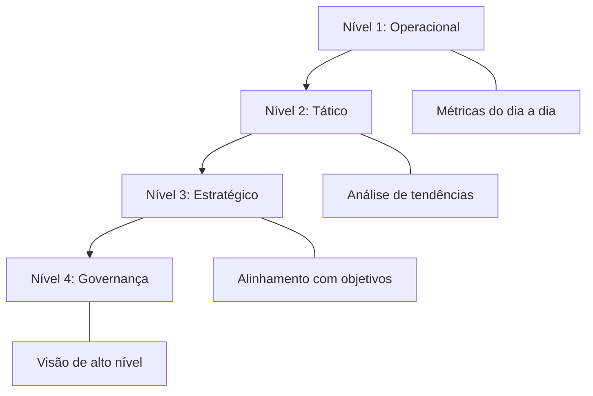
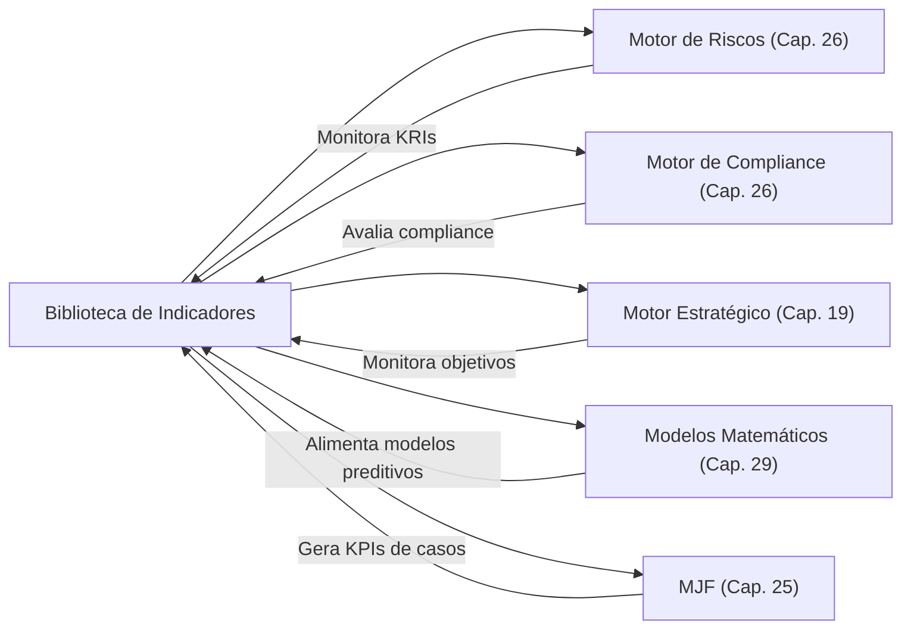

# 📊 09_INDICADORES — Biblioteca de Indicadores (KPIs e KRIs)

> **Diretório**: `09_INDICADORES/`
> **Capítulo de Referência**: [Capítulo 35 — Biblioteca de Indicadores](cap35_kpis_kris.md)

## Visão Geral

A Biblioteca de Indicadores é o repositório estruturado de métricas e parâmetros que permitem avaliar a eficiência, a eficácia e a conformidade da atuação jurídica, bem como identificar e monitorar riscos potenciais. Ela transforma a intuição em **informação quantificável**, subsidiando a tomada de decisões estratégicas e a otimização contínua dos processos no âmbito do Juris Intelligence Framework (JIF).

O diretório é organizado em duas grandes categorias: **KPIs** (Key Performance Indicators) para mensuração de performance e **KRIs** (Key Risk Indicators) para monitoramento de riscos.

## Arquitetura do Diretório

```
09_INDICADORES/
├── README.md                          ← Este arquivo
├── cap35_kpis_kris.md                 ← Capítulo 35: Fundamentação completa
├── kpis/                              ← Indicadores de Performance
│   ├── kpi_processuais.md             ← KPIs processuais
│   ├── kpi_financeiros.md             ← KPIs financeiros
│   ├── kpi_estrategicos.md            ← KPIs estratégicos
│   ├── kpi_recursais.md               ← KPIs recursais
│   ├── kpi_compliance.md              ← KPIs de compliance
│   ├── kpi_empresariais.md            ← KPIs empresariais
│   ├── kpi_ambientais.md              ← KPIs ambientais
│   └── kpi_tributarios.md             ← KPIs tributários
└── kris/                              ← Indicadores de Risco
    ├── kri_litigio.md                 ← KRIs de litígio
    ├── kri_regulatorio.md             ← KRIs regulatórios
    ├── kri_contratual.md              ← KRIs contratuais
    └── kri_reputacional.md            ← KRIs reputacionais
```

## Catálogo de Indicadores

### KPIs — Key Performance Indicators

| # | Categoria | Foco | Métricas-Chave |
|---|---|---|---|
| 1 | **Processuais** | Eficiência na gestão de processos | Taxa de sucesso, tempo médio, volume |
| 2 | **Financeiros** | Performance financeira jurídica | Custo por processo, economia gerada, ROI |
| 3 | **Estratégicos** | Alinhamento estratégico | Atingimento de metas, valor agregado |
| 4 | **Recursais** | Performance em recursos | Taxa de provimento, tempo recursal |
| 5 | **Compliance** | Conformidade normativa | Taxa de conformidade, treinamentos |
| 6 | **Empresariais** | Atuação jurídica empresarial | Contratos revisados, M&A, societário |
| 7 | **Ambientais** | Gestão ambiental jurídica | Licenças, TACs, passivos ambientais |
| 8 | **Tributários** | Performance tributária | Créditos recuperados, contencioso |

### KRIs — Key Risk Indicators

| # | Categoria | Foco | Sinais Monitorados |
|---|---|---|---|
| 1 | **Litígio** | Exposição a processos judiciais | Volume de ações, contingências, probabilidade de perda |
| 2 | **Regulatório** | Riscos de não conformidade | Sanções, mudanças legislativas, auditorias |
| 3 | **Contratual** | Riscos em contratos | Inadimplência, cláusulas vulneráveis, vencimentos |
| 4 | **Reputacional** | Riscos à imagem corporativa | Menções negativas, reclamações, sanções públicas |

## Categorização em 4 Níveis

Os indicadores do JIF são categorizados em **4 níveis de gestão**:



| Nível | Foco | Exemplo |
|---|---|---|
| **Operacional** | Tarefas do dia a dia | Prazos cumpridos, documentos produzidos |
| **Tático** | Tendências e padrões | Taxa de sucesso mensal, custo médio por área |
| **Estratégico** | Objetivos de longo prazo | ROI da área jurídica, economia gerada |
| **Governança** | Visão holística | Exposição total a riscos, compliance global |

## Ciclo de Vida do Indicador

1. **Definição** — O que medir, fórmula, fonte de dados, frequência
2. **Coleta** — Automatização da coleta de sistemas internos e externos
3. **Análise** — Processamento, cálculo, identificação de tendências
4. **Relatório** — Dashboards, relatórios visuais para partes interessadas
5. **Ação** — Decisões e melhorias baseadas nos insights

## Integração com Motores do JIF



## Capítulos Relacionados

- [Capítulo 17 — Benchmark Jurídico](../03_FRAMEWORK/cap17_benchmark_juridico.md)
- [Capítulo 19 — Gestão Estratégica Jurídica](../03_FRAMEWORK/cap19_gestao_estrategica.md)
- [Capítulo 20 — Gestão de Riscos Jurídicos](../03_FRAMEWORK/cap20_gestao_riscos.md)
- [Capítulo 25 — Módulo Jurídico Forense](../04_MOTORES/cap25_modulo_juridico_forense.md)
- [Capítulo 29 — Modelos Matemáticos](../10_MODELOS_MATEMATICOS/cap29_modelos_matematicos.md)
- [Capítulo 34 — Biblioteca de Checklists](../08_CHECKLISTS/cap34_biblioteca_checklists.md)
- [Capítulo 36 — Biblioteca de Estratégias](../10_MODELOS_MATEMATICOS/cap36_biblioteca_estrategias.md)

---
> Sigma—Juris Intelligence Framework (SJIF) v1.0 | Propriedade de Charles de Paula Eugênio — Sigma Sihf Soluções Analíticas Ltda
