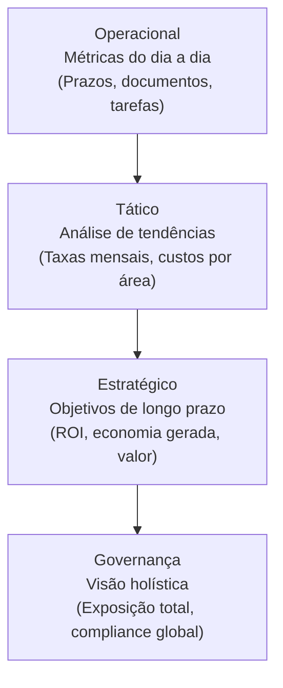
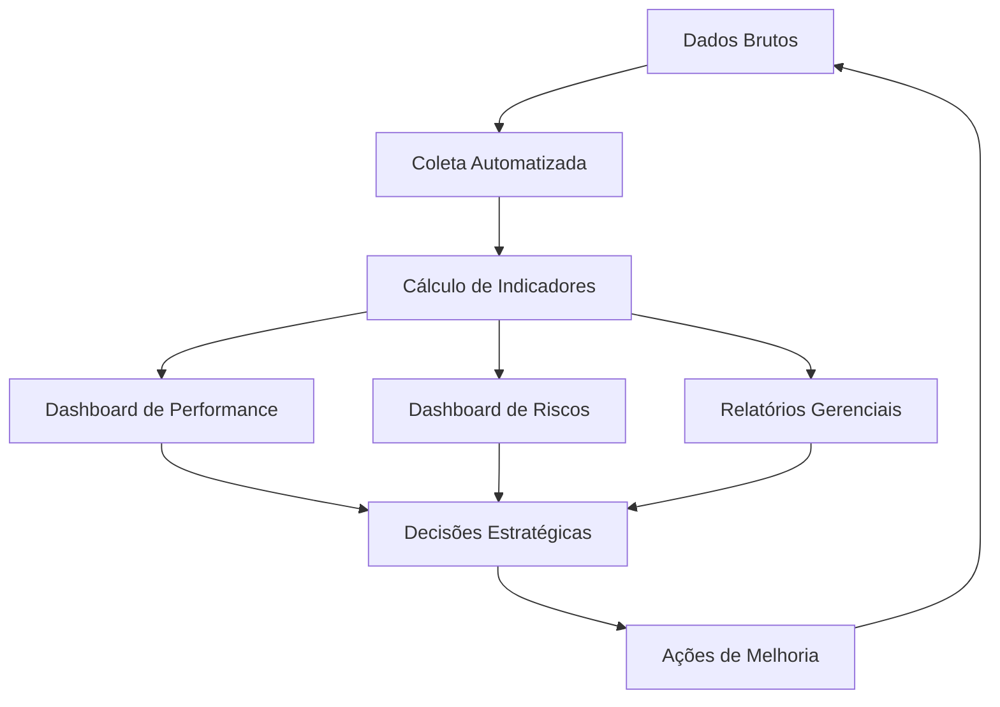

# Capítulo 35: Biblioteca de Indicadores (KPIs e KRIs)

> **Bloco VI — Bibliotecas e Ferramentas**
> **Diretório**: `09_INDICADORES/`

## 35.1 A Mensuração da Performance: Indicadores para a Gestão Jurídica Estratégica

Em um cenário onde a gestão baseada em dados se torna imperativa, a capacidade de mensurar a performance e monitorar os riscos é crucial para a função jurídica. A Biblioteca de Indicadores (KPIs e KRIs), no contexto do Juris Intelligence Framework (JIF), é um **repositório estruturado** de métricas e parâmetros que permitem avaliar a eficiência, a eficácia e a conformidade da atuação jurídica, bem como identificar e monitorar riscos potenciais.

Ela transforma a **intuição em informação quantificável**, subsidiando a tomada de decisões estratégicas e a otimização contínua dos processos.

### Objetivos da Biblioteca de Indicadores

1. **Definir e categorizar** KPIs e KRIs para a gestão jurídica
2. **Estruturar e gerenciar** indicadores com ciclo de vida completo
3. **Integrar com os motores de análise** do JIF para monitoramento e relatórios

---

## 35.2 Definição e Importância de KPIs e KRIs no Contexto Jurídico

KPIs e KRIs são ferramentas **distintas, mas complementares**, para a gestão estratégica da função jurídica.

### 35.2.1 Key Performance Indicators (KPIs)

KPIs são métricas que medem o **sucesso na consecução de objetivos estratégicos**. Eles respondem à pergunta fundamental: *"Estamos atingindo nossos objetivos?"*

No contexto jurídico, os KPIs podem medir:

| Dimensão | Exemplos de Métricas |
|---|---|
| **Eficiência Operacional** | Tempo médio de tramitação de processos, custo por processo, volume de documentos produzidos por advogado |
| **Qualidade da Atuação** | Taxa de sucesso em litígios, percentual de decisões favoráveis, satisfação do cliente (interno/externo) |
| **Produtividade** | Horas faturáveis, número de casos encerrados, cumprimento de prazos |
| **Geração de Valor** | Economia gerada por consultorias preventivas, recuperação de créditos, valor de acordos favoráveis |

### 35.2.2 Key Risk Indicators (KRIs)

KRIs são métricas que monitoram a **exposição a riscos** e alertam para a probabilidade de ocorrência de eventos adversos. Eles respondem à pergunta: *"Estamos expostos a riscos que podem comprometer nossos objetivos?"*

No contexto jurídico, os KRIs podem monitorar:

| Dimensão | Exemplos de Métricas |
|---|---|
| **Exposição a Litígios** | Número de novas ações judiciais, valor total de contingências passivas, percentual de processos com alta probabilidade de perda |
| **Conformidade** | Número de não conformidades identificadas em auditorias, percentual de treinamentos de compliance realizados, número de denúncias recebidas |
| **Reputação** | Menções negativas na mídia relacionadas a questões jurídicas, reclamações de clientes, sanções regulatórias |
| **Segurança da Informação** | Número de incidentes de segurança de dados, percentual de conformidade com a LGPD |

### 35.2.3 Importância para o JIF

- 📊 **Tomada de Decisão Informada** — Fornecem dados objetivos para embasar decisões estratégicas
- ⚙️ **Otimização de Processos** — Identificam gargalos e oportunidades de melhoria na atuação jurídica
- 🛡️ **Gestão Proativa de Riscos** — Permitem antecipar e mitigar riscos antes que se materializem
- 📋 **Prestação de Contas** — Demonstram o valor e a contribuição da função jurídica para a organização
- 🔄 **Benchmark** — Possibilitam a comparação de desempenho com pares de mercado ([Capítulo 17](../03_FRAMEWORK/cap17_benchmark_juridico.md))

---

## 35.3 Estruturação e Gestão de Indicadores Jurídicos

A Biblioteca de Indicadores do JIF é projetada para organizar, gerenciar e tornar acessíveis os KPIs e KRIs relevantes para a gestão jurídica.

### 35.3.1 Categorização de Indicadores em 4 Níveis

Os indicadores são categorizados em quatro dimensões complementares:

#### Nível 1 — Por Área do Direito
Indicadores específicos para cada ramo jurídico:
- Direito Civil, Trabalhista, Tributário, Empresarial
- Direito Ambiental, Minerário, Agrário
- Direito Constitucional, Administrativo

#### Nível 2 — Por Tipo de Atuação
Indicadores segmentados por natureza da atividade:
- Contencioso
- Consultivo
- Compliance
- Contratos

#### Nível 3 — Por Objetivo Estratégico
Indicadores alinhados aos objetivos da organização:
- Redução de custos
- Aumento de eficiência
- Mitigação de riscos
- Geração de valor

#### Nível 4 — Por Nível de Gestão
Indicadores escalonados por nível hierárquico:

### 35.3.2 Ciclo de Vida do Indicador

O ciclo de vida de cada indicador no JIF segue **5 etapas**:

| Etapa | Descrição |
|---|---|
| **1. Definição** | Identificar o que precisa ser medido, qual o objetivo, a fórmula de cálculo, a fonte de dados e a frequência de coleta |
| **2. Coleta de Dados** | Automatizar a coleta de dados de sistemas internos (processos, contratos, financeiro) e externos (bases de dados públicas) |
| **3. Análise** | Processar os dados para calcular os indicadores e identificar tendências, desvios e anomalias |
| **4. Relatório e Comunicação** | Apresentar os indicadores de forma clara e visual (dashboards, relatórios) para as partes interessadas |
| **5. Ação e Otimização** | Utilizar os insights dos indicadores para tomar decisões e implementar melhorias, reiniciando o ciclo |

### 35.3.3 Ferramentas do JIF para Gestão de Indicadores

- **Plataforma de Business Intelligence (BI)** — Ferramentas para criação de dashboards interativos e relatórios personalizados
- **Módulos de Coleta de Dados** — Integração com sistemas de gestão jurídica, ERPs e outras fontes de dados
- **Alertas e Notificações** — Configuração de alertas automáticos quando um indicador atinge um limite pré-definido (ex.: KRI de risco elevado)

---

## 35.4 Integração com os Motores de Análise do JIF para Monitoramento e Relatórios

A Biblioteca de Indicadores é intrinsecamente integrada aos motores de análise do JIF, permitindo o monitoramento contínuo da performance e dos riscos, e a geração de relatórios estratégicos.

### 35.4.1 Sinergia com os Motores Especializados

| Motor | Função na Integração |
|---|---|
| **Motor de Gestão de Riscos (Cap. 26)** | Utiliza os KRIs para monitorar a exposição a riscos jurídicos, gerando alertas e subsidiando a criação de planos de contingência |
| **Motor de Compliance (Cap. 26)** | Emprega KPIs e KRIs para avaliar a eficácia do programa de compliance e identificar não conformidades |
| **Motor Estratégico (Cap. 19)** | Utiliza os KPIs para monitorar o progresso em relação aos objetivos estratégicos da função jurídica |
| **Modelos Matemáticos (Cap. 29)** | Fornece os dados para a construção e validação de modelos preditivos de resultados e riscos |
| **Módulo Jurídico Forense (Cap. 25)** | Gera KPIs específicos para a gestão de casos (tempo médio de duração, taxa de sucesso, custos) |

### 35.4.2 Dashboards e Relatórios Inteligentes

O JIF oferece dashboards personalizáveis que apresentam os KPIs e KRIs de forma visual e intuitiva:

#### Dashboard de Performance Jurídica
Visão geral dos principais KPIs da área jurídica:
- Taxa de sucesso em litígios
- Tempo médio de tramitação
- Custos operacionais
- Produtividade da equipe

#### Dashboard de Riscos Jurídicos
Monitoramento dos KRIs mais críticos:
- Alertas visuais para riscos elevados
- Mapa de calor de contingências
- Tendências de exposição

#### Relatórios Gerenciais
Análises aprofundadas sobre a performance:
- Comparativos periódicos
- Insights e recomendações
- Projeções e cenários

---

## 35.5 A Biblioteca de Indicadores como Pilar da Gestão Data-Driven no JIF

A Biblioteca de Indicadores (KPIs e KRIs) é um **pilar fundamental** para a gestão data-driven no Juris Intelligence Framework. Ao fornecer um conjunto robusto de métricas para avaliar a performance e monitorar os riscos, e ao integrá-la de forma sinérgica com os motores de análise do JIF, ela capacita os profissionais do Direito a tomar decisões mais informadas, otimizar processos e demonstrar o valor estratégico da função jurídica.

### Benefícios Consolidados

| Benefício | Descrição |
|---|---|
| **Objetividade** | Decisões baseadas em dados, não em intuição |
| **Proatividade** | Antecipação de riscos antes da materialização |
| **Accountability** | Demonstração clara do valor da área jurídica |
| **Otimização** | Identificação contínua de oportunidades de melhoria |
| **Integração** | Conexão nativa com todos os motores do JIF |
| **Escalabilidade** | Adaptação a organizações de qualquer porte |

> A Biblioteca de Indicadores transforma a gestão jurídica de uma **arte** em uma **ciência**, garantindo que a atuação seja sempre baseada em evidências e orientada para a excelência e a prevenção.

## Referências Cruzadas

- [Capítulo 17 — Benchmark Jurídico](../03_FRAMEWORK/cap17_benchmark_juridico.md)
- [Capítulo 19 — Gestão Estratégica Jurídica](../03_FRAMEWORK/cap19_gestao_estrategica.md)
- [Capítulo 20 — Gestão de Riscos Jurídicos](../03_FRAMEWORK/cap20_gestao_riscos.md)
- [Capítulo 25 — Módulo Jurídico Forense](../04_MOTORES/cap25_modulo_juridico_forense.md)
- [Capítulo 29 — Modelos Matemáticos](../10_MODELOS_MATEMATICOS/cap29_modelos_matematicos.md)
- [Capítulo 33 — Biblioteca de Templates](../07_TEMPLATES/cap33_biblioteca_templates.md)
- [Capítulo 34 — Biblioteca de Checklists](../08_CHECKLISTS/cap34_biblioteca_checklists.md)
- [Capítulo 36 — Biblioteca de Estratégias](../10_MODELOS_MATEMATICOS/cap36_biblioteca_estrategias.md)

---
> Sigma—Juris Intelligence Framework (SJIF) v1.0 | Propriedade de Charles de Paula Eugênio — Sigma Sihf Soluções Analíticas Ltda
